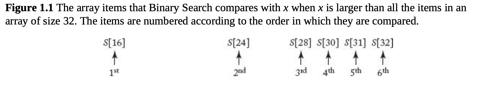
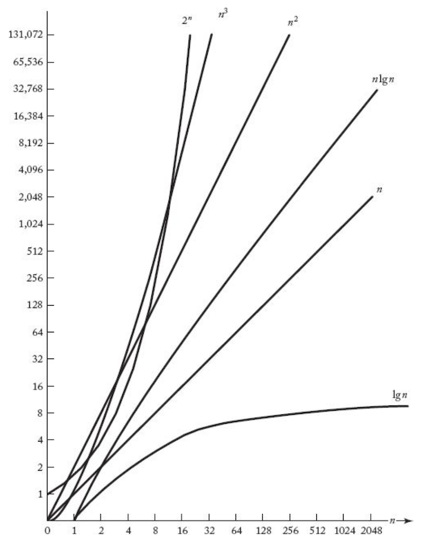
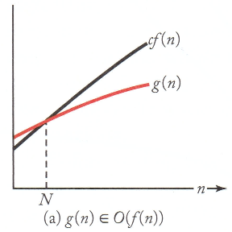
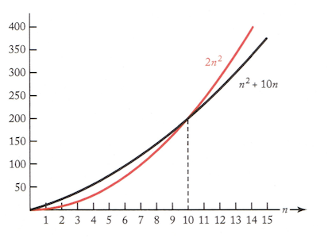
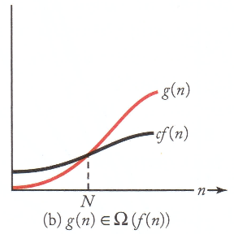
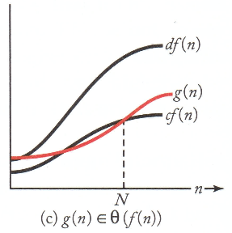
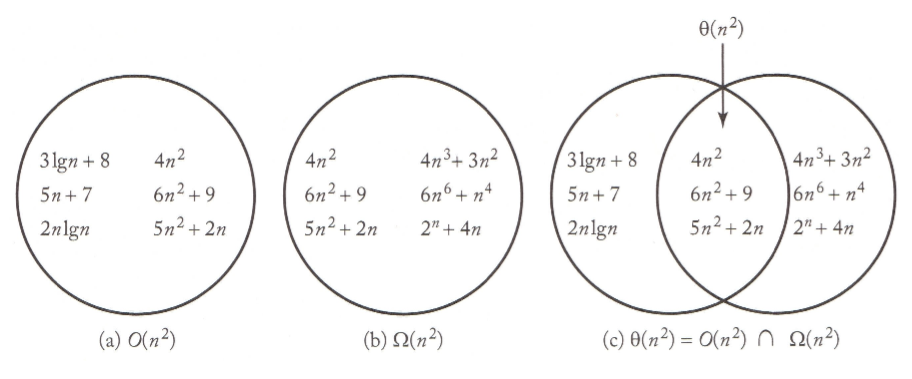

> _Efficiency, Analysis, and Order_

_학교에서 수강한 '알고리즘' 강의와 책 ⌜Foundation of Alogorithm - Rechard E. Neapolitan⌟을 중심으로 알고리즘에 대해 정리하고자 한 글입니다._

<!-- thumbnail -->

# 서론

2019년 가을학기에 수강한 아주대학교 위규범 교수님의 알고리즘(SCE-231) 강의와 책 [⌜Foundation of Alogorithm - Rechard E. Neapolitan⌟](http://www.yes24.com/Product/Goods/11999564) 을 중심으로 컴퓨터과학의 중요 분야 중 하나인 `알고리즘`에 관해 정리하고자 한다.

<br>

- 책 [⌜Foundation of Alogorithm - Rechard E. Neapolitan⌟](http://www.yes24.com/Product/Goods/11999564) 을 중심으로 소개한다.
- 해당 강의와 책의 내용을 제외하고도 모든 관련 내용을 폴랫폼에 구애받지 않고 참조하여 정리할 수 있다. 특히 책 [⌜파이썬 알고리즘 인터뷰 - 박상길⌟](http://www.yes24.com/Product/Goods/91084402) 을 상당 부분 참고한다.
- 주제의 흐름이나 순서는 해당 책을 기본으로 한다. 단, 각 챕터별 세부 내용은 달라질 수 있다.
- 단어나 설명은 해당 책의 표현(원어)을 기준으로 한다. 단, 널리 알려진 표현은 한글을 비롯한 다른 표현으로도 대체될 수 있다.
- 본 글은 문제 풀이(Problem Solving) 에 국한되어 설명하기보다는, 본인이 수강한 강의와 책을 바탕으로 학문으로써의 알고리즘에 대해 소개하고 정리하고자 한다.
- 해당 책에서는 C++과 JAVA를 기반으로 하는 Pseudocode를 제시하여 설명하는데, 이 글에서는 Python 기반, 또는 자연어 기반의 Pseudocode 또는 구체적인 Python Code 를 제시한다.

<br>

<details>
   <summary>RoadMap</summary>

1. `Algorithms; Efficiency, Analysis, and Order`
2. Divide-and-Conquer
3. Dynamic Programming
4. Greedy
5. Backtracking
6. Branch-and-Bound
7. Sorting
8. Searching
9. NP

   </details>

<br>

---

# Ch1. Efficiency, Analysis, Order

> 알고리즘이란

본 장에서는 알고리즘의 기본에 관하여 설명한다. 알고리즘이 무엇인지, 알고리즘의 효율성에 관하여, 알고리즘을 분석하는 법, 복잡도 등에 관하여 소개한다.

<br>

## Algorithm

> _...Applying a technique to a problem results in a step-by-step procedure for solving the probelm. This step-by-step procedure is called an `algorithm` for the problem..._

Program은 컴퓨터에 의해 이해될 수 있는 개별적인 module (ex, Sorting을 처리하는 module 등)</span>으로 구성된다. 이 text에서 우리는 전체적인 프로그램의 보다는, 각 module이 특정한 task를 처리하는 design에 대해 집중한다.

- 이때, 그 특정한 task를 **Problem**이라고 한다.
- 각 **Problem**은 문제에서 특정 값으로 정의되지 않은 variable를 포함할 수 있다. 이 var들을 **Parameters**라고 한다.
- **Paramaeter**로 전달되는 각각의 특정 값을 **Instance**라고 한다.
- 각 **Instant**에 대해 **Problem**에서 얻는 값을 **Solution**이라고 한다.

<br>
<br>

➤ 어떤 **Problem**에 전달되는 모든 **Instance**에 대해 **Solution**을 얻는 step-by-step procedure을 **`Algorithm`** 이라고 한다.

<br>

---

## Efficiency

컴퓨터가 얼마나 많이 빨라지고 메모리가 얼마나 많이 싸지는지와 관계없이, 알고리즘에서 **효율성(Efficiency)** 문제는 항상 대두될 수밖에 없다.

<br>

왜 그런지 다음의 두 알고리즘의 비교를 예시로 들어 설명한다.

### Sequential Search vs Binary Search

Sequential Search

```py
def sequential_search(s: list, x: int):
    for index in range(len(s)):
        if s[index] == x:
            return index
    return 0
```

> _순차 검색(sequential search), 또는 선형 검색(linear search)은 리스트에서 찾고자 하는 값을 맨 앞에서부터 끝까지 차례대로 탐색하는 알고리즘이다. - [출처](https://ko.wikipedia.org/wiki/순차*검색*알고리즘)_

<br>

Binary Search

```py
def binary_search(s: list, x: int):
    low, high = 1, len(s)
    location = 0

    while low <= high and location == 0:
        mid = (low+high)//2

        if x == s[mid]:
            location = mid

        elif x < s[mid]:
            high = mid-1
        elif x > s[mide]:
            low = mid +1
```

> _이진 검색(binary search)은 오름차순으로 정렬된 리스트에서 특정한 값을 찾는 알고리즘이다. 리스트에서 중간값과 대소를 비교하여 그 중간값을 다시 최대나 최솟값으로 하는 리스트에서 해당 과정을 반복한다._

<br>

리스트 S의 길이를 32라고 가정하고 찾고자 하는 $$x$$가 리스트에 포함되어 있지 않은 경우(_Worst Case_)를 생각하자.

Sequential Search의 경우 32번의 비교 연산을 수행하지만  
Binary Search의 경우 오직 약 6번의 비교 연산만을 수행한다.

<br>



<br>

binary search에서는 각 반복마다 검색하는 리스트의 크기가 절반이 된다. 따라서 최악의 경우 $$\lfloor\log_2 n\rfloor + 1$$ 의 경우만 검사하면 된다.

<br>

<br>

다음은 리스트의 사이즈별로 최악의 경우 (_when x is larger than all items in an array_)각 알고리즘마다 몇번의 비교가 수행되는지를 나타낸 표이다.

|    Array Size | Sequential Search | Binary Search |
| ------------: | ----------------: | ------------: |
|           128 |               128 |             8 |
|         1,024 |             1,024 |            11 |
|     1,048,576 |         1,048,576 |            21 |
| 4,294,967,296 |     4,294,967,296 |            33 |

<br>

$$O(n)$$의 Time Complexity를 가지는 Sequential Search와 $$O(\log_2 n)$$의 Time Complexity를 가지는 Binary Search의 비교만 하더라도 리스트의 **사이즈가 늘어감에 따라 증가하는 연산의 횟수**가 극단적으로 차이 나는 것을 볼 수 있다.

<br>
<br>

다음은 피보나치 수를 구하는 두 가지 방식의 알고리즘의 수행 시간을 나타낸 표이다. 피보나치 수 하나를 계산하는 데 걸리는 시간은 $$1ns (= 10^{-9}s)$$라고 가정한다.

<br>

| $$n$$ |            $$2^{n/2}$$ |  Iterative | Recursion                 |
| ----: | ---------------------: | ---------: | ------------------------- |
|    40 |              1,048,576 |  41 $$ns$$ | 1048 $$\mu s$$            |
|    80 | $$1.1 \times 10^{12}$$ |  81 $$ns$$ | 18 minuate                |
|   ... |                        |            |                           |
|   200 | $$1.3 \times 10^{30}$$ | 201 $$ns$$ | $$4 \times 10^{13} year$$ |

<br>

Recursion으로 구현한 피보나치 수를 구하는 알고리즘과 같이 exponential time complexity를 가지는 경우 등 매우 비효율적인 알고리즘은 표에서와 같이 paramaeter의 크기가 커질수록 극단적으로 비효율적인 수행을 보여준다.

이러한 비교가 **컴퓨터의 성능과는 관계없이 `알고리즘의 효율성`이 얼마나 중요한지** 보여준다.

<br>

---

## Analysis of Algorithm

알고리즘의 효율성이 중요하다는 것을 알았으니 이제 알고리즘이 `얼마나 효율적인지 분석`할 수 있어야 한다.

시간적 측면에서 알고리즘의 효율성을 분석할 때, **실제 CPU의 Cycle**을 계산하지는 않는다  
실제 CPU Cycle은 각 알고리즘을 수행하는 컴퓨터마다(CPU마다) 다를 수 있기 때문이다.

더 나아가 **실제 instruction이 몇 번 수행되는지**를 계산하지도 않는다.  
각 instruction의 숫자는 알고리즘을 수행하는 언어나 개발자가 프로그래밍하는 방식, compiler나 interpreter에 따라 달라질 수 있기 때문이다.

대신, 우리는 컴퓨터나 CPU, 프로그래밍 언어, 개발자가 프로그래밍하는 방식 등에 구애받지 않는 측정 기준을 마련하고 싶다.

따라서 우리는  
**input size에 따른 알고리즘의 Basic Operation 연산 횟수**를 알고리즘의 efficiency를 측정하는 척도로 사용한다.

> _Basic Operation : Comparison, Assignment, Loop, ..._

### input vs input size

- 많은 알고리즘에서 input size는 **parameter의 크기**와 같다.<p style="font-style:italic;color:gray;margin:0;">ex) (일반적으로) Searching 알고리즘들의 input size는 배열의 크기이다.<p/>

<br>

- 주의해야 할 점은, **input** 과 **input size**는 다르다는 것이다. 어떤 알고리즘에서 input size는 parameter(input)의 크기와 다르다.<p style="font-style:italic;color:gray;margin:0;">ex) 앞서 살펴본 피보나치 수를 계산하는 알고리즘에서의 parameter $$'n'$$은 input이지 input size는 아니다. 이 알고리즘에서의 input size에 대한 합리적인 추정은 입력 n을 인코딩하는데 필요한 symbol의 개수이다.<p/>

<br>

- 어떤 알고리즘에서의 input size는 **두 개 또는 여러 개의 숫자를 사용해서 측정**하는게 더 적절하다.<p style="font-style:italic;color:gray;margin:0;">ex) Graph가 input일 때, input size는 vertices와 edges두 매개변수로 결정하는 것이 더 적절하다.<p/>

<br>

알고리즘의 효율성을 측정하는 데는 `input`이 아닌 `input size`에 따른 알고리즘의 연산 횟수를 고려한다. 따라서 정확한 input size를 규정할 수 있어야 한다. 특히 input과 input size를 혼동하지 않도록 해야 한다.

### Basic Operation

입력 크기를 결정한 후, 알고리즘이 수행하는 총 작업이 대체적으로 instruction의 수행 횟수와 비례하도록 instruction이나 instruction 그룹을 지정한다.

이를 `basic operation` 이라고 한다.

예를 들어 Comparsion, Assigment, Loop State 등 다양한 operation이 해당될 수 있다.<p style="font-style:italic;color:gray;margin:0;">_ex) 앞서 sequential search와 binary search를 비교했을 때, 리스트의 아이템들과 키의 비교 연산을 basic operation으로 삼아 이 연산이 몇 번 수행되는지를 알고리즘의 상대적 효율성의 척도로 삼았다._<p/>

<br>

- `Basic Operation`을 선택하는 정해진 규칙은 없다. 경험에 기반에 적절하게 판단해야 할 것이다.

<br>

- 때에 따라 여러 개의 `Basic Operation`을 고려해야 할 수도 있다.<p style="font-style:italic;color:gray;margin:0;">_ex) 키를 비교하여 정렬하는 알고리즘, Comparison과 Assigment가 서로 다른 비율로 발생하기 때문에 서로 독립적인 Basic Operation으로 다룬다._<p/>

<br>

- Input size뿐만 아니라 input 자체도 `Basic Operation`의 실행 횟수에 영향을 줄 수 있다.<p style="font-style:italic;color:gray;margin:0;">_ex) sequential search에서는 찾아야 하는 key의 값이 리스트의 어느 부분에 존재하는지 (심지어는 존재하지 않는 경우까지)에 따라 comparison이 달라진다._<p/>

### Time Complexity

`time complexity analysis`는 각 **input** 마다 얼마나 많은 **basic operation**이 수행되는지를 말한다.

- $$T(n)$$ : `Every-Case` time complexity  
  \-Basic Operation의 실행 횟수가 **input에 관계없이 input size에만 영향**을 받는 경우의 time complexity.

<br>

<br>

많은 경우에, 알고리즘은 단순히 input size에만 영향을 받는 every-case time complexity anlysis를 하지 못한다. **input의 값에 따라 time complexity가 달라진다**.

<br>

이런 경우에 고려할 수 있는 3가지의 time complexity anaysis가 존재한다.

<br>

- $$W(n)$$ : `Worst-Case` time complexity  
  \-Basic Operation의 실행 횟수가 input에 의해 **최대** 실행 횟수를 가지는 경우의 time complexity.

<br>

- $$A(n)$$ : `Average-Case` time complexity  
  \-Input size에 대한 각 input마다의 Basic Operation의 실행 횟수 기대치(평균) time complexity.  
  \-size n에 대한 모든 input에 확률을 할당해 더하여 평균을 계산한다.

<br>

- $$B(n)$$ : `Best-Case` time complexity  
  \-Basic Operation의 실행 횟수가 input에 의해 **최소** 실행 횟수를 가지는 경우의 time complexity.  
  \-worst-case 와 average-case time complexity에 비해 잘 쓰이지 않는다.

  <br>

$$
  T(n)\text{이 존재한다면, } T(n) = W(n) = A(n) = B(n)
$$

$$
  \text{일반적으로, } B(n) \le A(n) \le W(n)
$$

<br>

---

## Order

모든 **$$\Theta(f(n))$$**으로 치환될 수 있는 함수를 `order` of $$f(n)$$ 이라고 한다.

$$f(n)$$의 최고차항이 $$g(n)$$의 최고차항보다 낮다면, 즉 order가 낮다면 f(n)은 n이 증가함에 따라 궁극적으로 g(n)의 값보다 작아지게 된다.

### order

함수의 입력값이 증가함에 따라 얻어지는 궁극적인 결괏값은 결국 **최고차항에 의해 좌우**된다.

예를 들어 다음은 **complete-quadratic function**(선형 항이 포함된 2차 함수)인 $$0.1n^2 + n + 100$$과  
**pure-quadratic function**(선형 항이 포함되지 않은 2차 함수)인 $$0.1n^2$$ 을 예시로 비교한 표이다.

| $$n$$ | $$0.1n^2$$ | $$0.1n^2 + n + 100$$ |
| :---: | ---------: | -------------------: |
|  10   |         10 |                  120 |
|  20   |         40 |                  160 |
|  50   |        250 |                  400 |
|  100  |      1,000 |                1,200 |
| 1,000 |    100,000 |              101,100 |

> 결과적으로 입력값이 커짐에 따라 결괏값의 차이가 결괏값의 전체 크기에 비해 줄어드는 것을 볼 수 있다.

<br>

따라서 complex-quadratic function이어도 최고차항인 2차 항만을 남겨놓고 나머지는 버려 pure-quadratic function으로 치환할 수 있다.

이와 같은 방법으로 time-complexity order를 따질 때 **모든 complex-function을 최고차항만 남기고 나머지는 버려 pure-function으로 치환**할 수 있다.

<br>

모든 pure-quadrtic function으로 치환될 수 있는 함수를 $$\Theta(n^2)$$이라고 하며, 이때 그 함수를 `order` of $$n^2$$라고 한다.

또한 어떤 알고리즘의 time-complexity가 $$\Theta(n^2)$$일때, 그 알고리즘을 $$\Theta(n^2)$$ 알고리즘이라고 한다.  
마찬가지로, 모든 pure-cubic function으로 치환될 수 있는 함수를 $$\Theta(n^3)$$라고 하며,

<br>

이와 같은 방법으로 모든 $$f(n)$$의 경우에 $$f(n)$$을 pure function으로 치환한 $$f'(n)$$에 대해 그 $$f(n)$$을 $$\Theta(f'(n))$$이라고 한다.

> ex) $$ n^2 + 32n + 2 \in \Theta(2^n)$$  
> $$ n\lg n + 100n + 10000 \in \Theta(n\lg n)$$

</p>

<br>

최고차항을 제외한 다른 항들의 값과 관계없이, $$f(n)$$의 최고차항이 $$g(n)$$의 최고차항보다 낮다면, **즉 order가 낮다면 $$f(n)$$은 $$n$$이 증가함에 따라 궁극적으로 $$g(n)$$의 값보다 작아지게 된다.**

다음은 그를 보여주는 그래프이다.



<br>

시작 값에 관계없이 $$n$$이 증가하면 증가할수록 함수의 결괏값이 궁극적으로 차이나는 것을 볼 수 있다.

주의해야 할 점은, 단순히 order만을 비교하는 것보다 time-complexity를 정확히 아는 것이 더 많은 정보를 알 수 있다는 것을 항상 염두에 두어야 한다는 것이다.

예를 들어, $$100n$$과 $$0.01n^2$$ 두 time-complexity를 가지는 두 알고리즘의 경우를 비교해 보면, $$n$$의 값이 10,000 이하일 경우 order가 더 높은 $$0.01n^2$$ time-complexity 알고리즘이 더 효율적이다.  
만약 두 알고리즘의 정확한 time-complexity말고 order만 알고 있었다면, 이와 같은 정보는 알지 못했을 것이다.

### $$O(f(n))$$, Big-O notation

> _알고리즘의 Asymptotic upper bound_

다음 성질을 가지는 양의 실수 $$c$$와 음이 아닌 정수 $$N$$이 존재할 떄, $$g(n) \in O(f(n))$$이 성립한다.

<br>

$$
   N \le n \text{ 인 임의의 정수 } n \text{ 에 대해, } g(n) \le c \cdot f(n)
$$

<br>



<br>

이때

- $$g(n)$$을 $$f(n)$$의 big-O, 즉 $$g(n)$$은 in $$O(f(n))$$이라고 한다.
- $$g(n)$$의 `asymptotic upper bound`(점근적 상한)은 $$f(n)$$이다 -라고 한다.

<br>

---

예를 들어, $$n^2 + 10n$$이라는 time-complexity를 가지는 알고리즘에 대해 생각해보자.

<br>

$$10 \le n$$ 의 경우 $$n^2 + 10n \le 2n^2$$라는 식이 성립한다.  
따라서 $$c = 2$$, $$N = 10$$인 경우와 같이 부등식이 성립하는 경우가 존재하므로, $$n^2 + 10n \in O(n^2)$$이라고 할 수 있다.

<br>

이는 다음과 같은 그래프로 표현할 수 있다.



그래프에서 볼 수 있듯이, $$g(n)$$이 $$O(n^2)$$이면 $$g(n)$$은 결국 어떤 pure-quadratic ($$cn^2$$)아래에 있게 된다.

이는 $$g(n)$$ time-complexity를 가지는 어떤 알고리즘이 결국 적어도 quadratic 보다 `같거나 빠른 수행시간`을 가진다는 것을 의미한다.

<br>

반면, $$n^3$$은 $$O(n^2)$$에 속하지 않는다.  
왜냐하면 $$c와$$ $$N$$ 을 어떻게 지정하더라도, $$N$$보다 큰 어떤 $$n$$에 대하여

$$ n^3 > c\cdot n^2 $$

가 성립하기 떄문이다.

<br>

따라서 $$n^3$$의 time-complexity를 가지는 어떤 알고리즘은 $$n^2$$보다 효율적인 time-complexity를 가지지 못한다-고 말할 수 있다.

<br>

Big-O를 비롯한 모든 asymptotic notation(점근적 표기)는 최종적인 행동(n값이 궁극적으로 커지는 상황, input size가 커지는 상황)만을 고려하기 때문에, 함수의 asymptotic behavior(점근적 행동)을 표현하는데 사용되는 척도이다.

### $$\Omega(f(n))$$, Big-Omega notation

> _알고리즘의 Asymptotic lower bound_

다음 성질을 가지는 양의 실수 $$c$$와 음이 아닌 정수 $$N$$이 존재할 떄, $$g(n) \in \Omega(f(n))$$이 성립한다

<br>

$$
  N \le n \text{ 인 임의의 정수 } n \text{ 에 대해, } c \cdot f(n) \le g(n)
$$

<br>



<br>

이 때

- $$g(n)$$을 $$f(n)$$의 big-Omega, 즉 $$g(n)$$은 in $$\Omega(f(n))$$이라고 한다.
- $$g(n)$$의 `asymptotic lower bound`(점근적 하한)은 $$f(n)$$이다 -라고 한다.

<br>

---

Big-O의 경우와 마찬가지로, $$n^2 + 10n$$이라는 time-complexity를 가지는 알고리즘을 예를 들어 생각해보자.

$$0 \le n$$ 의 경우 $$n^2 \le n^2 + 10$$라는 식이 성립한다.  
따라서 $$c = 1$$, $$N = 0$$인 경우와 같이 부등식이 성립하는 경우가 존재하므로, $$n^2 + 10n \in \Omega(n^2)$$이라고 할 수 있다.

이는 $$g(n)$$ time-complexity를 가지는 어떤 알고리즘이 결국 적어도 quadratic 보다는 `같거나 느린 수행 시간`을 가진다는 것을 의미한다.

반면, $$n^2$$은 $$\Omega(n^3)$$에 속해있지 않다.  
c와 N을 어떻게 지정하더라도, $$N$$보다 큰 어떤 $$n$$에 대하여

$$ n^2 \le c \cdot n^3 $$가 성립하기 때문이다.

<br>

따라서 $$n^2$$의 time-complexity를 가지는 어떤 알고리즘은 결국 최소한 $$n^3$$보다 효율적인 time-complexity를 가진다-고 말할 수 있다.

### $$\Theta(f(n))$$ Big-Theta notation

> _알고리즘의 Order_

이제 Big-O와 Big-Omega를 이용해 다시 $$\Theta$$에 대해 살펴보자.

time-complexity function $$f(n)$$에 대하여,

<br>

$$
  \Theta(f(n)) = O(f(n)) \cap \Omega(f(n))
$$

<br>

이다.

즉, 다음과 같은 성질을 가지는 양의 실수 $$c$$와 $$d$$, 음이 아닌 정수 $$N$$이 존재할 떄, $$ g(n) \in \Theta(f(n))$$ 이라고 한다.

<br>

$$
  N \le n \text{ 인 임의의 정수 } n \text{ 에 대해, } c \cdot f(n) \le g(n) \le d \cdot f(n)
$$

<br>



<br>

이때

$$g(n)$$을 `order` of $$f(n)$$, 즉 $$g(n)$$의 차수는 $$f(n)$$ 이다- 라고 한다.

<br>
<br>

$$n^2$$ time-complexity를 예를 들어, 다음과 같은 벤 다이어그램을 볼 수 있다.


### 특성

- $$g(n) \in O(f(n)) \iff f(n) \in \Omega(g(n))$$
- $$g(n) \in \Theta(f(n)) \iff f(n) \in \Theta(g(n))$$

<br>

- $$1 < a, b $$인 임의의 실수에 대해 $$\log_a n \in \Theta(\log_b n)$$  
  즉, **로그의 밑에 관계없이** 모든 로그함수는 같은 complexity category에 속한다. (order가 같다)

<br>

- $$0 < a < b$$인 임의의 실수에 대해 $$a^n \in o(b^n)$$  
  즉, 지수함수는 밑이 다르면 다른 complexity category에 속한다. (order가 다르다)

  <br>

- $$a^n \in o(n!)$$
  즉, 팩토리얼은 어떠한 지수함수보다 느리다.

  <br>

- $$ 0\le c, 0 < d, g(n) \in O(f(n)), h(n) \in \Theta(f(n))$$인 경우, $$c\cdot g(n) + d \cdot h(n) \in \Theta(f(n))$$

### $$o(f(n))$$, small-o notation

> _알고리즘의 Asymptotic upper bound와 같아질 수 없는 upper bound (여유있는 upper bound)_

임의의 양의 실수 $$c$$ 에 대해 다음 성질을 갖는 음이 아닌 정수 $$N$$이 존재할 떄, $$g(n) \in o(f(n))$$이 성립한다

<br>

$$
  N \le n \text{ 인 임의의 정수 } n \text{ 에 대해, } g(n) \le c \cdot f(n)
$$

<br>

이는 **어떠한 작은 양의 실수 $$c$$**에 대해서도 n이 충분히 크다면 $$g(n)$$이 $$f(n)$$보다 작다, 즉 효율적이라는 것을 의미한다.

또한,

<br>

$$
  o(g(n)) = O(g(n)) - \Theta((g(n)))
$$

<br>

이다.

<br>

Big-O의 경우 time-complexity의 asymptotic upper bound를 말한다면, small-o는 time-complexity의 `upper bound`를 말함과 동시에 알고리즘의 asymptotic 실행시간이 `upper bound와 같을 수는 없음`을 말한다.

<br>

만약 $$g(n) \in o(f(n))$$ 일 경우, $$ g(n) \in O(f(n)) - \Omega(f(n)) $$. 즉, $$g(n)$$은 $$O(f(n))$$이긴 하지만 $$\Omega(n)$$는 아니다.

<br>

주의할 점은, $$o(f(n))$$ 은 $$O(f(n)) - \Omega(f(n))$$ 과 항상 같지는 않다는 것이다.  
다음과 같은 예시를 보자

<br>

$$
  g(n) = \begin{cases}
    n       & \quad \text{if } n \text{ is even}\\
    1  & \quad \text{if } n \text{ is odd}
  \end{cases}
$$

<br>

과 같은 예시에서 $$g(n) \in O(n) - \Omega(n)$$ 이지만 $$g(n) \notin o(n)$$ 이다.

### $$\omega(f(n))$$, small-omega notation

> _알고리즘의 Asymptotic lower bound와 같아질 수 없는 lower bound (여유있는 lower bound)_

임의의 양의 실수 $$c$$ 에 대해 다음 성질을 갖는 음이 아닌 정수 $$N$$이 존재할 떄, $$g(n) \in \omega(f(n))$$이 성립한다

<br>

$$
  N \le n \text{ 인 임의의 정수 } n \text{ 에 대해, } c \cdot f(n) \le g(n)
$$

<br>

이는 **어떠한 큰 양의 실수 $$c$$**에 대해서도 n이 충분히 크다면 $$g(n)$$이 $$f(n)$$보다 크다, 즉 비효율적이라는 것을 의미한다.

또한,

<br>

$$
  \omega(g(n)) = \Omega(g(n)) - \Theta((g(n)))
$$

<br>

이다.

<br>

Big-Omega의 경우 time-complexity의 asymptotic lower bound를 말한다면, small-omega는 time-complexity의 `lower bound`를 말함과 동시에 알고리즘의 asymptotic 실행시간이 `lower bound와 같을 수는 없음`을 말한다.

<br>
<br>

### 극한을 사용한 order

극한(limit)을 사용하여 time-complexity의 order를 계산할 수 있다.

<br>

$$
  \lim \limits_{x \to \infty} \frac{g(n)}{f(n)} =
  \begin{cases}
    \text{양의 실수}   & \implies   & g(n) \in \Theta(f(n)) \\
    0   & \implies   & g(n) \in o(f(n)) \\
    \infty   & \implies   & f(n) \in o(g(n)) \\
  \end{cases}
$$

<br>

|                                                    |
| :------------------------------------------------: |
| $$ \omega(g(n)) = \Omega(g(n)) - \Theta((g(n))) $$ |
