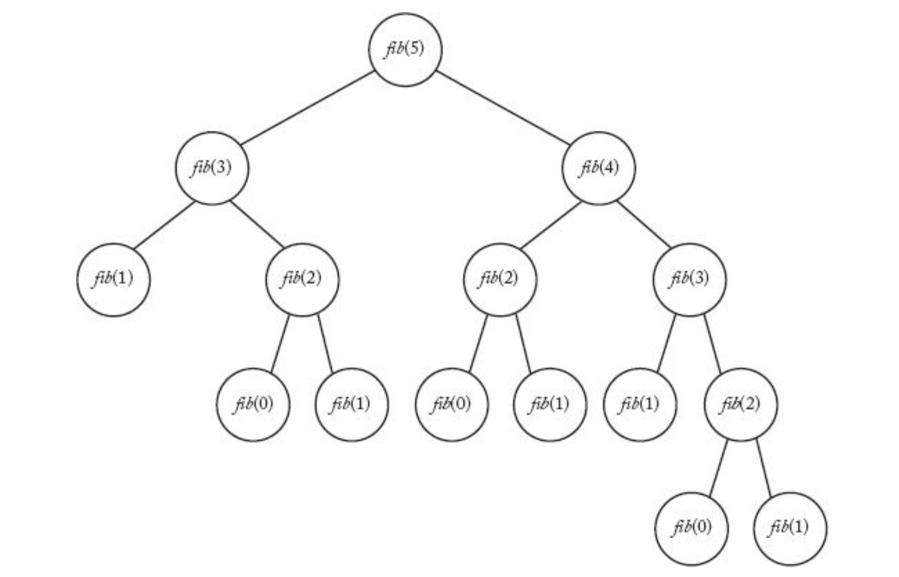
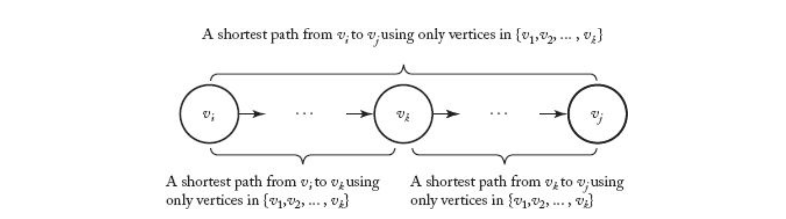
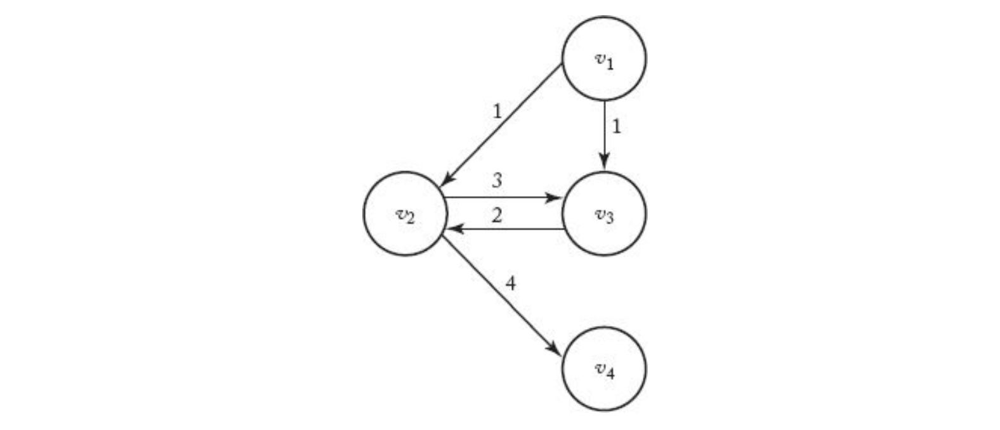

> _Dynamic Programming_

_⌜Foundation of Algorithms의 3장 Dynamic Programming에 관해 정리하고자 한 글입니다._

<!-- thumbnail -->

<br>

<details open>
   <summary>RoadMap</summary>

1. Algorithms; Efficiency, Analysis, and Order
2. Divide-and-Conquer
3. `Dynamic Programming`
4. Greedy
5. Backtracking
6. Branch-and-Bound
7. Sorting
8. Searching
9. NP

   </details>

<br>

---

# Ch3. Dynamic Programming

본 장에서는 Dynamic Programming(동적 계획법, DP) 알고리즘에 대해 소개한다.

## Dynamic Programming

> _...However, in this approach we solve small instances first, `store` the results, and later, whenever we need a result, look it up instead of recomputing it....._

Dynamic Programming 알고리즘은 divide-and-conquer 알고리즘과 유사하게 instance를 더 작은 instance들로 나누어서 problem을 해결하는 알고리즘이다.  
하지만, DP에서는 divide-and-conquer와 다르게 작은 instance를 해결하고 solution을 `저장`한 다음 나중에 그 결과가 필요할 때 마다 다시 계산하는 대신 **저장한 결과를 조회**한다.

<br>

1. problem의 instance에 대해 solution을 구할 수 있는 recursive한 property를 설정한다.

2) 그 property로 작은 problem부터 해결하며 bottom-up으로 problem을 해결한다.
   > 저장되어있는 작은 problem에 대한 solution을 이용한다.

<br>

DP 알고리즘은 `bottom-up` approach (상향식 접근법)이다.  
top-level의 solution은 array의 아래의 값(solution)을 가지고 위로 `올라가`면서 solution을 구성한다.

<br>

---

Dynamic programming의 이름은 왜 dynamic programming 일까?  
이 용어는 1940년대 리처드 벨만 (벨만-포드 알고리즘의 그 벨만이다) 이 사용한 용어이다. 다음은 그의 자서전에서 발췌한 문단이다.

> _나는 RAND 코퍼레이션에서 1950년의 가을을 보냈다. 여기에서 내게 주어진 첫 과제는 다단계(multistage) 의사 결정 프로세스에 대해 적절한 용어를 명명하는 것이었다. '동적 계획법'이라는 이름이 어디에서 왔는지 궁금하지 않은가? 1950년대는 내가 수학에 대해 연구하기에는 좋지 못한 시기였다. 우리는 그 때 워싱턴에서 윌슨이라는 사람과 함께 일하고 있었다. 윌슨은 연구라는 것에 대해 굉장히 병적인 공포를 가지고 있었다. 사람들이 그 앞에서 연구에 대해 이야기를 꺼내면 그는 완전히 미치다시피 했다. 그러나 불행히도 RAND는 공군 소속의 회사였고, 윌슨은 그 공군의 간부인 국방 위원장이었다. 그래서 내가 RAND 안에 있었을 때 윌슨을 비롯한 공군들이 내가 수학에 대해 연구하는 것을 보이지 않게 막는다는 것을 알 수 있었다. 처음 올 때는 나는 위의 문제에 대해 '의사 결정 프로세스'라는 이름을 사용했지만, 여기에서 '프로세스(Process)'라는 단어를 사용하는데 여러가지 차질이 생겨버리고 만 것이다. 그래서 나는 사람들이 알지 못하게 '계획법(Programming)'이라는 단어를 붙였다. 또한 나는 이 프로세스가 다단계로 이루어져 있으며, 시가변적(time-varing)이며, '동적(Dynamic)'이다라는 개념(idea)이 전달되길 원했다. 이 단어야말로 내가 연구하는 알고리즘의 성질을 정확하게 짚어내었고, 게다가 윌슨에게도 피해를 입히지 않으며 공군도 이 단어에선 꼬투리를 잡지 못했으니 그야말로 일석이조의 효과를 누린 것이다._

즉, Dynamic 이라는 용어는 DP 알고리즘의 시-가변적(time-varing)이고 동적(dynamic)인 개념을 나타내도록 채택한 용어이고,  
Programming 이라는 용어는 우리가 흔히 말하는 프로그래밍을 뜻하는 것이 아닌 계획법 이라는 의미로, 당시 Process라는 용어를 사용할 수 없게 되자 차용한 용어이다.. programming이라는 용어는 최적의 해를 찾는 연구 분야에서 최적의 프로그램을 찾아낸다-는 의미로 사용된다.

<br>

---

본격적으로 몇개의 대표적인 알고리즘을 예시로 들어 살펴보자.

## Fibonacci

> 피보나치 수

DP 알고리즘을 소개하기 위한 첫번째 알고리즘으로 피보나치 수를 구하는 알고리즘을 살펴보자.

피보나치 수열은 다음과 같다.

$$
  \begin{aligned}
    &f_0 = 0\\
    &f_1 = 1\\
    &f_n = f_{n-1} + f_{n-2} \quad \quad \text{for} \quad 2 \leq n\\
  \end{aligned}
$$

<br>

다음은 재귀적으로 구현한 n번째 피보나치 수를 구하는 알고리즘이다.

```py
def fibonacci(n: int):
  if n <= 1:
    return n
  else
    return fibonacci(n-1) + fibonacci(n-2)
```

위와 같은 알고리즘은 이해하기 매우 쉽고 깔끔하게 표현되지만, 매우 비효율적이다.  
다음은 5번째 피보나치 수를 위 알고리즘으로 구할 때 호출되는 재귀 트리를 보여준다.



그림에서 볼 수 있듯이, 중복된 계산을 매우 많이 하게 된다.  
5번째의 피보나치수를 구하는데만해도 2번째 피보나치수(fib(2))는 3번이나 계산해야 한다. 만약 더 큰 수의 피보나치 수를 계산한다면 이러한 중복 계산은 폭발적으로 많아지게 된다.

다음은 위 알고리즘의 time complexity 계산이다.

$$
  \begin{aligned}
    T(0) &= 1\\
    T(1) &= 1\\
    T(n) &= T(n-1) + T(n-2) + 1 \quad (2 \leq n) \\
         & > 2 \times T(n-2) \\
         & > 2^2 \times T(n-4) \\
         & > 2^3 \times T(n-6) \\
         & ...\\
         & > 2^{n/2} \times T(0) = 2^{n/2}\\
  \end{aligned}
$$

위와 같이, exponential 한 time-complexity를 가지는 것을 볼 수 있다.

---

다음은 dp를 활용해 iterative하게 구현한 n번째 fibonacci 수를 구하는 알고리즘이다.

```py
def fibonacci(n: int):
  s = [1, 1]

  if 1 < n:
    for i in range(2, n+1)
      fibo = s[i-2] + s[i-1]
      s.append(fibo)

  return s[n]
```

위 알고리즘은 n번째 피보나치 수를 계산하기 위해 정확히 n+1개 항(0 포함)의 모든 항을 한 번씩만 계산한다.  
즉, T(n) = n+1 이라고 할 수 있다.

---

<br>

두 알고리즘을 비교하면, 한 항을 1ns(10^-9초) 안에 계산 할 수 있다고 가정하고 120번째의 피보나치 수를 계산할 때  
첫 번째 $$2^{n/2}$$의 time-complexity 알고리즘은 36년의 시간이 걸린다.  
그에 비해 두 번째 $$n+1$$의 time-complexity 알고리즘은 121나노초만의 시간이 걸린다.

메모리에 값을 저장해가며 중복된 계산을 피하는 알고리즘으로 시간을 획기적으로 줄일 수 있음을 보여준다.

## Floyd-Warshall Algorithm

> 플로이드-와셜 알고리즘

### Shortest Path Problem

그래프에서 **한 꼭짓점에서 다른 꼭짓점까지의 최단 경로**(가중치의 합, 가중치가 없는 그래프에서는 꼭짓점의 개수)를 구하는 문제를 `Shortest Path Problem(최단 경로 문제)`이라고 한다.


예를 들어, 위와 같은 그래프에서 v1에서 v3로 가는 경로는

- [v1 -> v2 -> v3],
- [v1 -> v4 -> v3],
- [v1 -> v2 -> v4 -> v3]

3가지가 있다.
간선들의 가중치의 합은 두 번째 [v1 -> v4 -> v3] 가 가장 작으므로, 이 경로를 **최단 경로(shortest path)**라고 한다.

### Optimization Problem

최단 경로 문제는 `최적화 문제(Optization Problem)`이다.  
최적화 문제에는

- instance마다 둘 이상의 **후보 solution**들이 있으며,
- 각 후보 solution에는 **관련된 값**이 있고,
- instance의 solution은 후보 중 **최적의(optimal) 값**을 갖는 solution이다.

예를 들어 위 최단 경로 문제의 경우,

- 후보 solution은 instance로 주어진 꼭짓점에서 꼭짓점 사이의 이어질 수 있는 경로들이고,
- 각 후보 solution에 관련된 값은 경로의 길이이며,
- 최적의 solution은 이 경로들 중 최솟값이다.

### Brute Force Algorithm

이 문제를 해결하는데 가장 명백한 알고리즘은, instance로 주어진 꼭짓점들 사이의 **모든 경로를 구하고**, 그 중 최솟값을 구하는 Brute-Force 알고리즘일 것이다.

하지만 이러한 방법은 exponential-time보다 더 나쁜 time-complexity를 가진다.

예를 들어서, 모든 꼭짓점으로부터 다른 모든 꼭짓점으로 모서리가 연결된 그래프라고 가정하자.  
한 꼭짓점 $$v_x$$에서 다른 꼭짓점$$vy$$로 가는 모든 경로를 구하려면

- $$v_x$$에서 출발하여 도착할 수 있는 모든 꼭짓점의 수는 $$n-2$$개
- 그 중 하나를 선택하면, 그 다음 도착할 수 있는 꼭짓점의 수는 $$n-3$$개

  > simple path만을 고려하기 때문에, 그 전 꼭짓점은 선택하지 않는다.

  ...

- 따라서 선택할 수 있는 모든 경로의 수는 다음과 같다.

$$
  \begin{aligned}
   (n-2) \times (n-3) \times ... \times 1 = (n-2)!
  \end{aligned}
$$

팩토리얼의 time-complexity는 exponential time-complexity보다도 더 나쁘다.  
따라서 우리는 Brute Force가 아닌 더 효율적인 알고리즘을 고려해야 한다.

### Floyd-Warshall Algorithm

DP를 사용해서 해당 문제에 대해 cubic-time 알고리즘을 만들 수 있다.

#### Adjacency matrix

먼저 N개의 꼭짓점을 가지는 가중 그래프를 다음과 같이 $$n\times n$$ 행렬 $$W$$로 나타낼 수 있다.  
이러한 행렬은 그래프의 `인접 행렬(adjacency matrix)`이라고 한다.

$$
  W[i][j] =
  \begin{cases}
    \text{간선의 가중치} & \quad v_i \text{에서} v_j\text{로 가는 간선이 있을 경우} \\
    \infty & \quad v_i \text{에서} v_j\text{로 가는 간선이 없을 경우} \\
    0 & \quad \text{i=j}
  \end{cases}
$$

예를 들어, 위의 그래프는 다음과 같은 인접 행렬로 표현된다.

$$
\begin{array}{c|c}
  W[i][j] & 1 & 2 & 3 & 4 & 5 \\
  \hline
  1 & 0 & 1 & \infty & 1 & 5 \\
  2 & 9 & 0 & 3 & 2 & \infty \\
  3 & \infty & \infty & 0 & 4 & \infty \\
  4 & \infty & \infty & 2 & 0 & 3 \\
  5 & 3 & \infty & \infty & \infty & 0 \\
 \end{array}
$$

#### Shortest path matrix

그리고 우리가 구하고 싶은, `간선들 사이의 최단 경로를 나타내는 행렬`을 표현해보자.

예를 들어, 위의 그래프는 다음과 같은 **간선들간 최단 경로를 나타내는 행렬 D** 을 가진다.

$$
\begin{array}{c|c}
  D[i][j] & 1 & 2 & 3 & 4 & 5 \\
  \hline
  1 & 0 & 1 & 3 & 1 & 4 \\
  2 & 8 & 0 & 3 & 2 & 5 \\
  3 & 10 & 11 & 0 & 4 & 7 \\
  4 & 6 & 7 & 2 & 0 & 3 \\
  5 & 3 & 4 & 6 & 4 & 0 \\
 \end{array}
$$

> ex) v1에서 v3로 가는 최단경로는 [v1 -> v4 -> v3]이므로, D[1][3] = W[1][4] + W[4][3] = 1 + 2 = 3 이다.

만약 우리가 가진 **인접 행렬 W로부터 최단 경로를 나타내는 행렬 D를 얻을 수 있다면**,  
이는 곧 그래프로부터 모든 노드 간 최단 경로를 구할 수 있게 되었음을 의미하고,  
이는 Shortest Path 문제를 풀었다고 할 수 있을 것이다.

<br>

$$D^{(k)} \quad ( 0 \leq k \leq n)$$ 를 $$v_1$$에서 $$v_k$$까지의 정점만을 거쳐서 만들 수 있는 최단 경로 행렬 $$D$$라고 정의하자.

$$D^{(0)}$$은 다른 정점을 거치지 않고 가는 최단 경로이기 때문에 $$v_i$$에서 $$v_j$$로 가는 모서리의 가중치, 즉 배열 $$W$$라고 할 수 있다.  
$$D^{(n)}$$은 다른 모든 정점을 거칠 수 있는 경로이기 때문에 그 자체로 최단 경로(Shortest Path), 즉 배열 $$D$$라고 할 수 있다.

$$
  \begin{aligned}
   D^{(0)} = W \quad \quad \text{and} \quad \quad D^{(n)} = D
  \end{aligned}
$$

<br>

만약 $$D^{(k-1)}$$ 로부터 $$D^{(k)}$$ 를 만들 수 있다면, 다음과 같은 재귀적인 방법으로 $$D^{(0)}$$으로부터 $$D^{(n)}$$을 만들 수 있고,

$$
  \begin{aligned}
   D^{(0)} \rightarrow D^{(1)} \rightarrow D^{(2)} \rightarrow ... \rightarrow D^{(n)}
  \end{aligned}
$$

<br>

이는 곧 $$W$$로 부터 $$D$$를 만들 수 있음을 의미한다.

#### Floyd-Warshall Algorithm

이제 $$D^{(k-1)}$$으로부터 $$D^{(k)}$$를 구하는 재귀적인 방법을 알아보자.

<br>

두 가지의 경우가 있다.

1. {$$v_1$$ ~ $$v_k$$} 에 속한 정점들 만을 가지고 $$v_i$$에서 $$v_j$$로 가는 최단경로가 정점 $$v_k$$를 **거치지 않을 경우**:

$$
  \begin{aligned}
   D^{(k)}[i][j] = D^{(k-1)}[i][j]
  \end{aligned}
$$

정점 $$v_k$$를 거치지 않기 때문에 $$v_k$$가 고려되지 않은 $$D^{(k-1)}$$과 최단경로가 같다.

<br>

2. {$$v_1$$ ~ $$v_k$$} 에 속한 정점들 만을 가지고 $$v_i$$에서 $$v_j$$로 가는 최단경로가 정점 $$v_k$$를 **거쳐가는 경우**:

$$
  \begin{aligned}
   D^{(k)}[i][j] = D^{(k-1)}[i][k] + D^{(k-1)}[k][j]
  \end{aligned}
$$



그림을 보자, $$v_k$$를 거쳐가는 경우 $$v_i$$부터 $$v_j$$를 가는 경우의 최단경로(즉, $$D^{(k)}[i][j]$$)는  
$$v_i$$에서 $$v_k$$를 찍고, $$v_k$$에서 $$v_j$$를 가는 경로이기 때문에 그 길이는 $$D^{(k-1)}[i][k] + D^{(k-1)}[k][j]$$ 이다.

<br>

두 경우를 모두 고려해야 하는데 반해 어떤 경우가 더 짧은 경로를 나타낼지 알 수 없기 때문에,  
$$D^{(k)}[i][j]$$의 값은 두 경우의 값을 모두 구한 뒤 둘 중 작은 값이다.

$$
  \begin{aligned}
   D^{(k)}[i][j] = \text{minimum} ( D^{(k-1)}[i][j], \quad D^{(k-1)}[i][k] + D^{(k-1)}[k][j])
  \end{aligned}
$$

<br>
<br>

$$D^{(k-1)}$$ 를 통해 $$D^{(k)}[i][j]$$ 를 구하는 재귀적인 방법을 알아보았다.

다음은 위의 재귀적인 방법을 통해, $$W$$로부터 $$D$$를 구하는 알고리즘이다.

> 플로이드(Robert W Floyd)가 1962년 발표했다. 버나드 로이가 1959년 발표한 알고리즘과 스티븐 워셜이 1962년 발표한 알고리즘과 유사해 플로이드-워셜 알고리즘, 플로이드 알고리즘, 로이-워셜 알고리즘, 로이-플로이드 알고리즘 등으로 알려져 있다. [출처](https://ko.wikipedia.org/wiki/플로이드-워셜_알고리즘)

```py
def floyd_warshall(W: list):
  D = W

  for k in range(len(W)): #경유지
    for i in range(len(W)): #출발
      for j in range(len(W)): #도착
        D[i][j] = min(D[i][j], D[i][k] + D[k][j]) #경유지를 경유하고 가는 것 vs 경유하지 않고 가는 것

  return D
```

첫번째 k loop가 도는 동안 k열과 k행의 값은 변하지 않기 때문에 배열 D 하나만 사용해서 알고리즘을 구성할 수 있다.

> Floyd-Warshall Algorithm

### Anallyze

플로이드-와셜 알고리즘의 `time-complexity`를 분석해보자.

input에 관계 없이 **input size** $$n$$ (len($$w$$) = 배열 $$W$$의 길이 = 그래프의 정점의 개수 ) 에만 영향을 받기 때문에 **every-time** complexity를 가진다.

알고리즘에서 총 3번의 반복문을 input size $$n$$만큼 돌기 때문에

$$
  \begin{aligned}
    T(n) = n \times n \times n = n^3 \in \Theta (n^3)
  \end{aligned}
$$

cubic-time complexity를 가진다.

### Printing Shortest Path

위 알고리즘을 조금 수정해 `최단 경로를 출력`하는 함수를 구현한다.

$$P$$를 **두 정점 사이에 거쳐간 정점 중 가장 큰 인덱스**를 나타내는 행렬이라고 하자.  
즉,

$$
  P[i][j] =
  \begin{cases}
    k & \quad v_i \text{부터} v_j \text{까지의 최단경로에 사용된 정점 중 인덱스가 가장 큰 값이 k} \\
    0 & \quad v_i \text{부터} v_j \text{까지의 최단경로에 사용된 정점이 없는 경우}  \\
  \end{cases}
$$

이다.

```py
def floyd_warshall(W: list):
  D = W
  P = len(W) x len(W) array fill with False

  for k in range(len(W)):
    for i in range(len(W)):
      for j in range(len(W)):
        if D[i][k] + D[k][j] < D[i][j]:
          P[i][j] = k
          D[i][j] = D[i][k] + D[k][i]

  return D, P
```

와 같이 알고리즘을 살짝 변형해 배열 $$P$$를 만들 수 있다.  
배열 $$P$$를 다음과 같은 함수로 출력한다.

```py
def path(P: list, i: int, j: int):
  if P[i][j] != False:
    v = P[i][j]

    path(P, i, v)
    print(v)
    path(P, v, j)
```

이 알고리즘의 time-complexity는

$$
  \begin{aligned}
    W(n) \in \Theta (n)
  \end{aligned}
$$

이다.

<br>

## Optimization Problem

> 최적의 원칙

DP 알고리즘의 개발 단계는 다음과 같다.

1. Problem의 instance에 최적의 solution을 제공하는 recursive한 property를 설정한다.

2. 상향식(bottom-up)으로 최적의 solution을 계산한다.

3. 상향식(bottom-up)으로 최적의 solution을 구축한다.

### Principle of Optimality

어떤 최적화 문제도 DP를 사용해서 풀 수 있을것처럼 보이지만, 그렇지 않다.

다음과 같은 `최적의 원칙 (Principle of Optimaility)`이 그 problem에 적용되어야 한다.

```txt
Problem의 어떠한 instance에 대한 최적의 solution이
그 instance의 모든 부분 instance들에 대한 최적의 solution을 포함한다면,
그 problem은 최적의 원칙이 적용된다.
```

이렇게 최적의 원칙이 적용되는 problem은 DP로 해결할 수 있다.

<br>

예를 들어보자.

최단 경로 문제에서  
$$v_k$$가 $$v_i$$에서 $$v_i$$로 가는 최단 경로에 포함된 정점이라면,  
$$v_i$$에서 $$v_k$$까지의 경로와 $$v_k$$에서 $$v_i$$까지의 경로도 최적의 solution이여야 한다는 것을 보았다.

따라서 처음 instance의 최적 solution인 $$D[i][j]$$은 하위 instance들의 최적 solution인 $$D[i][k]$$와 $$D[k][j]$$를 포함하고, 이는 `최적성의 원칙`이 적용된다.

하지만 다음과 같은 예제를 보자



위 그래프에서 두 간선간 **최장**경로를 구하는 문제에 대해 생각해보자.

$$v_1$$에서 $$v_4$$로의 최장 경로는 [$$v1, v3, v2, v4$$]이다.  
그러나 이 경로의 부분 경로인 $$v_1$$에서의 $$v_3$$의 최장 경로는 [$$v_1, v_3$$] 가 아닌 [$$v_1, v_2, v_3$$]이다.

따라서 이 문제에 대해서는 `최적의 원칙`이 적용되지 않는다.

## LCS, LIS

## more...

0-1 Knapsack Problem  
Bellman-Ford Algorithm  
chain matrix multiplication  
sum of subset problem  
optimal binary search tree  
travelling sales person problem
