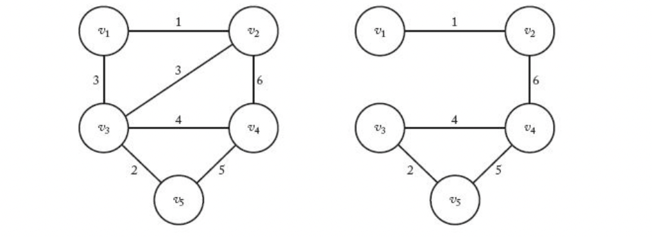
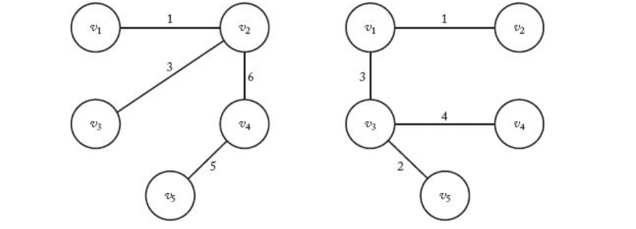
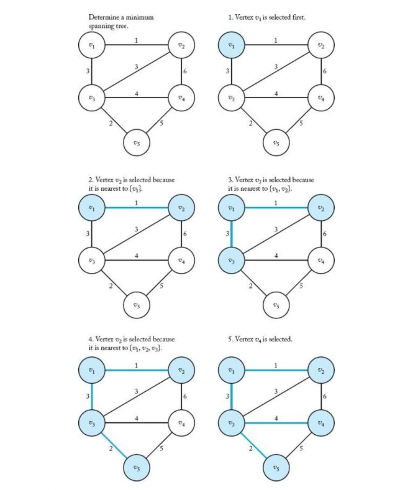
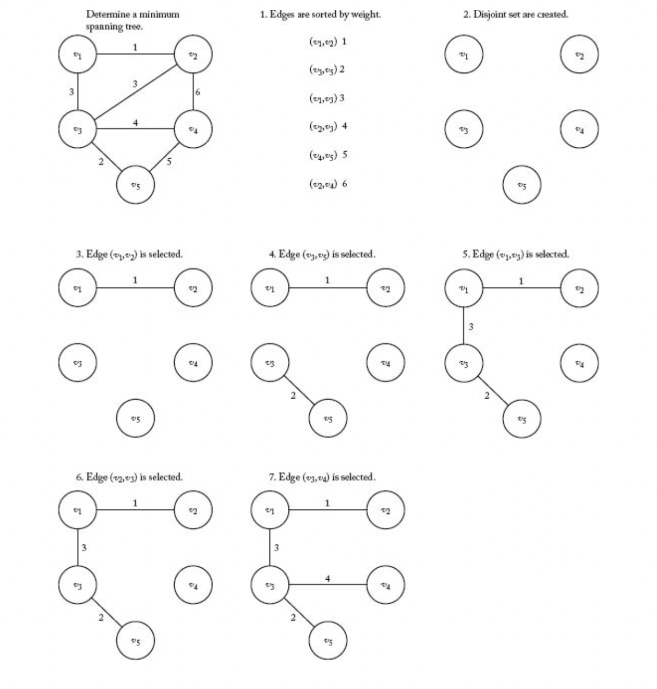

> _Greedy_

_⌜Foundations of Algorithms의 4장 Greedy Approach에 관해 정리하고자 한 글입니다._

<!-- thumbnail -->

<br>

<details>
   <summary>💡RoadMap</summary>

1. [Algorithms; Efficiency, Analysis, and Order](https://41312432.netlify.app/algorithm/algorithm1/)
2. [Divide-and-Conquer](https://41312432.netlify.app/algorithm/algorithm2/)
3. [Dynamic Programming](https://41312432.netlify.app/algorithm/algorithm3/)
4. `Greedy`
5. [Backtracking](https://41312432.netlify.app/algorithm/algorithm5/)
6. [Branch-and-Bound](https://41312432.netlify.app/algorithm/algorithm6/)
7. Sorting
8. Searching
9. NP

   </details>

<br>

---

# Ch4. The Greedy Approach

본 장에서는 Greedy Approach(탐욕법, 탐욕 알고리즘..) 에 대해 소개한다.

## Greedy

> _...A greedy algorithm proceeds in the same way as Scrooge did. That is, it grabs data items in sequence, each time taking the one that is deemed `“best”` according to some criterion, without regard for the choices it has made before or will make in the future. One should not get the impression that there is something wrong with greedy algorithms because of the negative connotations of Scrooge and the word `“greedy.”` They often lead to very efficient and simple solutions..._

Greedy 알고리즘은 이전에 했거나 미래에 할 선택과 관계없이 `매 순간 특정한 기준에 따라 최고, 최선이라고 여겨지는 데이터를 선택`하는 방법이다.

Greedy 알고리즘은 DP처럼 **최적화 문제**를 해결하기 위해 자주 사용된다.

DP에서는 Recursive Property를 사용해 instance를 더 작은 instance들로 나누어 문제를 해결한다.  
Greedy에서는 instance를 잘게 나누지 않는다.  
Greedy에서는 단순히 매 순간 최선의 선택들을 함으로써 solution에 도달한다.  
즉, 각각의 선택들은 **국소적으로 최적**이다(locally optimal)

우리는 전체 최적화 문제에 대해 전역적으로 최적의 해(globally optimal)을 얻고 싶지만, **Greedy에서 국소적으로 선택한 최적의 해가 전체적으로 최적의 해를 항상 보장하지는 않는다.**

따라서, Greedy 알고리즘으로 최적화 문제를 해결할 때는 solution이 **최적의 해인지 항상 검증**해야 한다.

<br>

알고리즘의 일련의 과정을 나열하면 다음과 같다.

0. 공집합(set)에서 시작한다.

1. **선택 (Selection Procedure)**  
   집합에 추가할 item을 현재 최적의 조건을 만족하는 greedy한 기준에 따라 선택한다.

1. **타당성 검사(Feasibility Check)**  
   instance에 대해 새로운 집합으로 구성된 solution이 적용 가능한지를 검사해 선택된 item이 추가된 새로운 집합의 타당성을 판단한다.

1. **해답 검사(Solution Check)**  
   새로운 집합이 problem에 대한 solution인지 판단한다.  
   solution을 얻을 때 까지 1~3 과정을 반복한다.

## Coin Change Algorithm

> 거스름돈 문제

간단한 문제 하나를 살펴보자.

36센트의 동전을 거슬러주어야 한다. **최대한 적은 갯수의 동전만을 사용**하여 거스름돈을 거슬러주는 방법은 무엇일까??

미국에는 다음과 같은 동전의 종류가 있다.

- 1 penny = 1 cent
- 1 nickel = 5 cents
- 1 dime = 10 cents
- 1 quater = 25 cents
- 1 half dollar = 50cents

위의 동전들로 36센트의 거스름돈을 Greedy 알고리즘을 통해 만들어보자 (동전별로 수량은 충분히 많다고 가정)

greedy 알고리즘으로 구현하려면, 전에 어떤 동전을 선택했든지, 앞으로 어떤 동전을 선택할지에 관계 없이  
**현재 남은 거슬러주어야 하는 금액**을 기준으로 **줄 수 있는 최대**의 동전을 주면 된다.

ex)

1. 거스름돈 36센트:  
   -> 36센트보다 낮은 금액의 동전 종류 중 가장 큰 25센트 선택

2. 거스름돈 11센트:  
   -> 11센트보다 낮은 금액의 동전 종류 중 가장 큰 10센트 선택

3. 거스름돈 1센트:  
   -> 1센트보다 낮은 금액의 동전 종류 중 가장 큰 1센트 선택

총 25센트 동전 하나, 11센트 동전 하나, 1센트 동전 하나 총 3개의 동전을 사용하여 36센트를 거슬러주었다.

이를 다음과 같은 알고리즘으로 표현할 수 있다.

```py
while not solved:
    coin = pick(max(remaining coins)) # selection procedure

    if adding coin makes the change exceed the amount owed: # feasibility check
        reject coin
    else:
        change.append(coin)

    if sum(change) == amount owed:  # solution check
        solved
```

이 알고리즘이 바로 greedy 알고리즘이다.  
알고리즘을 살펴보면, selection procedure에서 항상 `탐욕스럽게(greedy)` 제일 큰 동전을 선택한다.

<br>

선택을 재고할 기회따윈 없다.  
selction procedure에서 선택된 아이템이 feasibility check를 통과하면, 그 아이템은 영구적으로 solution에 포함되고  
feasibility check에서 한번 거부되면, 그 아이템은 영구적으로 solution에서 제외된다.

### Conditions for Optimal solution

Greedy 알고리즘은 매우 직관적이고 간단하지만 **항상 최적의 solution을 보장해주지는 않는다.**

만약 동전의 종류 중 12센트짜리 동전도 있었다고 가정해보자. 이번에는 16원의 거스름돈을 만들어야 한다.

만약 위 greedy 알고리즘으로 문제를 해결한다면, 다음과 같은 단계를 밟는다.

1. 거스름돈 16센트:  
   -> 16센트보다 낮은 금액의 동전 종류 중 가장 큰 12센트 선택

2. 거스름돈 4센트:  
   -> 4센트보다 낮은 금액의 동전 종류 중 가장 큰 1센트 선택  
   ... 4번 반복

총 12센트 동전 1개, 1센트 동전 4개로 16센트를 만들 것이다.

하지만 최적의 해는 10센트 동전 1개, 5센트 동전 1개, 1센트 동전 1개로 총 3개의 동전만으로 구성하는 것이다.

이처럼 greedy 알고리즘은 **항상 최적의 해를 보장하지는 않는다.**

<br>

Greedy 알고리즘이 최적의 해를 보장할 수 있는 좋은 **조건**은 다음과 같다.

- `greedy choice property`

  앞에 한 선택이 이후의 선택에 영향을 주지 않아야 한다.

- `optimal structure`

  최적의 원칙, DP에서도 살펴봤듯이 problem에 대한 최적 solution이 부분 problem에 대해서도 최적 solution 이여야 한다.

---

## Minimum Spanning Tree

> 최소비용 신장트리

### Spanning Tree

#### Tree

다음과 같은 조건을 만족하는 그래프를 `트리(tree)` 라고 한다.

- **무향(undirected)**  
  간선(edge)에 방향이 존재하지 않는다.

* **연결(connected)**  
  모든 정점간 경로(path)가 존재해야 한다.

* **비순환(acyclic)**  
  단순 순환 경로(simple cycle)가 없어야 한다.

  - **단순 순환 경로(simple cycle)**  
    어떤 정점에서 출발하여 다시 그 정점으로 돌아오는 경로에 서로 다른 3개 이상의 정점이 있고, 경로상의 모든 정점이 서로 다른 경로

사이클이 없는 연결된 무향그래프 (acyclic connected undirected graph)를 트리(free tree를 의미함)라고 한다.



<br>

한 정점이 root로 지정된 tree를 rooted tree라고 하는데, 일반적으로는 이것을 tree라고 한다.

#### Spanning Tree

그래프가 주어졌을때, 그 그래프의 **모든 정점은 포함**하면서 **간선을 일부 제거**하여 만들 수 있는 트리들을 `spanning tree(신장 트리)`라고 한다.



### Minimum Spanning Tree

> MST

그래프의 spanning tree중에서 **모든 간선의 가중치의 합이 최소**가 되도록 하는 tree를 `Minimum Spanning Tree(MST, 최소 신장 트리)라고 한다.`

<br>

MST는 여러 분야에서 활용될 수 있을 것이다.  
예를 들어, 도시끼리 모두 연결되게 하면서 도로의 길이가 최소가 되도록 도시를 설계하거나, 통신선의 길이가 최소가 되도록 케이블 망을 구성하는 문제 등 네트워크 디자인과 같은 분야 등에서 활용할 수 있다.

<br>

이제 그래프가 주어졌을 때, MST를 구하는 알고리즘에 대해 생각해보자.

만약 Brute-Force 방법으로 모든 spanning tree를 구하고 비용이 최소인 tree를 선택한다면, 최악의 경우 지수시간보다 나쁘다.  
따라서 더 효율적인 알고리즘을 생각해야 한다.

### Prim's Algorithm

`프림 알고리즘`은 그래프 $$G = (V, E)$$ 가 주어졌을 때, (V = Vertices, E = Edges)

정점을 넣는 집합 $$Y = \{v_1\}, \quad Y \subseteq V$$  
간선을 넣는 집합 $$F = \emptyset , \quad F \subseteq E$$

로 초기화하고 시작한다.  
이 때 $$Y$$에 넣고 시작하는 $$v_1$$는 임의로 정해진 정점이다.

<br>

알고리즘은 다음과 같다:

1. 매 순간 주어진 $$V - Y$$의 정점 중에서 가장 최소거리인 정점을 선택한다. (Greedy)
2. 그 정점을 $$Y$$에 추가하고, 그 정점을 선택하는데 사용된 간선을 $$E$$에 넣는다.

   $$Y == V$$일 때까지 반복한다.

> Pseudo code

```py
Y = {v1}
F = {}

while True:
    v, e = select in V-Y and E that is nearest to Y #Selection procedure & Feasibility check

    Y.append(v)
    F.append(e)

    if Y == V:  #Solution check
        break
```

<br>

$$V - Y$$에서 새로운 정점을 취하면 cycle이 생성되지 않기 때문에 Selection Procedure 단계에서 Feasibility check가 같이 이루어진다.

다음은 위 알고리즘을 적용한 예시를 순차적으로 나타낸 그림이다.


#### Optimal solution

$$V == Y$$일때 종료되고, 모든 정점들이 연결되었으며, cycle이 존재하지 않기 때문에 알고리즘이 spanning tree를 생성하는것은 확실하다.

하지만 이것이 **minimum** spanning tree. 즉, 최적의 해 인지는 어떻게 확신할 수 있을까?

##### Promissing

무향 그래프 $$G = (V, E)$$가 주어졌다고 하자. $$E$$의 부분집합 $$F$$에 간선을 추가해 spanning tree를 만들 수 있으면, $$F$$는 `유망하다(promising)` 라고 한다.

이제 반복문에서 간선 $$e$$를 추가한 집합 $$F$$가 항상 promising인것을 증명하면 된다.

- $$F$$가 promising하면, MST인 $$(V, F')$$에 대해서 $$F \subseteq F'$$이다.
- 반복문에서 $$e$$가 $$F'$$의 원소라면 $$F \cup \{e\}$$도 당연히 $$F'$$에 속한다.

  - 반면 만약 $$e$$가 $$F'$$의 원소가 아닌것을 골랐다면, (if $$ e \notin F'$$)
  - $$F' \cup \{e\}$$는 MST의 간선들인 $$F'$$에 추가적인 간선이 있는 것이므로 cycle이 필연적으로 생긴다.
  - 이 cycle은 현재 정점들의 집합 $$Y$$와 $$V-Y$$ 사이를 연결하며 생긴 cycle이다.
  - 그렇다면 $$F'$$에는 그룹간을 연결하는 $$e$$대신에
  - 원래 MST를 구성하는 $$Y$$의 정점과 $$V-Y$$의 정점 사이의 간선 $$e'$$이 있을 것이다. ($$e' \in F'$$)
  - $$e$$는 최소의 간선을 선택한 것이므로 $$e'$$보다 작거나 같다.
  - 그렇다면 $$[F' \cup \{e\}] - \{e'\}$$ 이 MST일 것이다.
  - 그 말은, $$F \cup \{e\}$$가 $$[F' \cup \{e\}] - \{e'\}$$에 속해야한다.
  - > 잘 생각해보면, 그 경우는 $$e$$와 $$e'$$의 크기가 같은 경우라는것을 알 수 있다.

- 그러므로 $$F \cup \{e\}$$ 역시 promising하다.
- 귀납법에 의해, 반복문의 최종 단계를 포함한 모든 `F는 promising하다.`

#### Analyze

DP의 shortest path problem을 살펴보았을때와 같이 **인접행렬** $$W$$를 사용한다면,

$$V-1$$만큼의 정점만큼 돌면서  
$$V$$정점 모두까지의 $$W$$를 조사하기 때문에

$$T(V) \in \Theta(V^2)$$의 time complexity를 가진다.

### Kruskal's algorithm

`크루스칼 알고리즘`은 Tree $$G = (V, E)$$ 가 주어졌을 때, (V = Vertices, E = Edges)

$$V$$의 각 정점들만이 들어있는 subset들을 생성하고 시작한다.  
각 subset들은 그 자체로 tree 일 것이다.

그리고 $$E$$를 오름차순으로 정렬한다.
<br>

알고리즘은 다음과 같다:

1. $$E$$에서 간선을 선택한다.
2. 그 간선이 subset 사이를 연결한다면 두 subset을 하나의 set으로 병합한다.

   subset들이 $$V$$로 병합될 때까지 반복한다.

> Pseudo code

```py
Vs = disjoint subsets of V

for node in V:
   V_i.append(node)

E.sort()

> pseudo code
while True:
    e = E.pop(0) #Selection procedure

   if e connects two subsets: #feasibility check
      merge(Vs)

    if all Vs are merged  #Solution check
        break
```

다음은 위 알고리즘을 적용한 예시를 순차적으로 나타낸 그림이다.


prim 알고리즘과 비슷한 방법으로, kruskal 알고리즘 역시 항상 최적의 solution을 구할 수 있음을 증명할 수 있다.

#### Analyze

알고리즘에서 나올 수 있는 3가지의 worst case에 대해 살펴보자.

1. 간선들의 집합 $$E$$를 정렬해야 한다. 어떤 정렬 알고리즘을 택하던.
   $$W(E) \in \Theta(E\lg E)$$

2. 반복문에서 disjoint set을 조작하는데 걸리는 시간.  
   worst case의 경우 모든 간선을 조작한다.  
   disjoint set data structure를 사용하면,  
    $$W(E) \in \Theta(E\lg E)$$

3. V개의 disjoint set을 만드는데 걸리는 시간,  
   $$ T(V) \in \Theta(V)$$

그러므로 1, 2번 중 더 영향을 끼치는 최악의 경우 $$\Theta(E\lg E)$$ 시간이 걸린다.

그런데, 정점에 대한 worst case는 모든 정점이 다른 정점으로 연결되어 있는 경우이므로  
$$ E = V \times (V - 1) / 2 \in \Theta(V^2)$$ 이다.

따라서,
$$ W(V, E) \in \Theta(V^2\lg V^2) \Theta(V^2 2\lg V) = \Theta(V^2 \lg V) = \Theta(E \lg V)$$
라고 할 수 있다.

### Prim's vs Kruskal's

프림 알고리즘과 크루스칼 알고리즘을 비교해보자.

한 그래프에서 정점의 개수를 v, 간선의 개수를 e라고 하자.  
연결 그래프(connected graph)의 간선의 개수는

$$
\begin{aligned}
v - 1 \leq e \leq \frac{v(v-1)}{2} \\
\end{aligned}
$$

의 범위를 가진다.

프림 알고리즘은 $$\Theta(v^2)$$  
크루스칼 알고리즘은 $$\Theta(e \lg e)$$ 또는 $$\Theta(v^2 \lg v)$$의
time complexity를 가진다.

만약 간선의 개수 e가 하한선(v - 1) 근처의 개수를 가지는 희소 그래프(sparse graph)일 떄는  
크루스칼 알고리즘이 $$\Theta(e \lg e) = \Theta((v-1) \lg (v-1)) = \Theta(v \lg v)$$ 으로 프림 알고리즘의 $$\Theta(v^2)$$ 보다 효율적이다.

만약 간선의 개수 e가 상한선($$\frac{v(v-1)}{2}$$)근처의 개수를 가지는 밀집 그래프(dense graph)일 때는  
크루스칼 알고리즘이 $$\Theta(v^2 \lg v)$$으로 프림 알고리즘의 $$\Theta(v^2)$$ 보다 비효율적이다.

## more..

dijkstra  
scheduling  
huffman code
