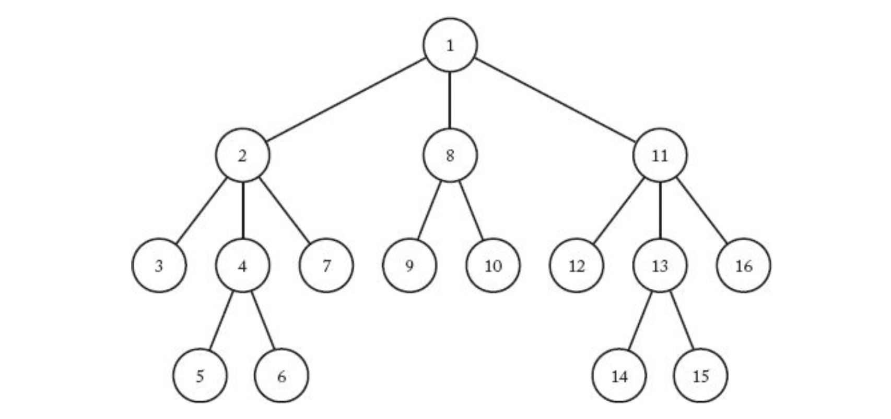
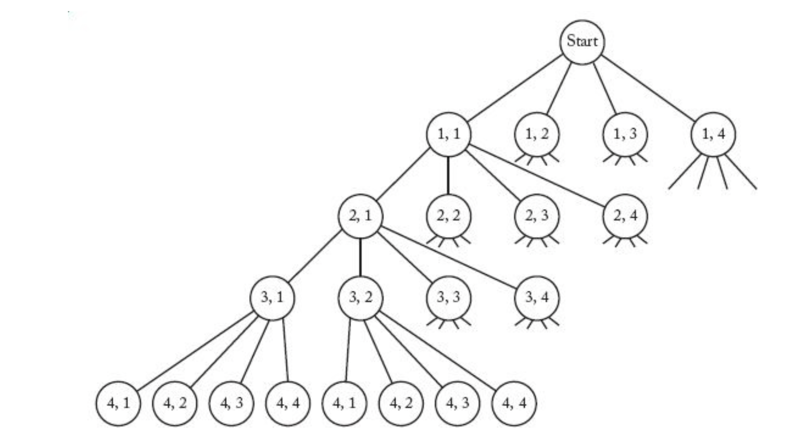

> _Backtracking_

_⌜Foundations of Algorithms의 5장 Backtracking에 관해 정리하고자 한 글입니다._

<!-- thumbnail -->

<br>

<details>
   <summary>💡RoadMap</summary>

1. Algorithms; Efficiency, Analysis, and Order
2. Divide-and-Conquer
3. Dynamic Programming
4. Greedy
5. `Backtracking`
6. Branch-and-Bound
7. Sorting
8. Searching
9. NP

   </details>

<br>

---

# Ch5. Backtracking

본 장에서는 Backtracking(되추적, 퇴각검색..)에 대해 소개한다.

## Backtracking

> _If you were trying to find your way through the well-known maze of hedges by Hampton Court Palace in England, you would have no choice but to follow a hopeless path until you reached a dead end. When that happened, you’d `go back to a fork and pursue another path`. Anyone who has ever tried solving a maze puzzle has experienced the frustration of hitting dead ends. Think how much easier it would be if there were a `sign`, positioned a short way down a path, that told you that the path led to nothing but dead ends. If the sign were positioned near the beginning of the path, the time savings could be enormous, because all forks after that sign would be eliminated from consideration. This means that not one but many dead ends would be avoided. There are no such signs in the famous maze of hedges or in most maze puzzles. However, as we shall see, they do exist in `backtracking` algorithms._

Backtracking 알고리즘은 모든 경우에 대해서 solution을 찾다가, solution이 아니면 다시 그 전의 분기점으로`되돌아가서` 다시 solution을 찾아나가는 방법이다.

### Constraint-Satisfication Problems

CSP, Constarnt-statisfication problems(제약 충족 문제)는 특정한 집합, `특정한 domain`에서 `특정 기준(조건, criterion)`을 충족시키도록 선택하는 문제이다. Backtracking 알고리즘은 CSP를 해결하는데 사용된다.

## Depth-First Search

`DFS, Depth-First Search(깊이 우선 탐색)`란 그래프(rooted graph를 말한다)가 주어졌을때, 그래프를 탐색하는 방법 중 하나이다.



Tree의 `preorder traversal(전위 순회)`가 바로 DFS이다.  
즉,

1. root를 먼저 방문한다.
2. 노드를 방문했으면 그 노드의 하위 노드를 방문한다.
3. 끝까지 방문했으면 다시 되돌아오면서 노드를 방문하고, 2를 반복한다.

위 그림의 tree는 각 노드마다 DFS로 방문했을 때의 순서가 써져있다.  
일반적으로 같은 깊이(depth)의 노드끼리는 우선순위가 없지만, 편의상 왼쪽에서 오른쪽으로 방문하였다.

> pseudo code

```py
def DFS(v):
    visit v

    for child in children of v:
        DFS(child)
```

코드에서 볼 수 있듯이, DFS는 재귀로 구현한다.

## N-Queen problem

N-Queen 문제를 예를 들어 Backtracking에 대해 알아보자.

문제는 다음과 같다.  
n x n 체스판 위에 n개의 퀸을 배치하고자 한다. n개의 퀸들은 서로의 공격 범위에 서 있을 수 없게 배치해야 한다.

### State Space tree

위 문제에 대해 체스판의 행(row, 가로줄)별로 각 행 내에서 열에 대한 선택사항을 트리의 노드로 표현해, 트리의 깊이(level, depth)는 행을 나타내고 깊이 내의 다른 노드들은 열을 나타내는 각 칸이 체스판의 한 칸을 나타내는 트리를 구성해서 후보 솔루션을(candidate solution)을 생성할 수 있다.  
루트에서부터 잎사귀(leaf)까지의 path는 후보 솔루션이다.

> 트리에서 리프는 자식이 없는 노드를 뜻한다.

이렇게 각 **특정한 기준에서 변수가 가질 수 있는 값**을 노드로 가지는 tree를 `state space tree` 라고 한다.



위 그림은 4x4 n-queen problem의 state space tree의 일부를 나타낸 것이다.

root를 depth 0 이라고 할 때, 그 밑의 노드들의 depth는 행을 나타내고 각 노드들의 2번째 인덱스는 열을 나타낸다.

> ex v(2, 1)은 2행의 1번째 열 칸에 퀸을 배치한다는 뜻이다.

### Pruning

위 트리에 무작정 preorder traversal을 적용한다면, 이것은 tree를 전부 탐색하기 떄문에 brute force와 같은 time-complexity를 가질것이다.

<br>

Backtracking 알고리즘에서는 특정 domain에서 선택한 아이템이 **CSP의 특정한 조건을 만족하지 못한다면**,  
즉, DFS에서 트리를 순회하다가 특정 node를 선택하면 **CSP의 특정한 조건을 만족하지 못하게 된다면**  
그러한 노드를 `non-promising(유망하지 않음)다고` 한다.

Backtracking은 state space tree를 DFS로 탐색하고, 탐색중에 node가 non-promising이라면 그 노드의 부모로 다시 backtracking 하는 알고리즘이다.  
따라서 Brute-Force 알고리즘보다 훨씬 일찍 가능할 수 없는 solution을 탐색하는 경우를 제할 수 있고, time-complexity를 효율적으로 가져갈 수 있다.

이렇게 non-promising인 노드를 방문 할 때 그 노드와 그 자식 노드의 탐색을 멈추고 부모 노드로 backtracking하는 과정을 `pruning(가지치기)`라고 한다.

---

Backtracking 알고리즘을 다시 정의하면:

1. State space tree를 DFS로 탐색한다.
2. 탐색 과정에서 non-promising 노드를 만나면 pruning하고 부모 노드로 backtracking한다.

<br>

다음은 backtracking의 일반적인 알고리즘을 나타낸 코드이다.

```py
def backtracking(v):
    visit v

    if is_promising(v):
        if solution:
            sol
        else:
            for child in children of v:
                backtracking(child)

```

알고리즘을 살펴보면 preorder traversal의 경우와 다르게 그 노드가 promising하지 않을떄는 그 하위 노드는 탐색을 하지 않음을 알 수 있다.

### N-Queen problem

다시 n-queen problem으로 돌아와서, backtracking을 통해 문제를 해결하는 알고리즘을 생각해보자.

CSP에서  
**domain**은 1~n의 row이다.  
**criterion**은 퀸들이 서로 공격하지 않는것. 즉, 두 개의 퀸이 하나의 행, 열, 대각선에 위치하지 않는것이다.

DFS에서 행별로 조사하기 때문에, promising function은 행은 고려하지 않고 2개의 퀸이 같은 대각선이나 열에 없는지 조사하는 함수이다.  
같은 대각선에 존재하는지 검사하는 방법은, 그 칸의 행과 열의 차이값의 절대값을 조사하면 된다.

코드로 표현하면 다음과 같다.

```py
def backtracking(row):
    if promising(row):
        if row == n:
            return
        else:
            for column in range(n):
                col[row+1] = column
                backtracking(row+1)

def promising(row):
    k = 1
    flag = True

    while k < row and flag:
        if col[row] == col[k] or abs(col[row] - col[k]) == row-k:
            flag == True
        k++

    return flag
```

### analyze

이 알고리즘을 분석하기 위해, 일단 퀸의 개수 n에 대해서 state space tree의 노드 개수를 알아내야한다. (upper bound)

root depth에서 1개, 레벨 1(depth 1)에서 $$n$$개, 레벨 2에서 $$n^2$$개 ... 총

$$
  \begin{aligned}
    1 + n + n^2 + ... + n^n = \frac{n^{n+1} - 1}{n - 1}
  \end{aligned}
$$

개가 있다.

하지만 backtracking 알고리즘에서 pruning을 하기 떄문에, state space tree의 모든 노드를 탐색하지 않을 수도 있기 때문에, 경우마다 매우 다르다.

따라서 의미있는 정확한 time-comlexity를 정의내리기란 쉽지 않다.

## Monte Calro Algorithm

앞서 살펴보았다시피, backtracking algorithm에서 의미있는 time-complexity를 얻기는 쉽지 않다.

만약 같은 $$n$$값을 가지는(같은 크기의) instance 에 대해서 그 중 하나는 매우 적은 수의 노드만 검사해야 하는 반면, 다른 하나는 state space tree를 거의 전부 탐색해야 할 수도 있다.

특정 instance에 대해서 주어진 backtracking 알고리즘이 얼마나 효율적으로 그 instance를 처리할 수 있는지에 대한 **추정치**가 있다면, 해당 특정 instance에 대해 그 알고리즘을 사용하는 것이 합라적인지에 대한 여부를 결정할 수 있다.

`Monte Carlo 알고리즘`을 통해 그 추정치를 구할 수 있다.

Monte Carlo 알고리즘은 `확률론적(probabilistic) 알고리즘`이다. 그 말은, 알고리즘에서 다음 명령(instruction)이 떄때로 어떤 확률 분포에 따라(언급이 없는 한, 균등 분포) 무작위로 결정된다는것을 뜻한다.  
`결정론적(deterministic) 알고리즘`은 이것이 일어날 수 없는 알고리즘을 말한다.

Monte Carlo 알고리즘은 샘플 공간(sample space)에 정의된 랜덤 변수의 기대값을 그 공간의 랜덤 샘플의 평균값으로부터 추정한다.  
즉, 가능한 입력의 domain(샘플 공간)에서 그 도메인에 대한 확률 분포에서 랜덤한 변수를 생성하여 평균값을 구한다. 그 공간의 변수의 기대값은 그 평균값이다.  
그 추정치가 실제 기대값에 가까워지기 위해서는 랜덤한 변수 생성이 많을수록. 즉, 알고리즘에 사용할 수 있는 시간이 늘어날수록 실제 기대값에 가까워질 확률은 올라간다.

<br>

Monte Calro 알고리즘을 사용해 특정한 instance에 대한 backtracking의 효율성을 다음과 같이 추정할 수 있다.

트리에 해당 instance에 의해 체크될 노드들로만 구성된 `typical path`를 생성한 다음 그 path로부터 이 트리의 노드 수를 추정한다.  
이 추정치는 모든 solution을 찾기 위해 검사되는 총 노드 수에 대한 추정치이다.  
이 기법을 적용하기 위해서는 알고리즘에 의해 다음 조건들이 충족되어야한다.

1. state space tree에서 같은 레벨(depth)의 모든 노드에 대해서 같은 promising 함수가 사용되어야 한다.
2. state space tree에서 같은 레벨(depth)의 노드에 동일한 수의 자식 노드가 있어야 한다.

<br>

Monte Calro 기술은 균등 분포에 따라 노드의 promising한 자식 노드를 무작위로 생성해야 한다.  
그 방법은 다음과 같다.

- $$m_0$$를 루트 노드의 promising한 자식 노드라고 하자.
- 레벨(depth)1에서 promising한 노드를 무작위로 생성한다. 그 수를 $$m_1$$라고 하자.
- 이전에서 얻은 노드의 promising한 자식을 무작위로 생성한다. 그 수를 $$m_2$$라고 하자.
- ...
- 이전에서 얻은 노드의 promising한 자식을 무작위로 생성한다. 그 수를 $$m_i$$라고 하자.
- ...

이 과정은 promising한 자식 노드를 찾을 수 없을 때 까지 계속된다.  
위 조건에서 state space tree에 같은 레벨의 노드는 모두 동일한 수의 자식 노드를 가지고 있다고 가정하기 떄문에, $$m_i$$는 레벨$$i$$의 promising한 자식 노드들의 수에 대한 평균 추정치이다.

$$m_i = \text{level i 의 promising한 자식 노드들의 수 평균 추정치}$$

$$t_i = \text{level i 의 자식 노드들의 수}$$

모든 $$t_i$$ 자식 노드들만 검사되고 $$m_i$$ promising 자식 노드만 검사된 자식 노드를 가지기 떄문에, 모든 solution을 찾기 위한 backtracking 알고리즘에 의해 조회된 총 노드의 수의 추정치는 다음과 같다.

$$
  \begin{aligned}
    1 + t_0 + m_0 t_1 + m_0 m_1 t_2 + ... + m_0 m_1 m_2 ... m_{i-1} t_i + ...
  \end{aligned}
$$

다음은 조회한 총 노드의 수의 추정치를 구하는 monte calro 알고리즘이다.

```py
def monte-calro():
    v = root node of state space tree
    number_of_node = 1
    m = 1
    mprod = 1

    while m:
        t = number_of_children(v)
        mprod *= m
        number_of_node += mprod * t
        m = number_of_promising_children(v)
        if m:
            v = randomly select promising child of v

    return number_of_node
```

## more..

Sum of Subset problem  
graph coloring  
Hamiltonian Circuits problem
Knapsack
