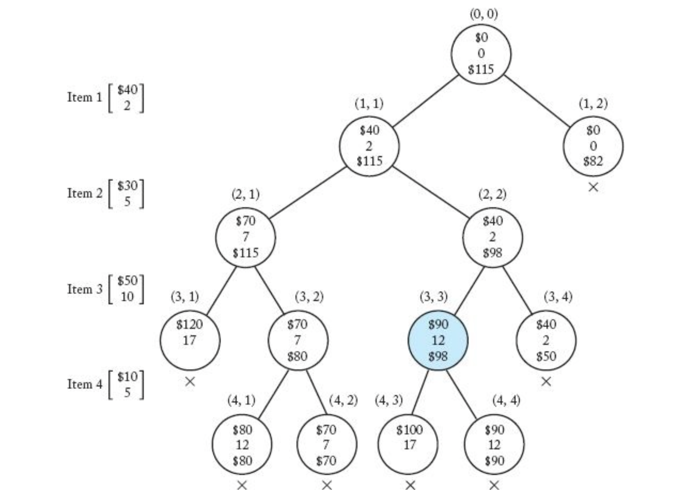
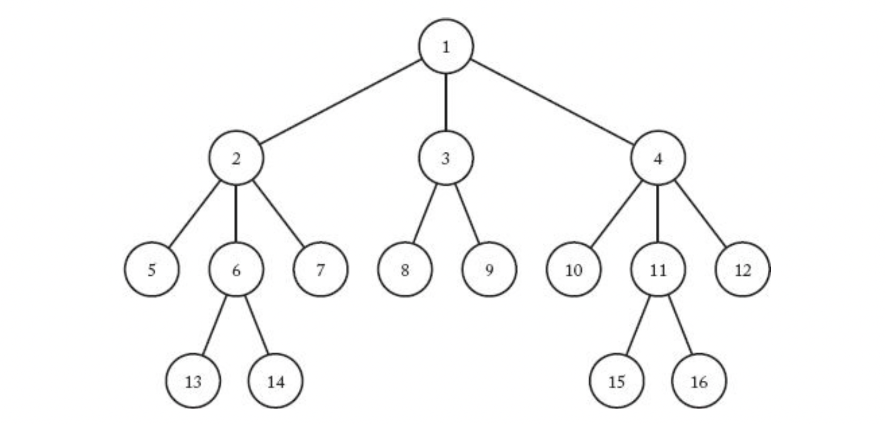
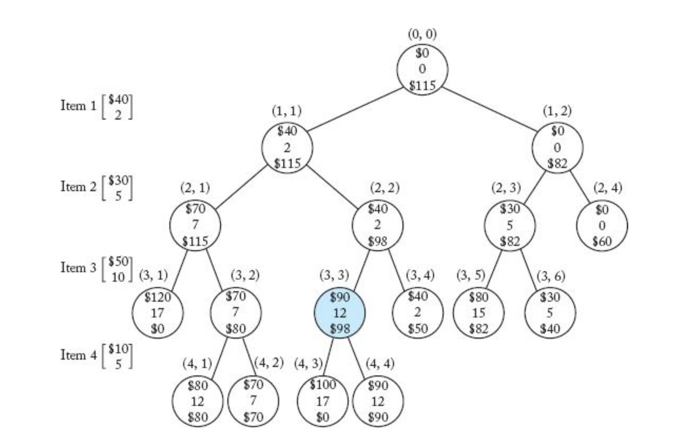
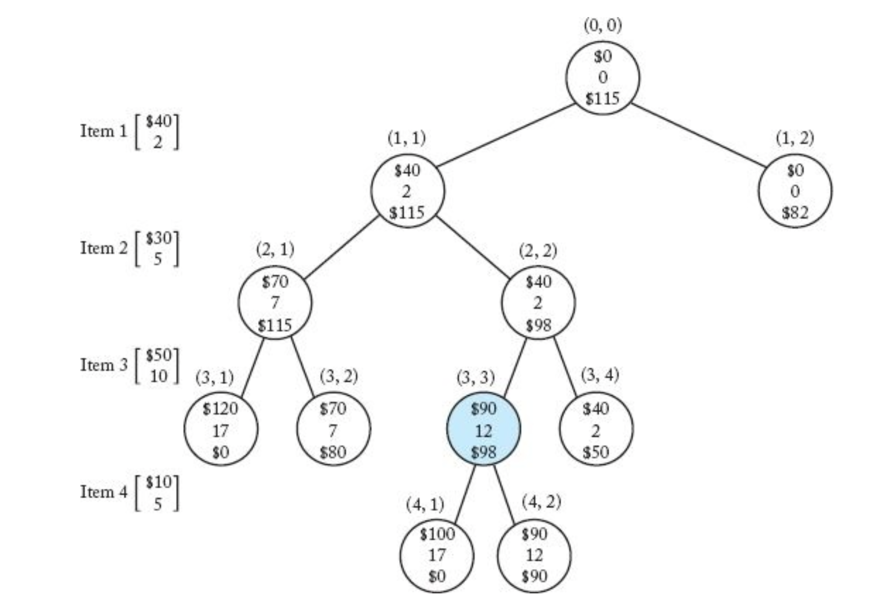

> _Branch-and-Bound_

_⌜Foundations of Algorithms의 6장 **Branch-and-Bound**에 관해 정리한 글입니다._

<!-- thumbnail -->

<br>

<details>
   <summary>💡RoadMap</summary>

1. [Algorithms; Efficiency, Analysis, and Order](https://41312432.netlify.app/algorithm/algorithm1/)
2. [Divide-and-Conquer](https://41312432.netlify.app/algorithm/algorithm2/)
3. [Dynamic Programming](https://41312432.netlify.app/algorithm/algorithm3/)
4. [Greedy](https://41312432.netlify.app/algorithm/algorithm4/)
5. [Backtracking](https://41312432.netlify.app/algorithm/algorithm5/)
6. `Branch-and-Bound`
7. Sorting
8. Searching
9. NP

   </details>

<br>

---

# Ch6. Branch-and-Bound

본 장에서는 Branch-and-Bound(분기한정)에 대해 소개한다.

특히, 알고리즘 방법론 종류에 대한 마지막 챕터이므로, Knapsack problem을 통해 그 전 방법들에 대해 비교하고 정리한다.

## Branch-and-Bound

> _In this chapter, we provide our thief with yet another approach, called branch-and- bound. As we shall see, the branch-and-bound algorithm developed here is an improvement on the backtracking algorithm. Therefore, even if the other two algorithms fail to solve our thief’s instance efficiently, the `branch-and-bound` algorithm might do so._

Branch-and-Bound 알고리즘은 Backtracking 알고리즘에서 개선되어 나온 알고리즘이다.

Backtracking의 경우처럼 state space tree를 생성해서 문재를 해결하지만, 다른점은

1. tree를 순회(traversal)하는데 특별한 방식에 제한을 두지 않으며.
2. 최적화 문제에만 사용한다.

는 것이다.

Branch-and-Bound 알고리즘은 노드가 promising한지 여부를 결정하기 위해서 그 노드에서 `숫자(Bound)`를 계산한다.  
이 Bound는 **그 노드를 넘어 확장(expand)함으로써 얻을 수 있는 solution의 값의 한계**이다.

만약 그 한계값이 지금까지 구한 다른 노드에서의 solution 한계들의 최적의 값 보다 더 낫지 않으면, 그 노드는 promising하지 않다. 그 반대의 경우라면, 그 노드는 promising하다.

<br>

Branch-and-Bound 알고리즘은 Backtracking의 경우처럼 최악의 경우 exponential time complexity가(또는 더 나쁜) 소요되지만, 많은 큰 instance에 대해 효율적으로 작동한다.

<br>

이런 방식으로 미리 정해진 traversal 종류에 따라 노드를 **bound를 통해 체계적으로 순회**함으로써 최적의 solution에 도달하는 경우가 많다.  
예를 들어 Backtracking에서 살펴보았던 DFS에 bound를 통한 pruning 과정을 더한다면, 그것을 branch-and-bound 알고리즘이라고 할 수 있을 것이다.  
이러한 접근 방식을 `Best-First Search with Branch-and-Bound Pruning` 이라고 한다.

## 0-1 Knapsack problem

0-1 Knapsack 문제는  
$$n$$개의 물건들을 한정된 용량($$W$$)의 배낭에 골라서 넣었을 떄, 용량을 넘지 않으면서 최대의 값어치를 담을 수 있는 물건의 조합을 찾는 문제이다.  
즉,

$$W$$ = 배낭에 담을 수 있는 최대 무게

items = [item1, item2, item3, ...]

$$w_i$$ = i번째 item의 무게  
$$p_i$$ = i번째 item의 가치

라고 할 때 $$w$$들의 합이 $$W$$를 넘지 않으면서 $$p$$의 합이 최대가 되게 하는 아이템들의 조합을 구하는 문제이다.

<br>

---

<br>

이 문제를 앞서 배운 Greedy, DP, Backtracking, Branch-and-Bound 알고리즘을 통해 구현하면서 비교해보도록 한다.

특히, 이 장의 Branch-and-Bound 알고리즘으로 구현할 때는 **BFS with Branch-and-Bound Pruning** 방법으로 구현한다.

### Greedy vs DP

Greedy 알고리즘과 DP 알고리즘 모두 최적화 문제를 해결하기 위해 사용한다.

때때로 두 방법 모두 최적화 문제를 해결할 수 있다.
하지만 Greedy 알고리즘이 대부분의 경우 더 직관적이고 간단하며 효율적이다.

> ex) Shortest Path Problem. Floyd Algorithm(DP): $$\Theta(n^3)$$ Dijkstra Algorithm(Greedy): $$\Theta(n^2)$$

그러나 Greedy 알고리즘의 경우 그 알고리즘이 **항상 최적의 solution을 제공하는지** 증명해야 하는 문제가 남아있다.

Greedy 알고리즘이 항상 최적의 해를 제공하는것은 아니며, 심지어는 그런 경우에도 그것을 증명하는것이 매우 어려울 수 있다.
DP 알고리즘의 경우, **최적의 원칙(principle of optimality)**이 적용되는지만 보면 된다.

위 Knapsack Problem을 통해 두 알고리즘을 비교해보자.

#### Brute Force

가장 먼저 Brute Force로 해결하려면 얼마만큼의 time complexity가 나오는지 알아보자.

모든 물건의 조합을 계산해서, 그 조합이 배낭 안에 들어가는지를 계산하고, 들어가는 조합 중 가치가 가장 높은 조합을 구하면 된다.

$$n$$개의 물건마다 그 물건이 조합에 포함되는지, 안포함되는지 2개의 경우가 있기 때문에 가능한 조합의 수는

$$
\begin{aligned}
2 \times 2 \times 2 \times ... = 2^n \in \Theta(2^n)
\end{aligned}
$$

exponential time complexity가 소요된다.

#### Greedy

Greedy 알고리즘으로 문제를 해결해보자.

##### profit first, weight first

첫번째로 생각해 볼 수 있는 방법은, 아이템들을 높은 가치순으로 배낭에 담는 방법이다.

조금만 생각해봐도, 이 방법은 최적의 해를 제공하지 못한다는것을 알 수 있다.

예를 들어, items = [(10만원, 15kg), (9만원, 10kg), (8만원, 5kg)] 세 아이템이 있고 가방의 용량 $$W = 15kg$$라면  
최적의 해는 17만원이지만 가장 가치가 높은 15kg의 10만원 짜리 아이템을 먼저 담기 때문에 이 알고리즘은 최적의 해를 구할 수 없다.

이처럼 더 높은 무게를 지불함에도 아이템이 그만큼 더 많은 가치를 보장하지 못하므로, greedy 알고리즘은 작동하지 않는다.

비슷하게, 가장 가벼운 물건부터 담는 greedy 알고리즘도 최적의 해를 제공하지 못한다. 아이템이 더 낮은 무게를 가지고 있는 대신 그거보다 훨씬 더 심각하게 낮은 가치를 가진다면, 알고리즘은 효율적으로 작동하지 못할 것이다.

<br>

이는 greedy 알고리즘의 **최적의 해 보장 조건**을 만족시키지 못했다.

매 물건의 선택이 무게를 차지하므로 뒷 물건의 선택 과정에 영향을 끼치므로 **greedy choice property** 조건을 만족시키지 못하고,  
전체 최적 solution은 위와 같은 방법으로 구해지는 부분 문제의 최적 solution과 다를 수 있으므로 **optimal structure** 조건도 만족시키지 못한다.

##### profit per weight first

그보다 조금 더 정교하게(sophisticated) 생각을 조금 더 해서 greedy 알고리즘을 고려해보자.  
위 방법의 문제점은 고른 아이템이 무게를 지불함에 따라 얻을 수 있는 가치가 너무 형편없거나, 무게를 덜 지불하는 대신 가치가 너무 심각하게 낮은 경우에 의해 문제가 되는것으로 보였다.

그렇다면 무게에 비한 아이템의 가치, 즉 가치를 무게로 나눈($$p_i/w_i$$)순으로 높은 아이템을 선택하면 최적의 해를 제공하지 않을까? 다음의 경우를 보자.

items = [(14만원, 20kg), (6만원, 10kg), (5만원, 5kg)] 세 아이템이 있고 가방의 용량 $$W = 30kg$$라면  
각 아이템들의 $$p_i/w_i$$는 순서대로 0.7만원/kg, 0.6만원/kg, 1만원/kg 이므로 5만원 5kg, 14만원 20kg 순으로 담아 25kg하고 19만원의 아이템을 담았을것이다.

하지만 최적의 해는 1, 2번 아이템을 담아 30kg에 20만원을 담는 것이다.

<br>

더 세심하고 복잡한 수준의 greedy 알고리즘으로도 최적의 해를 구성하는데 실패했다.

역시 greedy choice property 조건과 optimal structure 조건도 만족시키지 못해 최적의 해를 보장하지 못한다.

#### DP

위 문제에 대해 최적의 원칙(principle of optimality)가 적용되는것을 보인다면, 이 문제는 DP로 해결할 수 있을것이다.

$$A$$를 $$n$$아이템에 대한 최적의 subset이라고 하자.  
그렇다면 두가지 경우가 생기는데:

1. $$\text{item}_n$$이 $$A$$에 포함된 경우

   $$A$$ 아이템들의 $$p$$의 합은 $$p_n$$에 $$n - 1$$ 아이템에서 $$W - w_n$$의 무게를 넘지 않으면서 얻을 수 있는 최적의 아이템들의 profit의 합을 더한 값이다.

<br>

2. $$\text{item}_n$$이 $$A$$에 포함되지 않은 경우

   $$A$$는 $$n-1$$아이템에 대한 최적의 subset과 같아질것이다.

그러므로, 최적의 원칙이 적용된다.

<br>

알고리즘을 구현해보자.

$$P[i][w]$$는 총 무게가 $$w$$를 넘지 않는 조건 하에서 처음 $$i$$개의 아이템을 선택했을때 얻는 profit 인 배열 $$P$$를 생성한다. 그러면 다음과 같은 재귀식에 따라

1. $$i = 0$$인 경우
   아이템이 없다.  
   따라서 모든 $$0 \leq w \leq W$$에 대해 $$P[0][w] = 0$$이다.

2. $$i > 0$$인 경우
   1. $$w_i > w$$인 경우
      즉, i번째 아이템을 가방에 넣을 수 없다.
      따라서 $$P[i][w] = P[i-1][w]$$
   2. $$w_i \leq w$$이지만 $$i$$번째 아이템이 최적해에 사용되지 않는경우
      $$P[i][w] = P[i-1][w]$$
   3. $$w_i \leq w$$이고 $$i$$번째 아이템이 최적해에 사용되는 경우
      $$P[i][w] = p_i + P[i-1][w-w_i]$$

따라서,

$$
  P[i][w] =
  \begin{cases}
    \text{max}(P[i-1][w], p_i + p[i-1][w-w_i]) & \text{if} \quad w_i \leq w\\
    P[i-1][w] & \text{if} \quad w_i > w  \\
  \end{cases}
$$

그러면 문제의 총 최대 이익은 $$P[n][W]$$일 것이다.

$$n \times W$$ 행렬을 계산해야 하기 때문에, time complexity는

$$
\begin{aligned}
T(n) = nW \in \Theta(nW)
\end{aligned}
$$

이는 알고리즘이 $$W$$의 값에 절대적으로 의존함을 보여준다.  
$$n$$과 $$W$$에는 아무런 관계도 없다. 즉, 예를들어 $$W$$가 $$n$$!에 가까워질만큼 클 수도 있는데 그렇다면 이 알고리즘은 $$\Theta(n\times n!)$$의 매우 비효율적인 time complexity를 가지는 것이다.

<br>

DP에서 최적의 원칙을 만족한다는 것을 보였기 때문에, greedy로는 풀 수 없었던 문제를 DP로 풀어낼 수 있었다.

### Backtracking

Backtracking으로 이 문제를 풀기 위해, **state space tree**를 만들어보자.

먼저 아이템을 무게대비 가치가 높은 순으로($$p_i / w_i$$ 내림차순) 정렬하고, 트리의 root부터 각 레벨은 고려할 수 있는 아이템들을 (즉, 레벨 1은 첫번째 아이템을, 레벨 2 에서는 첫번째와 두번째 아이템, 레벨 i에서는 첫번째부터 i번째 아이템들) 나타낸다.  
각 노드의 자식 노드들은, 그 자식 노드들의 아이템을 취하는경우와 안취하는 경우로 나누어진다.  
즉 각 노드는 2가지의 자식 노드만을 가질 것이다. 여기서는 왼쪽 노드를 그 아이템을 취하는 경우, 오른쪽 노드를 그 아이템을 취하지 않는 경우로 한다.

이 state space tree에서 root에서 leaf 노드까지 가는 path는 solution의 후보가 될 것이다.

<br>

이 문제는 다른 Backtracking 문제들과는 다르게 최적화 문제를 다룬다.  
따라서 최적이라고 생각했던 노드를 선택했다고 해서 그 노드를 확장하는 경로가 꼭 최적의 solution이라고 할 수는 없다.  
따라서 순회가 끝나기 전에는 최적의 solution이 무엇인지 알 수 없으므로 **검색하는 과정동안 그때까지 얻은 최적의 solution을 항상 기억해 놓아야 한다.**

<br>

이 state space tree에서 promising한 노드는, 그 노드를 선택했을 때 $$w_i$$를 더한 weight이 $$W$$보다 낮은 노드이다.  
즉 $$ \text{weight} \geq W$$이면 non-promising이다.

마지막 노드를 제외하고, 이는 심지어 총 무게가 $$W$$와 같을때에도 non-promising인데,  
이는 최적화 문제에서 promising은 자식 노드로 확장(expand)될 수 있음을 의미하기 때문이다.

하지만 이것만을 가지고는 promising한 노드로 제한하기에는 부족하다. 이는 Brute Force의 경우처럼 사실 무게가 들어가는대로 거의 모든 경우의 수를 전부 조사해야한다.

따라서 추가적인 변수를 정의해 promising을 더 엄밀히 제한한다.

<br>

- totweight = 지금까지의 무게 합 + 지금 노드를 넘어서 앞으로 넣을 수 있는 무게의 합  
  이는 이 노드를 넘어서 가질 수 있는 무게의 합을 말한다.
- bound = 지금까지의 가치 합 + 지금 아이템을 제외한 앞으로 넣을 수 있는 가치의 합 + partial profit
  이는 이 노드를 넘어서 얻을 수 있는 profit의 상한선(upper bound)를 말한다.

이라고 정의하자.
즉,  
노드가 레벨 $$i$$에 있고, 레벨 $$k$$에 있는 노드에서 총 무게가 $$W$$를 넘을 때

$$
\begin{aligned}
totweight &= \underbrace{weight + \sum_{j=i+1}^{k-1} w_j}_{지금까지의 무게 합 + 앞으로 넣을 수 있는 무게 합} \\
bound &= \underbrace{profit + \sum_{j=i+1}^{k-1} p_j}_{\text{지금까지의 가치 합 + 앞으로 넣을 수 있는 가치 합}} + \underbrace{W - totweight}_{\text{k번째 아이템으로 가질 수 있는 무게}} \times \underbrace{\frac{p_k}{w_k}}_{\text{k번째 아이템의 profit per unit}} \\
\end{aligned}
$$

이다.

upper bound를 살펴보자. 이 노드를 선택했을 떄, 이 노드를 확장해서(expand)얻은 경로(solution)에는 $$k$$레벨에서 $$W$$를 초과하므로 $$k-1$$까지의 합을 구하는것이다. 그리고 나머지 공간을 위한 무게(즉, $$W - totweight$$)만큼의 이익을 쪼개서 넣은것이다.

그리고 maxprofit이라는 변수를 지금까지 찾은 경로(solution)의 이익 중 최고의 값 이라고 정의하자.  
그럼 **노드를 확장했을 때 bound값이 maxprofit 보다 작거나 같다면, promising하지 않다.**

$$
\begin{aligned}
\text{promising} : bound \leq maxprofit \\
\end{aligned}
$$



위 그림은 Backtracking을 통한 알고리즘의 state space tree이다.  
그림에서 각 노드에  
맨 윗줄은 profit을,  
가운데줄은 weight을,  
맨 아랫줄은 bound를 나타낸다.

이제 알고리즘을 살펴보자.

1. bound와 totweight을 profit과 weight으로 초기화한다.
2. greedy하게 아이템을 선택하며 state space tree를 탐색한다.
   1. 해당 노드의 profit, weight, bound를 계산한다.
   2. weight이 $$W$$보다 작고, bound가 maxprofit보다 크면 promising한 노드이다. 그렇지 않으면 backtracking한다.
3. totweight이 $$W$$를 초과하는 아이템을 선택할 떄 까지 반복한다.

코드로 나타내면 다음과 같다.

```py
def backtracking(i, profit, weight):
   if weight <= W and profit > maxprofit:
      maxprofit = profit
      best_num = i
      best_set = include

   if promising(i):
      include[i+1] = 'Yes'
      knapsack(i+1, profit+p[i+1], weight+w[i+1])
      include[i+1] = 'No'
      knapsack(i+1, profit, weight)

def promising(i):
   if weight >= W:
      return False
   else:
      j = i+1
      bound = profit
      totweight = weight

      while j<=n and totweight+w[j] <= W:
         totweight += w[j]
         bound += p[j]
         j++

      k = j

      if k <= n:
         bound += (W-totweight) * (p[k]/w[k])

      return bound > maxprofit
```

state space tree의 노드 수는 $$w_i$$를 취하느냐 안취하느냐 2개의 경우가 있으므로 역시

$$
\begin{aligned}
2 \times 2 \times 2 \times ... = 2^n \in \Theta(2^n)
\end{aligned}
$$

이다. 최악의 경우 똑같이 brute force의 경우와 같이 exponential time complexity를 가지지만 pruning을 통해 훨씬 적게 탐색하기 떄문에 **더 효율적일 수** 있다.

DP로 구현한 $$ \Theta (\text{min} (2^n, nW)$$와 비교할 떄 DP의 $$nW$$가 더 효율적으로 보일 수도 있지만, 두 알고리즘의 상대적인 효율을 이론적으로 분석하기는 정말 어렵다.

Monte Calro 알고리즘으로 분석했을 때, Backtracking을 통한 구현이 조금 더 효율적임이 알려져 있다.

### Branch-and-Bound

본 장의 주제인 Branch-and-Bound 알고리즘으로 이 문제를 살펴보자.

위에서 살펴본 Backtracking 방식은 사실 branch-and-bound 방식이였다.  
앞장에서 살펴본 다른 Backtracking 알고리즘과 달리 bound를 계산해서 그 bound가 지금까지 찾은 최적의 solution보다 좋다면 promising한 노드로 생각하고 탐색하는 방식이였기 때문이다.

즉, DFS를 활용한 Branch-and-Bound 알고리즘이였던 것이다.

이번에는 BFS로 해결하는 방법에 대해 살펴본다.  
왜냐하면 Branch-and-Bound 알고리즘인 Best-First Search는 BFS(Breadth-First Search)를 약간 변형해서 만들 수 있는 알고리즘이기 떄문이다.

#### Breadth-Frist Search

`BFS, Breadth-First Search(너비 우선 탐색)`란 DFS와 마찬가지로 그래프(rooted graph를 말한다)가 주어졌을때, 그래프를 탐색하는 방법 중 하나이다.



BFS는

1. root를 먼저 방문한다.
2. 다음 레벨의 모든 노드를 방문한다.
3. 반복한다.

위 그림의 tree는 각 노드마다 BFS로 방문했을 때의 순서가 써져있다.
역시 일반적으로 같은 레벨의 노드끼리는 우선순위가 없지만, 편의상 왼쪽에서 오른쪽으로 방문했다.

> pseudo code

```py
def BFS(v):
   q = queue

   q.enqueue(v)

   while q:

      x = q.dequeue()
      visit(x)

      for child of x:
         q.enqueue(child)
```

DFS의 경우처럼 간단한 재귀 알고리즘으로 구현할 수 없다. 대신 **큐(Queue)**자료구조를 이용해 구현한다.

<br>

##### knapsack problem with BFS

Backtracking으로 구현한 knapsack problem with DFS와 똑같지만 탐색 방법만 BFS로 바뀐것이다.  
즉



위의 그림과 같이 state space tree를 BFS로 방문하는 것이다.

탐색하는 순서가 바뀌었으므로 조사하는 노드의 수 등에 다소 차이가 있을 수는 있다.  
예를 들면 위 그림의 노드(1, 2)는 DFS라면 non-promising임을 알고 pruning 했을것이다. 하지만 BFS에서는 그 밑으로 확장한다.

노드가 weight이 $$W$$를 초과해서 non-promising하게 된다면, bound를 0으로 초기화한다. 그래서 그 노드가 확장되었을때 bound가 maxprofit보다 크지 않게 될 것이다.

BFS로 구현한 알고리즘은 어떤 노드의 자식 노드를 방문해야 할지를 그 노드를 방문할 때 결정한다.  
예를 들어, 노드 (2,3)을 방문했을 때는 maxprofit이 70이였으므로 그 노드는 promising했다. 하지만 DFS와는 다르게, BFS에서는 maxprofit이 실제로 그 자식노드를 방문했을 때 변할 수 있다. 따라서 (2,3)노드의 자식 노드를 방문할 때는 maxprofit이 90이기 때문에, 그 자식노드들은 non-promising이다. 이는 시간을 낭비했다고 볼 수 있는데, 이는 **best-first search**에서 해결한다.

<br>

BFS를 통한 방법 역시 DFS를 통한 방법과 마찬가지로 state space tree의 노드 수는 최악의 경우 $$\Theta(2^n)$$이다.  
위의 노드(2, 3)의 예시처럼 순회 방법에 따라 더 비효율적이게 많은 노드를 탐색할 수도 있고, 경우에 따라 더 적은 노드를 탐색할 수 있다.  
따라서 **두 방법 중 어떤 알고리즘이 더 효율적인지는 문제마다 다르다.** 또한, 이의 효율성을 분석하기는 이론적으로 어렵다.

#### Best-First Search

Best-First Search에서는 **bound 값을 단지 노드가 promising한지 아닌지 판단하는것 이상으로 사용**해 DFS나 BFS의 경우보다 알고리즘의 효율성을 향상시킨다.

Best-First Search는 BFS처럼 어떤 노드의 자식 노드를 모두 탐색한 후, 그 자식 중 확장되지 않았으며(unexpanded) promising한 노드 모두를 살펴보고 그 중 bound가 가장 높은 노드를 우선으로 확장한다.  
그러면 그 노드의 자식 노드들을 확장하면서 maxprofit값이 갱신되기 떄문에 다시 그 전 노드들 중 다음 bound를 가진 노드 순으로 확장할텐데 갱신된 maxprofit 보다 bound가 낮으면 non-promising한것이기 때문에 확장하지 않는다.

이렇게 하면 대부분의 경우 미리 결정된 순서 (DFS, BFS 등)로 탐색을 진행하는 것 보다 더 빨리 최적의 해를 찾을 수 있다.



위 그림을 토대로 best first search를 진행해보자.

<details>
   <summary>best-first search</summary>

1. root를 방문한다.
   [profit = 0], [weight = 0], [bound = 115(= 40 + 30 + (16-7) x (50/10))]
   maxprofit = 0

2. (1, 1)을 방문한다.
   [profit = 40], [weight = 2], [bound = 115]  
   2 <= 16(W) and 40 > 0(current maxprofit) → maxprofit = 40

3. (1, 2)를 방문한다.
   [profit = 0], [weight = 0], [bound = 82(= 30 + 50 + (16-15) x (10/5))]
   0 <= 16(W) and 0 > 40(current maxprofit) → false

4. promising한 노드 중에서 아직 확장하지 않았고, 가장 bound가 큰 노드를 찾는다. 그 노드를 확장한다(자식노드를 방문한다.)

5. 그 노드는 (1, 1)이므로, 자식 노드 (2, 1)을 방문한다.
   [profit = 70], [weight = 7], [bound = 115]
   7 <= 16(W) and 70 > 40(current maxprofit) → maxprofit = 70

6. (2, 2)도 방문한다.
   [profit = 40], [weight = 2], [bound = 98(= 40 + 50 + (16-12) x (10/5))]
   2 <= 16(W) and 40 > 70(current maxprofit) → false

7. promising한 노드 중에서 아직 확장하지 않았고, 가장 bound가 큰 노드를 찾는다. 그 노드를 확장한다(자식노드를 방문한다.)

8. 그 노드는 (2, 1)이므로, 자식 노드 (3, 1)을 방문한다.
   [profit = 120], [weight = 17], [bound = 0]
   17 <= 16(W) and 120 > 70(current maxprofit) → false
   weight > $$W$$ 이므로 bound 값을 0으로 설정한다(non-promising)

9. (3, 2)도 방문한다.
   [profit = 70], [weight = 7], [bound = 80(= 40 + 30 + 10)]
   7 <= 16(W) and 70 > 70(current maxprofit) → false

10. promising한 노드 중에서 아직 확장하지 않았고, 가장 bound가 큰 노드를 찾는다. 그 노드를 확장한다(자식노드를 방문한다.)

11. 그 노드는 (2, 2)이므로, 자식 노드 (3, 3)을 방문한다.
    [profit = 90], [weight = 12], [bound = 98(= 40 + 50 + (16-12) x (10/5))]
    12 <= 16(w) and 90 > 70(current maxprofit) → maxprofit = 90

12. 이 때가 중요한데, maxprofit이 90으로 갱신되었으므로  
    아직 확장되지 않은 노드들 중에서 bound가 90보다 작은 (1, 2), (3, 2)는 non-promising이다.

13. (3, 4)도 방문한다.
    [profit = 40], [weight = 2], [bound = 50(= 40 + 10)]
    bound가 90보다 작으므로 non-promising이다.

14. promising한 노드 중에서 아직 확장하지 않았고, 가장 bound가 큰 노드를 찾는다. 그 노드를 확장한다(자식노드를 방문한다.)

15. 그 노드는 (3, 3)이므로, 자식 노드 (4, 1)을 방문한다.
    [profit = 100], [weight = 17], [bound = 0]
    weight > $$W$$ 이므로 bound 값을 0으로 설정한다(non-promising)

16. (4, 2)도 방문한다.
    [profit = 90], [weight = 12], [bound = 90(= 40 + 50)]
    bound가 maxprofit과 같으므로 non-promising이다.

17. state space tree에서 leaf 노드들은 bound값이 maxprofit을 넘을 수 없으므로 자동으로 non-promising이다.
    따라서 promising한 노드 중 확장되지 않은 노드가 없으므로 탐색이 종료된다.

   </details>

<br>

위 예제에서 12의 경우를 살펴보면, maxprofit이 갱신 될 때 bound가 그 값보다 작거나 같은 확장되지 않은 노드를 non-promising이라고 생각하기 때문에 경우의 수가 줄어듦을 알 수 있다.

<br>

위 예제를 살펴보면, 노드(2, 1)이 (2, 2)보다 좋아보였지만 (2, 2)가 최적 solution에 포함되는 노드이다.  
즉, 최고라고 여겨지는 노드에서 최적의 solution이 나온다는 보장이 없다(Greedy를 적용시킬 수 없다!)

<br>

위 알고리즘은 BFS와 매우 유사함을 알 수 있다.  
하지만 이 경우 큐에 노드를 넣은 순이 아닌 최고의 bound 값을 가진 노드를 우선적으로 확장(방문)하기 때문에 **priority queue**를 사용한다.

<br>

이러한 방법 역시 state space tree의 노드 수는 최악의 경우 $$\Theta(2^n)$$ exponential time complexity가 걸릴 수 있다.

하지만 같은 예제를 통해 살펴보았듯이 DFS나 BFS의 경우처럼 정해진 순서(predeterminated order)로 탐색하는거보다 best-first search처럼 methodically 하게 방문하는 알고리즘이 더 빠르게 탐색할 수 있다.  
이는 state space tree가 커질경우 그 차이가 더 드러날 수 있다.

## more..

Traveling salesperson problem
...
