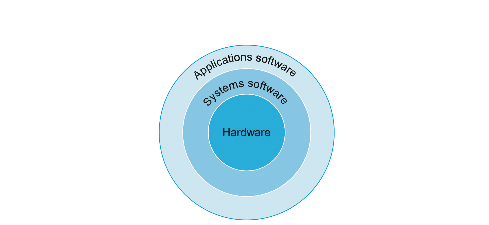
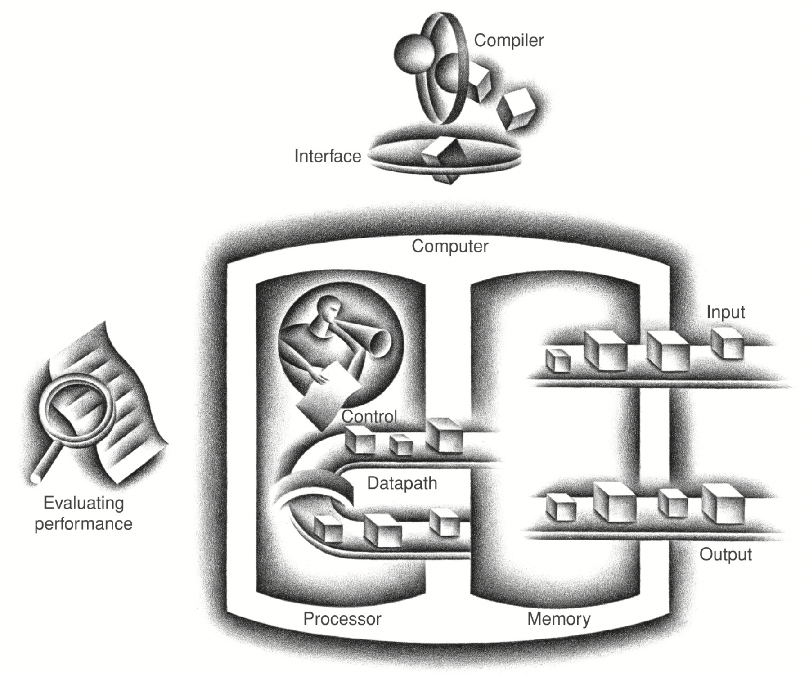
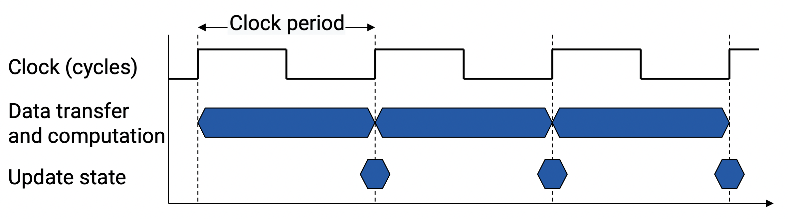
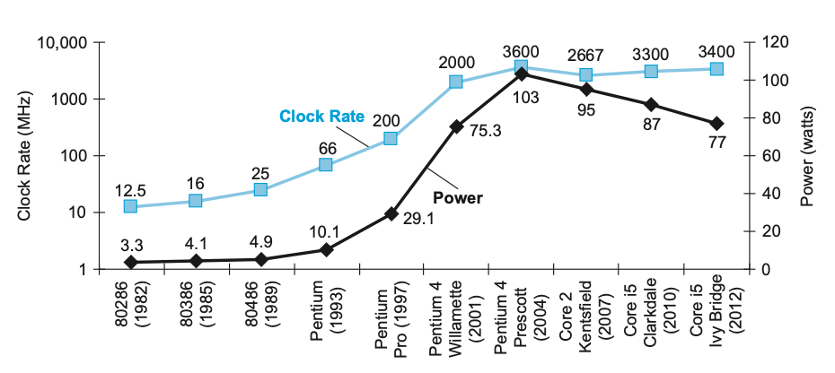

> _Introduction_

_아주대학교의 '컴퓨터 구조' 강의와 책 ⌜Computer Organization and Design⌟을 바탕으로 **컴퓨터 구조**에 대해 정리하고자 한 글입니다._

<!-- thumbnail -->

# Introduction

2019년 가을학기에 수강한 아주대학교 김상훈 교수님의 운영체제(SCE-212) 강의와 책 ⌜Computer Organization and Design (The Hardware/Software Interface) - David A. Patterson⌟ 을 중심으로 컴퓨터과학의 중요 분야 중 하나인 `컴퓨터 구조`에 관해 정리하고자 한다.

 

- 책 [⌜Computer Organization and Design (The Hardware/Software Interface) - David A. Patterson⌟](http://www.kyobobook.co.kr/product/detailViewEng.laf?mallGb=ENG&ejkGb=ENG&barcode=9780124077263) 을 바탕으로 글을 작성한다.
- 해당 강의와 책의 내용을 제외하고도 모든 관련 내용을 공부하고 참조하여 정리할 수 있다.
- 주제의 흐름이나 순서는 강의를 기준으로, 해당 책을 참고해서 한다. 단, 각 주제의 세부 내용은 달라질 수 있다.
- 단어나 설명은 해당 책의 표현(원어)을 기준으로 한다. 단, 널리 알려진 표현은 한국어를 비롯한 다른 표현으로도 대체될 수 있다.

 

   
💡RoadMap

1. `Computer Abstraction and Technology`

   

 

---

## Computer Organization

프로그래머들은 항상 프로그램의 **성능(performance)**에 신경쓴다.

1960년대 컴퓨터 성능에 대한 가장 주요한 제약사항은 컴퓨터 **메모리의 크기**였다.  
그래서 당시 프로그래머들은 다음과 같은 신조(credo)를 준수했다:  
_프로그램을 빠르게 만들기 위해 메모리 공간(memory space)를 최소화해서 설계한다._

하지만 지난 몇 년간 컴퓨터 설계(computer design)와 메모리 기술의 발전으로 몇몇 특수한 경우(임베디드 시스템을 포함한)를 제외하고 대부분의 어플리케이션에서 이와 같은 메모리 크기의 중요성은 크게 줄어들었다.

이제 성능에 관심이 있는 프로그래머들은 그 당시의 단순한 메모리 모델을 대체한 문제들:  
즉 프로세서의 **병렬적 특성(parallel nature of processor)**과 **메모리의 구조적 계층(hierarchical nature of memory)**를 이해할 필요가 있다.  
나아가, 오늘날의 프로그래머들은 PMD(Personal Mobile Device)또는 클라우드에서 실행되는 **프로그램의 에너지 효율성**을 고려해야 하며, 이는 프로그램 코드를 넘어 더 깊은 내용을 이해해야 한다.

따라서 경쟁력 있는 프로그램을 만들고자 하는 프로그래머들은 `컴퓨터 구조(Computer Organization)`에 대한 지식을 필수적으로 알아야 한다.

 

이 주제를 공부하면 다음과 같은 질문에 대답할 수 있다:

- C, Java, Python 등 **고급 언어(high-level language)**로 작성된 프로그램은 어떻게 `하드웨어의 언어로 변역`되며, 또 하드웨어는 어떻게 그 `프로그램을 실행`하는가?  
   이러한 개념을 이해하는것은 프로그램 성능에 영향을 미치는 소프트웨어와 하드웨어 두 측면에 대해 이해할 수 있는 기초를 형성한다.

- 소프트웨어와 하드웨어 사이의 `인터페이스(interface)`는 무엇이며, 소프트웨어는 하드웨어가 동작하도록 어떻게 명령을 내리는가?  
   이러한 개념을 공부하는것은 다양한 종류의 소프트웨어를 작성하는 방법을 이해하는데 필수적이다.

- 무엇이 `프로그램의 성능(performance)`을 결정하며, 어떻게 그 성능을 향상시키는가?

- `성능 향상`을 위해 `하드웨어 디자이너`가 사용할 수 있는 기술은 무엇인가?

- `에너지 효율`을 개선하기 위해 `하드웨어 디자이너`가 사용할 수 있는 기술은 무엇인가? 또한 `프로그래머`는 `에너지 효율`을 향상시키거나 방해하기 위해 무엇을 할 수 있는가?

- 최근 `순차적 프로세싱(Sequential Processing)`에서 `병렬적 프로세싱(Parallel Processing)`으로 전환한 이유는 무엇인가?

 

---

 

## 8 Great Ideas in Computer Architecture

컴퓨터 구조에서 발명된 8가지 아이디어를 소개한다.

이 아이디어들은 앞으로 책의 여러 챕터를 소개하면서 살펴보면서 어떻게 적용되는지 언급할 내용이다.

1. `Design for Moore's Law`

[무어의 법칙](https://ko.wikipedia.org/wiki/무어의_법칙)이란 집적회로(IC, Integrated Circuit)의 자원(resource)은 18~24개월마다 2배가 된다는 법칙이다.

컴퓨터 디자이너들에게 변하지 않는 규칙은 빠른 변화이다. 즉, 프로젝트를 시작할 떄와 끝낼 때 컴퓨터의 성능은 판이하게 다를 수 있다. 따라서 컴퓨터 설계자들은 기술이 어디서 시작되었는지보다 끝날때 **기술이 어느 수준일지를 예측해서 설계**해야 한다.

2. `Use Abstraction to Simplify Design`

컴퓨터 디자이너와 프로그래머들 둘 다 생산성을 위해 **추상화(Abstraction)**을 사용해야 한다.  
추상화를 사용해 설계(design)를 다양한 레벨의 표현으로 나타내는것이(더 높은 수준의 레벨에서 단순한 모델을 제공하기 위해 낮은 레벨의 세부적인 정보가 감춰진-추상화-다.) 생산성 향상에 도움을 준다.

3. `Make Common Case Fast`

**일반적인 케이스**를 빠르게 만드는것이 드문 케이스를 최적화하는 것보다 성능이 향상된다.

4. `Performance via Parallelism`

**병렬적(parallelism)**으로 작업을 수행하는것이 성능이 향상된다.

5. `Performance via Pipelining`

**파이프라인(pipeline)**을 통해 성능이 향상된다.  
프로그램의 실행시 중간의 결과를 겹친다(overlap).

6. `Performance via Predicition`

**예측(prediction)**을 통해 성능이 향상된다.  
잘못된 예측으로부터 복구하는 메커니즘이 비용이 많이 들고 예측이 비교적 정확하다고 가정할 때 확신이 들 때까지 기다리는 것보다 평균적으로 예측하고 동작하는 것이 더 빠르다.

7. `Hierachy of Memories`

**메모리 계층구조(Memory Hierachy)**를 사용한다.  
빠르고 비싼 메모리일수록 가깝게, 느리고 싼 메모리일수록 멀리 구성한다.

8. `Dependability via Redundancy`

**중복성(Redundancy)**를 통해 컴퓨터를 신뢰할 수 있게한다.  
장애가 발생했을 때 장애를 감지하고 장치를 대신할 수 있는 중복된 구성요소를 포함하여 시스템의 신뢰성을 높인다.

## Below Program

살펴보겠지만, 우리의 하드웨어는 매우 간단한 낮은 레벨의(low-level)명령만 실행할 수 있다.  
몇 백만 줄의 코드로 구성된 어플리케이션을 단순한 명령어(instruction)들로 전환하려면 높은 레벨의 동작(operations)을 간단한 컴퓨터 명령어로 전환하는 `소프트웨어의 여러 계층`을 포함한다.  
이는 **추상화(Abstraction)**의 훌륭한 예이다.

그림은 이러한 소프트웨어의 계층(layer)을 계층적 방식(Hierachy fashion)으로 구성되어 있음을 보여준다.  
어플리케이션은 가장 바깥쪽(상위)계층이며, 다양한 시스템 소프트웨어들은 어플리케이션과 하드웨어 사이에 위치함을 볼 수 있다.

### System Software

시스템 소프트웨어에는 많은 종류가 있지만, 2가지의 대표적인 시스템 소프트웨어 오늘날의 컴퓨터의 중심이 된다.

1. `운영체제(OS, Operating System)`

   - I/O를 다룬다.
   - Storage와 Memory를 할당한다(Allocating).
   - Scheduling
   - Sharing resource
     > _운영체제에 대해서는 따로 정리한다._

2. `컴파일러(Compiler)`

   - C, Java등의 고급언어(high-level language)를 하드웨어가 실행할 수 있는 코드(Machine Code)로 번역한다.

### Components of Computer(HardWare)

컴퓨터의 하드웨어는 데이터 입력, 데이터 출력, 데이터 처리, 데이터 저장 과 같은 기본 기능을 수행한다.  
이러한 기능을 수행하는 컴퓨터의 5가지 고전적인 구성요소(classical components)는

- `Input` : 데이터 입력
- `Output` : 데이터 출력
- `Memory` : 데이터 저장
- `Data Path` : 데이터 경로
- `Control` : 데이터 통제

5개이며 마지막 2개 (Datapath, Control)은 떄때로 합쳐서 `Process`라고 불린다.

그림은 컴퓨터의 표준 구조(standard **Computer Organization**)를 보여준다.

이러한 기능이 어떻게 조직되고 수행되는지가 이 과목의 중점 주제이며, 이후 장에서 이러한 네가지 작업을 구체적으로 다룬다.

 

이러한 구조(Organization)은 하드웨어 기술과는 독립적이다.  
과거와 현재의 거의 모든 컴퓨터를 이 5가지의 구성요소 범주 중 하나에 배치할 수 있다.

## Performance

컴퓨터의 `성능(performance)`이 좋다는것은 무슨 말일까?

이는 멍청한 질문처럼 보일지도 모른다.  
하지만 컴퓨터의 성능은 여러가지 측면에서 생각해 볼 수 있기 때문에 절대적으로 어떤 컴퓨터가 모든 경우에서 성능이 좋다고 말하기란 쉽지 않다.

예를 들어, 어떤 비행기 A의 속력은 시속 800km이고, 비행기 B의 속력은 시속 1,000km이다. 그렇다면 B가 더 좋은 비행기인가?  
만약 2,700km 떨어져 있는 곳을 가고 싶은데 비행기 B는 2시간 밖에 날 수 없는 연료만을 채울 수 없는 비행기라면? 또는 한번에 400명 가량의 손님을 옮기고 싶은데 비행기 B는 한번에 100명밖에 탈 수 없는 비행기라면??  
절대 비행기 B가 더 성능이 좋은 비행기라고 말할 수 없을 것이다.

이처럼 성능이라는 것은 어떻게 정의내리느냐에 따라, 어떤 관점에서 보느냐에 따라 좋고 나쁨을 결정할 수 있다.

컴퓨터의 경우, 두가지 측면에서 성능을 바라볼 수 있다.

- `Response Time (Execution Time)`
  어떠한 일(task)를 처리하는데 걸리는 시간

- `Throughput (Bandwidth)`
  주어진 시간(unit time)동안 처리한 총 작업량

 

   
예시

처음에는 두 요인이 같은 맥락을 가지는 요소라고 생각했다. Execution Time이 빨리자면 Throughput도 많아질 것이라고 생각했기 때문이다.

하지만 엄밀히 말하면 둘은 다르다.  
다음과 같은 예시를 들어서 생각해보자.

 

한 식당에서 라면을 3그릇 끓이는데 5분이 걸린다고 생각해보자. 그러면 이 식당의 두 측정치는

- Execution Time : 5분
- Throughput : 0.6 그릇/분

그런데 이 식당이 주방 리모델링을 진행해서 화구를 업그레이드했다. 그래서 라면을 끓이는데 2분 30초 밖에 걸리지 않게 되었다.  
이 때 이 식당의 두 측정치는

- Execution Time : 2.5분
- Throughput : 1.2 그릇/분

으로 좋아졌다.

그런데 주방의 리모델링이 한번 더 진행되어 이번에는 화구가 3개에서 6개로 늘었다. 이 때 이 식당의 두 측정치는

- Execution Time : 2.5분 으로 똑같지만
- Throughtput : 2.4 그릇/분 으로 증가되었다.

두 예시를 잘 생각해보면 두 측정치는 서로 절대적인 연관이 없다는것을 알 수 있다.

> (예시에서처럼, 대부분의 경우 execution time이 빨라진다면 Throughput도 늘어난다.)

 

Single core process의 경우, execution time에 영향받는다.  
따라서 본 글에서는 execution time을 중점적으로 살펴본다.

### Relative Performance

컴퓨터의 성능을 높인다는것은, execution time을 최소화하는 것이다.

즉, 다음과 같이 표현할 수 있다.

$$
\begin{aligned}
\text{Performance} = \frac{1}{\text{Execution Time}}\\
\end{aligned}
$$

 
 

만약 두 컴퓨터 X와 Y의 성능이 $$\text{Performance}_X$$, $$\text{Performance}_Y$$라면

$$
\begin{aligned}
\text{if  } \text{Performance}_X &> \text{Performance}_Y\\
\Rightarrow \frac{1}{\text{Execution Time}_X} &> \frac{1}{\text{Execution Time}_Y}\\
\Rightarrow \text{Execution Time}_Y &> \text{Execution Time}_X\\
\\
\frac{\text{Performance Time}_X}{\text{Performance Time}_Y}  &= n \text{ 일때, X는 Y보다 n배만큼 빠르다.}

\end{aligned}
$$

### Execution Time

그렇다면 **Execution Time**은 어떻게 측정할까??

#### Wall Clock Time

Wall Clock Time (=Response Time, Elapsed Time)은 말그대로 벽시계 시간, 즉 `task를 처리하는데 실제로 걸린 시간`을 말한다.

그러나 이것은 disk access, memory access, I/O activitie, OS overhead등을 포함한 **모든 작업**을 완료하는데 걸리는 시간을 말한다.  
또한 processor는 공유되고, 여러 프로그램에서 동시에 동작 할 수 있기 때문에 이런 경우 시스템은 한 프로그램의 Response time을 줄이려고 하기보다는 throughput을 최적화 하고 싶어 한다.

따라서, 우리는 이러한 Elapsed Time 과 processor가 실제로 일한 시간을 구별하고 싶다.

#### CPU Execution Time

CPU Execution Time (간단하게 CPU Time)은 `CPU가 task를 위해 processing(computing) 하는 시간`이다.

이 시간은 I/O를 기다리거나, 다른 프로그램을 실행하는 시간 등은 포함하지 않는다.

CPU Time은

- **User CPU Time**  
  프로그램에서 소요되는 CPU Time

- **System CPU Time**  
  OS에서 소요되는 CPU Time

으로 나눌 수 있다.

#### CPU Clocking

거의 모든 컴퓨터는 `하드웨어에서 이벤트가 발생하는 시간을 결정하는 시계`를 사용해서 구성된다.
이러한 시간 간격을 `clock cycle` (= ticks, clock ticks, clock periods, clocks, cycles)라고 한다.

- clock **period**  
  clock의 1 cycle의 시간(duration)

- clock **frequency**(rate)  
  cycles/second

##### CPU Time

$$
\begin{aligned}
\text{CPU Time} &= \text{CPU Clock Cycles} \times \text{Clock Cycle Time}\\
&= \frac{\text{CPU Clock Cycles}}{\text{Clcok Frequency}}
\end{aligned}
$$

즉,

- 프로그램에 필요한 clock cycles 를 줄이거나
- clock rate를 늘려서(clock period를 줄여서)

성능을 향상시킬 수 있다.

##### Instruction Performance

위 식은 프로그램에 필요한 명령(instruction)의 수를 언급하지 않았다.

프로그램을 실행하기 위해 컴파일러가 명확하게 instruction을 생성하고, 컴퓨터가 그 instruction을 실행하기 떄문에  
실행 시간은 `프로그램의 명렁어의 수`에 따라 달라지게 된다.

즉,

$$
\begin{aligned}
\text{Clock Cycles} = \text{Instruction Count} \times \text{CPI}
\end{aligned}
$$

**CPI**는 Cycles per Instruction. CPU가 instruction을 실행하는데 소요하는 평균 싸이클을 말한다.

따라서

$$
\begin{aligned}
\text{CPU Time} &= \text{CPU Clock Cycles} \times \text{Clock Cycle Time}\\
&= \text{Instruction Count} \times \text{CPI} \times \text{Clock Cycle Time}\\
&= \frac{\text{Instruction Count} \times \text{CPI}}{\text{Clcok Frequency}}\\
\end{aligned}
$$

이다.

##### Summary

Performance에 대해 배운것을 요약하자면 다음과 같이 표현할 수 있다.

$$
\begin{aligned}
\text{CPU Time} &=
\frac{\text{time}}{\text{program}} =
\underbrace{\frac{\text{Instructions}}{\text{Program}}}_{\text{프로그램당 명령어 수}}  \times
\underbrace{\frac{\text{Clock Cycles}}{\text{Instruction}} }_{\text{명령어당 CPU Cycle 수}} \times
\underbrace{\frac{\text{time}}{\text{Clock Cycle}}}_{\text{CPU Cycle당 걸리는 시간}} \\
\end{aligned}
$$

성능은 다음과 같은 요소들에 의존한다.

- `Algorithm`
  프로그램이 어떤 알고리즘을 사용하는지가 instruction의 수에 영향을 준다. [Algorithm](https://41312432.netlify.app/algorithm/algorithm1/)  
  나아가, 알고리즘이 더 느리거나 빠른 instruction을 선호함으로써 CPI에도 영향을 미칠 수 있다.  
  예를 들면, 알고리즘이 나눗셈과 같은 복잡한 연산을 많이 사용하면 높은 CPI를 가질 수 있다.

- `Programming Language`  
  어떤 프로그래밍 언어를 사용하는지가 instruction의 수에 영향을 준다.  
  언어의 statements들이 processor의 언어로 번역되기 떄문이다.
  또한, CPI에도 영향을 미친다.  
  예를 들어, JAVA와 같은 데이터 추상화(Data abstraction)를 많이 지원하는 언어는 간접 호출(indirect call)을 많이 요구하며, 이는 더 높은 CPI instruction을 사용한다.

- `Compiler`  
  컴파일러가 instruction의 수와 CPI에 영향을 준다.

  > _컴파일러에 대해서는 다른 글에서 따로 정리한다._

- `Instruction Set Architecture (ISA)`  
  ISA가 Instruction의 수, clock frequency, CPI에 영향을 준다.  
  ISA에 대해서는 다른 장에서 자세히 알아본다.

## Power Wall

다음 그림은 25년에 걸친 인텔 x86 프로세서의 8세대간 Clock Frequency의 증가와 Power 소모량의 증가를 보여준다.

두 요인이 함께 종가한것은 서로 매우 밀접한 관계에 있기 떄문이다.

 

IC(Integrated Circuit, 집적회로)를 위한 주요 기술은 CMOS(Complementary Metal Oxide Semiconductor)이다.

CMOS에서 에너지 소비의 주요 원인은 소위 **동적 에너지**(dynamic energy)라고 불리는 트랜지스터가 상태를 0에서 1로 전환할 때 소비되는 에너지이다.

 
동적 에너지는 각 트랜지스터의 용량 부하(capacitive loading)와 인가 전압(voltage applied)에 따라 달라진다.

$$
\begin{aligned}
\text{Energy} &\propto \text{Capacitive Load} \times \text{Voltage}^2\\
\text{Power} &\propto \text{Capacitive Load} \times \text{Voltage}^2 \times \text{Frequency}\\
\end{aligned}
$$

위 식에서 Frequency와 Power의 관계를 보면, 그래프에서의 두 요인의 증가와 감소 관계를 이해할 수 있다.  
위 그래프에서 두 요소 모두 수십년동안 급격하게 중가하다가 최근에 감소했는데, 이는 microprocessor를 냉각시키는데 실질적인 **전력의 한계**(practical power limit)에 봉착했기 때문이다.
