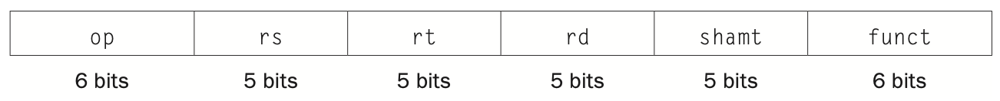
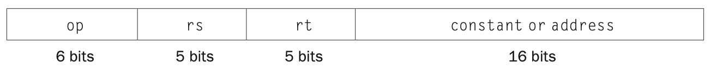
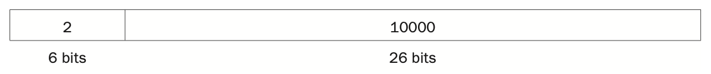
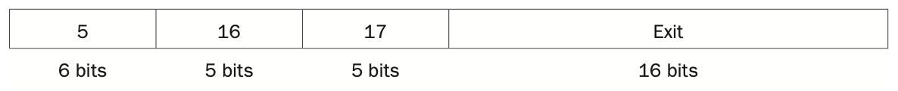
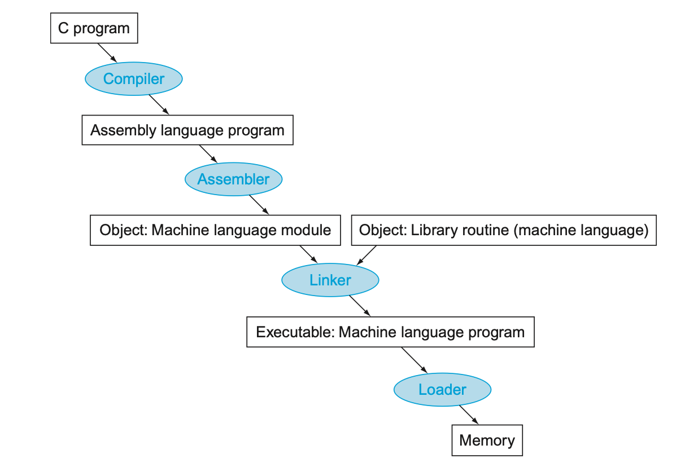

> _Introduction Set Architecture_

_⌜Computer Organization and Design⌟의 2장 **ISA**에 대해 정리한 글입니다._

<!-- thumbnail -->

<details>
   <summary>💡RoadMap</summary>

1. Computer Abstraction and Technology
2. `Instruction Set Architecture`

   </details>

<br>

---

# ISA, Instruction Set Architecture

이 장에서는 ISA에 대해 정리한다. 특히, 본 과목을 다루는 이 글 전반에서 예시로 들어 다루는 MIPS ISA에 대해 살펴본다.

본 책의 2장은 MIPS assembly어와 Assembly어를 machine code로 변환하는 2개의 부분으로 나누어 포스팅한다.  
본 장은 MIPS assembly어를 machine code로 변환하는 부분을 포함한 프로그램을 실행하는 과정을 다룬다.

## Number System

MIPS Assembly 코드를 컴퓨터가 실행할 수 있도록 binary instruction(machine code)로 변환하기 전에, 컴퓨터의 숫자 체계를 간단하게 알아보자.

> digital system, digital circuit 등의 구체적인 내용은 다른 주제에서 따로 정리한다.

### Binary System

컴퓨터의 숫자 체계는 `이진법(Binary System)`을 사용한다.

이진법은 다음과 같이 표현한다.

- $$1011_{\text{two}}$$

  또는

- 0b1011

MIPS word는 32비트이므로, 위 숫자는 다음과 같이 그릴 수 있을 것이다. (오른쪽에서 왼쪽으로 표현한다.)


#### Unsigned Integer

Unsigned Integer는 0~$$2^{32}$$-1 의 정수를 표현한다.

> MIPS에서의 word는 32비트이기 때문이다.


위 식에서 $$x_i$$는 위의 MIPS 32비트 넘버링 그림에서의 비트 자리수마다 들어있는 숫자를 나타낸다.

ex) 위 그림의 0b1011 = $$2^0 \times 1 + 2^1 \times 1 + 2^2 \times 0 + 2^3 \times 1 = 11(\text{decimal})$$

#### Signed Integer

그렇다면 이진법에서의 음수는 어떻게 표현할까??

몇가지 방법을 시도해보자.

##### sign-magnitude

첫번째로 가장 쉽게 생각할 수 있는 방법인 `최상위 비트`(Most Significant Bit)를 **sign**으로 이용하는 방법에 대해 고려해보자.

예를 들어, 11은 이진수로  
$$0000...00001011_{(2)} = 11_{(10)}$$
로 표현한다.  
이러한 숫자의 최상위 비트(맨 왼쪽 비트)를 1로 바꾸어 음수를 표현하자고 하는 것이다.  
$$1000...00001011_{(2)} = -11_{(10)}$$

이러한 방법은 매우 직관적이고 비트 하나만을 사용하기 때문에 효율적으로 보이나 컴퓨터의 입장에서 살펴보면 몇가지의 문제가 발생한다.

<br>

예를 들어, -11과 11을 더하면 0이 나와야 한다.  
하지만 위와 같은 방법으로 음수를 표현하면 두 이진수를 더했을 때 0이 아닌 음수가 나오게 된다.

$$0000....00001011$$ (11)  
\+  
$$1000....00001011$$ (-11)  
=  
$$1000....00010110$$ (-22)

엉뚱한 수가 나오게 된다.  
이 예시와 같이 음수가 포함된 덧셈에서는 일반적인 이진수의 연산을 진행할 수 없다는 문제가 있다.

##### 1's complement

다음 방법은 `1의 보수`로 표현하는 방법이다.

[보수](<https://ko.wikipedia.org/wiki/보수_(수학)>)(補數)란 말 그대로 보충해주는 수, 즉 어떤 수를 만들기 위해 필요한 수를 말한다.(영어로는 complement라고 한다.)

이진수에서 1의 보수는 각 비트를 flip(0이라면 1로, 1이라면 0으로)한 수이다.

즉  
$$0000...00001011_{(2)} = 11_{(10)}$$ 의 1의 보수는  
$$1111...11110100_{(2)} = -11_{(10)}$$이다.

이러한 방법으로 나타내면, 음수가 포함된 계산도 이진수의 일반적인 연산을 통해 할 수 있다.

예를 들어, -11과 -8의 덧셈을 살펴보면

$$1111....11110100$$ (-11)  
\+  
$$1111....11110111$$ (-8)  
=  
$$1\text{carry} \And 1111....11101011$$(-20)

-20과 자리수가 넘어선 1 carry가 발생하게 된다.  
이 캐리를 연산된 값에 더해주면 -20 + 1 = 19 정상적인 음수의 계산이 진행되는것을 볼 수 있다.

이 경우, 연산을 진행할 수는 있지만 자리 넘김수 carry를 따로 처리해주어야 하는 단점이 있다.

또한, -11과 11을 더해보자.

$$1111....11110100$$ (-11)  
\+  
$$0000....00001011$$ (11)  
=  
$$1111....11111111$$(-0)

0(=0b0000....0000)의 1의 보수, 즉 -0이 나오게 된다.

이는 0과 -0의 경우를 따로 처리해서 다뤄야 함을 의미한다.

##### 2's complement

[two's complement](https://en.wikipedia.org/wiki/Two%27s_complement)

carry의 계산과 -0과 0의 문제를 해결하기 위해, 2의 보수 방법을 적용해보자.

즉, 보수를 더했을 때 1이 아닌 2가 나와야 한다는 것인데, 그 말은 1의 보수에 1을 더하면 2의 보수가 된다는 말이다.

즉  
$$0000...00001011_{(2)} = 11_{(10)}$$ 의 1의 보수는  
$$1111...11110100_{(2)}$$이고, 2의 보수는 여기에 1을 더한 값인  
$$1111...11110101_{(2)}$$ 이다.

이제 -11과 11을 더해보자.

$$1111....11110101$$(-11)  
\+  
$$0000....00001011$$(11)  
=  
$$1\text{carry} \And 0000....00000000$$(0)

0과 자리수를 넘긴 carry 1이 발생한다.  
이 carry를 자연스럽게 버려주면 정상적인 0이 나오는것을 볼 수 있다.

위와같은 방법은 carry를 따로 처리하지 않고 자연스럽게 버리면 되고, -0과 0의 구분도 둘 필요가 없다.  
또한 Most significant bit가 1이면 음수인 성질도 자연스럽게 유지할 수 있으며, 덧셈만으로 뺄셈을 구현할 수 있기 때문에 효율적이다.

<br>

다음과 같이 정리할 수 있다.

Signed Integer는 $$-2^{31}$$ ~ $$2^{31}-1$$의 정수를 표현한다.

> MIPS에서의 word는 32비트이기 때문이다.


위 식에서 $$x_i$$는 위의 MIPS 32비트 넘버링 그림에서의 비트 자리수마다 들어있는 숫자를 나타낸다.

## Represent Instruction (Format)

이제 MIPS Assembly를 MIPS Instruction으로 전환하는 방법에 대해 알아보자.

살펴보았듯이 MIPS는 32bit를 word단위로 사용한다.  
즉, 각 명령어(isntruction)은 32비트의 길이로 이루어져 있다.

ex) 0b00000010001100100100000000100000

이러한 machine코드는, 16진법(hexadecimal system)으로 다음과 같이 표현할 수 있다.

ex) 0x02324020

2진법의 비트 4개가(1 바이트가) 0~15를 표현하므로 16진법의 한자리를 표현한다.  
즉, 32비트 word는 8자리의 16진법 코드로 표현할 수 있다.

이처럼 2진수와 16진수의 전환은 매우 쉽기때문에, 우리는 더 표현하기 쉬운 16진법의 머신코드를 사용한다.

<br>

이제 우리의 목표는 MIPS Assembly 코드와 MIPS Instruction(즉 machine code)간의 전환을 자유롭게 하고 싶다는 것이다.

<br>

MIPS Instruction들은 3가지의 format으로 나눌 수 있다.

### R-Format

먼저 `R-format`부터 살펴보자.



R-format insturction은 위와 같은 32비트 코드로 이루어져 있다.  
각 칸은 다음을 나타낸다.

- **op** : opcode, operation을 나타낸다. (R-format은 opcode가 전부 0이다.)
- **rs** : 명령어의 두번째 레지스터, 첫번째 source를 나타낸다.
- **rt** : 명령어의 세번째 레지스터, 두번째 source를 나타낸다
- **rd** : 명령어의 첫번째 레지스터, destination register를 나타낸다.
- **shamt** : Shift Amount, shift의 크기를 나타낸다.
- **funct** : function, 일정한 opcode에 맞춰 특정한 값이 선택된다.

Add의 예시를 들어보자.

```txt
add $t0, $s1, $s2
```

add는 R-format이며, opcode가 0이고, funct는 0x20 = 32이다.  
위 식에서 rd = \$t0, rs = \$s1, rt = \$s2이다.  
각 레지스터의 번호로 나타내면  
rd = 8, rs = 17, rt = 18이다.  
쉬프트 연산이 아니기 때문에 shamt = 0이다.

instruction으로 나타내면

$$
\begin{array}{|c|c|c|c|c|c|}
   \hline
  \text{opcode} & \text{rs} & \text{rt} & \text{rd} & \text{shamt} & \text{funct} \\
  \hline
  0 & 17 & 18 & 8 & 0 & 32 \\
  \hline
  000000 & 10001 & 10010 & 01000 & 00000 & 10000 \\
  \hline
   \end{array}
$$

즉,

$$
\begin{aligned}
 \text{add \$t0, \$s1, \$s2} \Rightarrow 0\text{b}0000001000110010010000000010000 \Rightarrow 0\text{x}02324020\\
\end{aligned}
$$

이처럼 assembly 명령어를 1word의 machine code로 전환할 수 있다.

### I-Format

다음은 `I-format`에 대해 살펴보자.



각 칸은 다음을 나타낸다.

- **op** : opcode, operation을 나타낸다.
- **rs** : 두번째 레지스터(source, base address)를 나타낸다.
- **rt** : 첫번째 레지스터(destination)를 나타낸다.
- **constant or address** : 상수값이나 주소값을 나타낸다. 16자리이기 때문에 $$-2^{15} \sim 2^{15}$$의 sign integer만 가능하다.

I-format인 addi의 예시를 들어보자.

```txt
addi $t0, $t1, 4
```

addi는 I-format이며, opcode가 8이다.  
위 식에서 rs = \$t1, rt = \$t0, constant = 4이다.  
각 레지스터의 번호로 나타내면  
rs = 9, rt = 8이다.

instruction으로 나타내면

$$
\begin{array}{|c|c|c|c|}
  \hline
  \text{opcode} & \text{rs} & \text{rt} & \text{constant} \\
  \hline
  8 & 9 & 8 & 4 \\
  \hline
  001000 & 01001 & 01000 & 0000 0000 00000 0100 \\
  \hline
   \end{array}
$$

즉,

$$
\begin{aligned}
 \text{addi \$t0, \$t1, 4} \Rightarrow 0\text{b}00100001001010000000000000000100 \Rightarrow 0\text{x}21280004\\
\end{aligned}
$$

이처럼 assembly 명령어를 1word의 machine code로 전환할 수 있다.

### J-Format

마지막으로 `J-format`에 대해 살펴보자.



처음 6비트는 **opcode**를, 나머지 26비트는 **address**를 나타낸다.

J-format인 j(jump) 를예시로 들어보자.

```txt
j 10000     #go to 10000
```

j는 J-format이며, opcode가 2이다. address는 10000이므로  
instruction으로 나타내면

$$
\begin{array}{|c|c|}
  \hline
  \text{opcode} & \text{address} \\
  \hline
  2 & 10000  \\
  \hline
  000001 & 00 0000 0000 0010 0111 0001 0000\\
  \hline
   \end{array}
$$

즉,

$$
\begin{aligned}
 \text{j 10000} \Rightarrow 0\text{b}0000 0100 0000 0000 0010 0111 0001 0000 \Rightarrow 0\text{x}04002a10\\
\end{aligned}
$$

이처럼 assembly 명령어를 1word의 machine code로 전환할 수 있다.

## Addressing

Branch instruction에 대해 다시 생각해보자.

```txt
bne $s0, $1, Exit
```

라는 명령어는, I-format의 형태에 맞춰 다음과 같이 표현할 수 있다.



I-format에서는 16개의 비트만을 주소를 표현하는데 사용할 수 있다.  
이 16개의 비트로 어떻게하면 주소를 표현할 수 있을까?

### PC-relative addressing

Register에는 $$2^{32}$$ 크기의 주소값이 들어가 있기 때문에, 아래와 같은 addressing을 활용하면 branch address size 문제를 해결할 수 있다.

```txt
Program counter = Register + Branch Address(from I-format)
```

그렇다면 위의 식에서 레지스터는 어떤 레지스터를 뜻할까?

<br>

Conditional Branch는 loop문이나 if문에서 사용된다. 그래서 그들은 가까운 instruction을 branch target으로 삼는 경향이 있다.  
즉, \$PC가 현재 isntrcution의 주소를 담고 있기 때문에, 그 branch에서 16개의 비트로 표현할 수 있는 $$\plusmn 2^{15}$$만큼의 주소값으로 branch 하는 경향이 있다.

따라서, 위 식에서 register는 \$PC로 정할 수 있다. 따라서 위의 addressing을 `PC-relative addressing`이라고 한다.

<br>

<br>

만약 branch target이 16비트로 인코딩 할 수 없을만큼 너무 멀리 있다면, assembler가 j를 활용해 다음과 같이 인코딩한다.

```txt
beq $s0, $s1, L1

=>

L1 : bne $s0, $s1, L2
     j   L2
L2 : ...

```

### Jump Addressing

jal 이나 j, jr 같은 J-format instruction은 opcode 6자리를 제외한 26자리의 비트를 사용할 수 있다.

branch instruction과는 다르게 이러한 instruction들은 가까운곳으로 branch 한다는 보장이, 또 그럴 이유가 없다.

따라서, 다음과 같은 다른 addressing 방법을 사용한다.

<br>

instruction은 4바이트(1word)크기로 존재하기 때문에, 주소를 구성하는 32비트의 마지막 두개의 비트는 무조건 0이다.  
(0b0100이 4 이기 때문에 그 다음 주소는 0b1000, 0b1100 ... 일 것이기 때문이다.)  
따라서 2개의 비트를 절약할 수 있고, J-format에서 얻을 수 있는 26개의 비트를 포함하면 4개의 비트만 더 있으면 32비트를 표현할 수 있다.

그 4개의 비트는 \$PC의 31~28번째 비트를 빌려온다.

즉, MIPS는 한 프로그램을 약 256MB의(6400만개의 isntruction) 범위 내의 instruction으로 배치한다.

<br>

```txt
$PC[31...28]-Address(from J-format)-00  (-는 뺼셈이 아닌 이어붙임을 말함)
```

위 addressing을 `Pseudo-direct jump addressing`이라고 한다.

<br>

---

<br>

MIPS의 Addressing을 요약하면 다음과 같이 5개로 나타낼 수 있다.


1. `Immmediate addressing`  
   operand가 instruction에서 제공하는 constant 그 자체인 경우.

   > ex) addi

2. `Register addressing`  
   operand가 레지스터인 경우. 레지스터의 주소값으로 레지스터의 값을 활용한다.

   > ex) add

3. `Base addressing`  
   operand가 memeory의 값인 경우. momoery의 주소값으로 레지스터의 값과 address를 활용한다.

   > ex) lw, sw

4. `PC-relative addressing`  
   16비트의 정보만 얻을 수 있는 경우. branch 주소값으로 \$PC와 address를 더한다.

   > ex) beq, bne

5. `Pseudodirect addressing`  
   26비트의 정보만 얻을 수 있는 경우. jump 주소값으로 \$PC4비트에 address 26비트, 0비트 2개를 붙인다.

   > ex) j

## Other Instructions

### Character

오늘날의 컴퓨터들은 대부분 8bit로 한 character를 표현할 수 있는 [ASCII](https://en.wikipedia.org/wiki/ASCII)(American Standard Code for Information Interchange)를 사용한다.

lw나 sw는 word(4byte)를 대상으로 연산하기 때문에, 8bit(1byte)의 character를 다루는데 적합하지 않다.  
따라서 MIPS에는 다음과 같은 instruction이 존재한다.

`lb(load byte)`는 1byte를 load한다. (메모리 32비트의 맨 오른쪽 8비트를 로드해서, 레지스터의 맨 오른쪽 8비트에 저장한다.)  
`lh(load halfword)`는 2byte(half word)를 load한다. (메모리 32비트의 맨 오른쪽 16비트를 로드해서, 레지스터의 맨 오른쪽 16비트에 저장한다.)

`sb(store byte)`는 1byte를 store한다. (레지스터의 맨 오른쪽 8비트를 메모리 32비트의 맨 오른쪽 8비트에 저장한다.)  
`sh(store halfword)`는 2byte(half word)를 store한다. (레지스터의 맨 오른쪽 16비트를 메모리 32비트의 맨 오른쪽 16비트에 저장한다.)

<br>

String(문자열)은 character들의 연속적인 집합이다.(일련의 byte들이다.)

C를 대표로 하는 많은 프로그래밍 언어는 `null-terminated string`, 즉 string의 마지막을 '\$\0'으로 끝낸다.

### 32-bit constant

대부분의 상수는 16비트로 표현할 수 있기 때문에 addi와 같은 I-format으로 연산할 수 있다.

16비트로 전부 표현할 수 없는 상수는, 다음의 연산으로 다룰 수 있다.

`lui(load upper immediate)`는 instruction의 16비트 constant를 앞의 16비트로 하고(왼쪽으로 16비트 밀고) 뒤의 16비트를 0으로 채워 레지스터에 복사한다.

## Making a Program

C로 작성된 프로그램을 컴퓨터가 실행시키는 일련의 과정을 예시로 들어 설명한다.



`Compiler`  
 Compiler는 프로그램을 Assembly 프로그램으로 변환한다.

`Assembler`  
 Assembler는 그들 자신 스스로 machine language instruction의 변형(variation)을 그들의 명령어처럼 다룰 수 있다. 그러한 명령어들을 **psuedoinstruction**이라고 한다.  
 Assembler는 assembly어를 machine code로 변환한다.  
 그러한 파일을 **object file**이라고 한다.  
 object file에는 machine language instruction, data, instruction을 메모리에 적절하게 배치할 수 있는 정보 등이 담겨있다.

**symbol table**이란 instruction이 차지하는 메모리의 주소와 label들의 이름이 매칭되어있는 표이다.  
 Assembler는 assembly language를 machine instruction으로 변환하는데 모든 label의 주소를 결정해야 하는데, symbol table을 활용해 branch와 data transfer instruction들의 label들을 추적한다.

UNIX System의 object file은 다음과 같은 6부분으로 나누어져 있다.

1. **Header**:  
   파일의 크기와 다른 부분의 위치를 담고있다.

2. **Text segment**:  
   machine code 를 담고있다.

3. **Static data segment**:  
   프로그램의 수명에 따라 할당되는 데이터를 담고있다.

4. **Relocation information**:  
   프로그램이 메모리에 로드될 때 그 절대적인 주소(absolute address)에 따라 instruction과 data word들을 재규정한다.

5. **Symbol table**:  
   external reference과 같은 정의되지 않은 label들을 포함한다.

6. **Debug information**:  
   Debugger가 C 파일과 machine instruction을 연결시키고 데이터 구조를 읽을 수 있게 할 수 있도록 모듈이 컴파일 된 방법에 대한 정보를 담고있다.

`Linker`

앞서 설명한 바에 따르면 한 procedure의 한 줄만 변경해도 전체 프로그램을 다시 compile하고 assembling 해야한다.

그에 대한 대안으로 각 procedure을 독립적으로 compile하고 assembling하는 방법을 이용하면 한 procedure에 변경사항이 있더라도 그 procedure만 변경하고 compile하고 assembling 하면 된다.

이러한 방법은 **linker(link editor)**라는 시스템 프로그램을 요구한다. linker는 독립적으로 assembling된 machine program들을 취합해서 연결(linking)한다.  
다음과 같은 3가지의 순서로 이루어진다.

1. code와 data moudle을 메모리에 배치한다.
2. data와 instruction label의 주소를 결정한다.
3. 내부와 외부 reference를 patch한다.

linker는 각 object file의 relocation information과 symbol table을 이용해서 정의되지 않은 label들을 resolve한다.  
모든 외부 reference가 resolve되면, linker는 각 모듈이 차지할 메모리의 주소를 결정한다.

linker는 위와 같은 과정을 거쳐 **executable file**을 생성한다.  
일반적으로 이 파일은 resolve되지 않은 label이 없다는것을 제외하면 object 파일과 형식이 동일하다.

여전히 library routine과 같은 resolve 되지 않은 부분적으로 링크된 파일이 있을 수 있기 떄문에, object file에 그런 정보가 있을 수 있다.

`Loader`

Executable file이 disk에 올라가고, operating system이 그것을 읽어 메모리에 올리고, 실행한다.  
**loader**는 다음의 6가지 단계를 밟는다.(in UNIX)

1. executable file의 header를 읽어, text와 data segment의 size를 읽는다.
2. size에 맞게 address space를 생성한다.
3. executable file에서 instruction과 data를 메모리에 복사한다.
4. parameter를 stack에 복사한다.
5. 레지스터를 실행시키고, stack pointer를 첫번째 빈 주소를 가리키게 한다.
6. start-up rountine으로 점프한다. start-up rountine은 parameter를 argument 레지스터로 복사하고 프로그램의 main routine을 호출한다.

---

프로그램을 실행하기 전에 library를 linking하는 전통적인 방법은 library routine을 호출하는 가장 빠른 방법이지만, 다음과 같은 단점이 있다.

1. library routine이 executable code의 한 부분이 된다. 만약 library가 새로운 버전이 나와도, static linked program은 여전히 구버전을 사용하게 된다.
2. executable file의 어느 부분에서든지 library가 호출될 떄 모든 routine이(사용하지 않는 library의 일부분도) 호출된다.

이러한 단점을 보완하기 위해, `DLL(Dynamic Linked Librarys)`을 활용한다.

DLL은 프로그램이 실행될 때 까지 library routine을 link하거나 load하지 않는다.  
프로그램과 library routine 모두 nonlocal procedure들의 위치와 이름에 대한 추가 정보를 보관한다.  
DLL의 초기 버전에서는 loader가 그 추가 정보를 사용하여 적절한 library를 찾고 모든 외부 reference를 업데이트하는 dynamic linker를 사용했다.  
이런 방식의 단점은 여전히 호출될 수 있는 library의 모든 routine을 여전히 링크한다는 점이다.  
이러한 방식의 대안으로 `lazy procedure linkage version of DLL`이 생성되었다.  
이 방식은 **각 routine이 호출된 후에만 link한다.**

요약하자면, DLL은 dynamic link에 필요한 추가 공간을 필요로하기 때문에 처음 routine이 호출될 떄 상당한 오버헤드를 지불하지만, 전체 library를 복사하거나 link할 필요가 없다.  
오직 routine이 호출되면 간접점프만 할 뿐이다.


