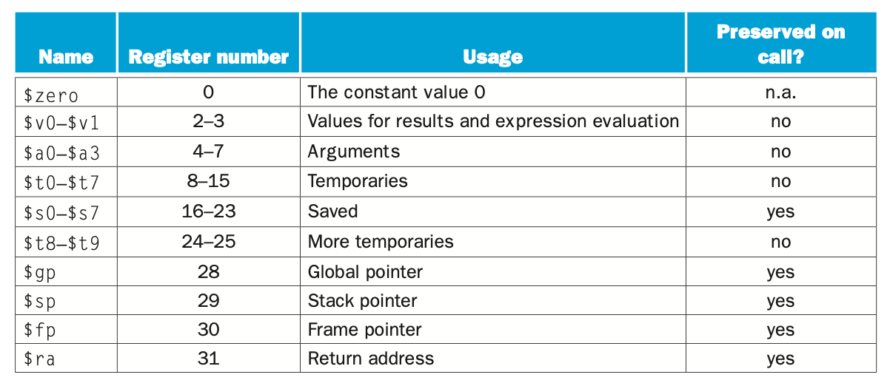
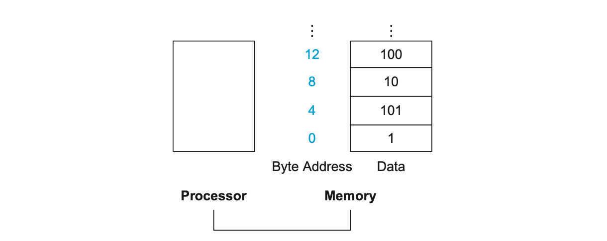
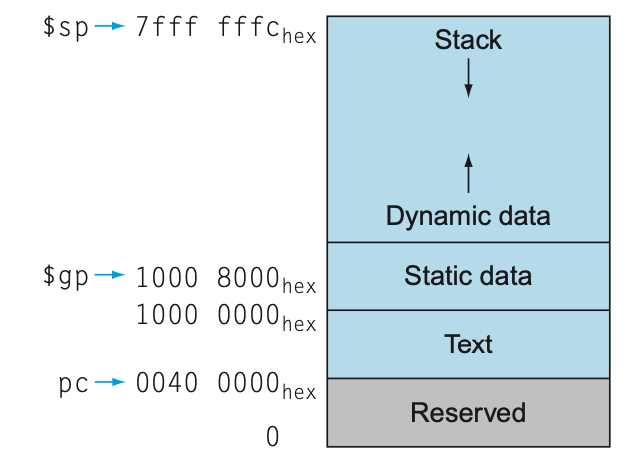

> _Introduction Set Architecture_

_⌜Computer Organization and Design⌟의 2장 **ISA**에 대해 정리한 글입니다._

<!-- thumbnail -->

<details>
   <summary>💡RoadMap</summary>

1. Computer Abstraction and Technology
2. `Instruction Set Architecture`

   </details>

<br>

---

# ISA, Instruction Set Architecture

이 장에서는 ISA에 대해 정리한다. 특히, 본 과목을 다루는 이 글 전반에서 예시로 들어 다루는 MIPS ISA에 대해 살펴본다.

## Architecture

컴퓨터 하드웨어에 명령을 내리려면 하드웨어의 언어로 번역해야 한다.

그 컴퓨터 언어의 단어(word)를 `instruction`이라고 하고, 그 문법(vocabulary)을 `instruction set`이라고 한다.  
`Instruction Set Architecture (ISA)`는 다음으로 구성된다.

- Instruction Set
- Operand Types
- Data Types
- Memory Addressing mode
- ...

<br>

ISA( 즉, 프로세서)는 컴퓨터마다, 제조사, 목적, 설계되거나 제조될 떄의 기술 수준 등에 따라 다르다.  
하지만 한국어와 영어가 판이하게 다른것 처럼 사람의 언어는 종류가 극단적으로 다르고 다양한데 반해 컴퓨터의 경우 다른 종류의 instruction set 끼리 크게 다르지 않다.

따라서 한 컴퓨터 언어에 대해 공부하면 다른 컴퓨터 언어를 이해하기 매우 쉽다.

<br>

## MIPS

`MIPS Instruction Set`은 1980년대 경 MIPS Technology에서 개발했다.  
이 ISA는 실리콘 그래픽스사의 컴퓨터 시스템, 많은 임베디드 시스템, 닌텐도 64, 플레이스테이션 등 많은 분야에서 사용되었다.

현대 **RISC ISA**의 정석, 표준에 가까운 구조를 가지고 있고 매우 깔끔하게 구성되므로 공부할 때 다루기 좋다.  
따라서 컴퓨터 구조를 다루는 이 글 전반에서는 MIPS instruction set을 대표적으로 선택해서 다룰것이다. [_MIPS Architecture_](https://en.wikipedia.org/wiki/MIPS_architecture)

### Instruction vs Assembly

MIPS Instruction은 32비트 바이너리 코드로 이루어져 있다.

> ex) 0x02324020 이 코드가 레지스터 a와 레지스터 b를 더해서 레지스터 c에 저장하라 라는 instruction 을 나타낼 수 있다.

이러한 형태는 사람이 작성하고 이해하기 매우 어렵다.

따라서 우리는 `MIPS Assembly`라고 불리는, 사람이 이해하기 비교적 쉬운 표현을 정의한다.

> ex) add \$s0 \$s1 \$s2

MIPS Assembly는 MIPS Instruction와 동등하다(equivalent).

<br>

우리가 프로그램을 작성하면,  
**컴파일러(Compiler)**가 코드를 **MIPS Assembly**로 전환하고,  
MIPS **어셈블러(Assembler)**가 Assembly어를 **MIPS Instruction**으로 전환한다.

<br>


위 표는 MIPS Assembly어를 나타낸 표이다.  
Category 별로 명령어에 대해 살펴보자.

## Arithmetic Operation

MIPS assembly에는 두 가지의 기본 `Arithmetic operation(수학 연산자)`이 있다.

`add`, `sub(Subtract)`

```txt
add $s1, $s2, $s3    # $s1 = $s2 + $s3
sub $s1, $s2, $s3    # $s1 = $s2 - $s3
```

두 operation은 항상 정확히 **3가지의 operand**만을 필요로한다.  
첫번째 operand는 **desination**을, 뒤따라오는 두개의 operand는 **source**를 나타낸다.  
2가지 source의 값을 연산해서 destination에 저장한다.

<details>
   <summary>예제</summary>
<br>
   예를 들어, 파이썬으로 구현한 다음의 코드를 보자.

```py
a = (b + c) - (d + e)

```

위의 연산은 MIPS Assembly로 다음과 같이 구현한다.

```txt
add $t0, b, c
add $t1, d, e
sub a, $t0, $t1
```

</details>

## Operand

두 arithmatic operation은 **memory**의 값을 직접적으로 쓸 수 없다.  
오직 **register**에 저장된 값만을 `operand`로써 사용할 수 있다.

### Register

MIPS Architecture는 **32 x 32-bi**t 의 `register`를 가지고 있다.  
즉, 32비트의 데이터를 담을 수 있는 레지스터가 0~31번까지 32개가 존재한다.  
그리고 그 **32비트의 데이터(32Bits == 4Bytes)**를 `word`라고 한다.



### Memory

Processor는 오직 제한된 숫자의 register에 일부 값만을 가지고 있다.  
그렇다면 array, structue등과 같은 큰 data는 어떻게 다룰 수 있을까?

<br>

그러한 데이터들은 `Memory`에 저장된다.

#### Data Transfer Instruction

기본 수학 operation은 오직 register의 값만을 operand로 사용한다고 언급했다.

따라서 memory의 값을 연산하기 위해서는 memory와 register사이에 데이터를 옮기는 instruction이 필요하다.  
그러한 instruction을 `data transfer instruction` 이라고 한다.

<br>

`lw(load word)`는 memory의 값을 register에 저장한다.  
`sw(store word)`는 register의 값을 memory에 저장한다.

```txt
lw $s1, 4($s2)    # $s1 <- Memory[$s2 + 4]
sw $s1, 4($s2)    # Memory[$s2 + 4]  <- $s1
```

<br>
<br>

Memory의 값에 접근하려면 `주소(address)`값을 알아야 한다.



위 그림을 보자.  
메모리는 단순히 주소값을 배열의 인덱스로 생각할 수 있는 1차원의 큰 배열(large, single-dimension array with the address acting as the index to that array)이다.

Memory는 Byte 단위의 주소값을 사용한다.  
Memory 한 칸에는 1word = 32bits = 4bytes의 데이터가 들어간다.  
즉, 메모리의 주소값은 **4의 배수** 단위로 구성된다.

### Immediate Operand

프로그램에서 상수(constant)를 사용하는 경우는 매우 많을 것이다.  
위에서 살펴본 기본 수학 연산자들로는 operand로 register의 값만을 사용할 수 있기 떄문에 연산을 할 때마다 memory에서 상수를 register에 불러오고, 그 값을 읽는 과정을 거쳐야 할 것이다.

<br>

그것에 대한 대안으로. MIPS에서는 하나의 **operand를 상수로 삼는** instruction을 제공한다.

`Addi(Add Immediate)`

```txt
addi $s1, $s1, 4     # $s1 += 4
```

subi(sub immediate)는 존재하지 않는다. 상수 operand로 음수의 값을 사용하면 되기 때문이다.

<br>

또한, 0번째 register(=`$zero`)는 항상 **상수값 0**을 가진다. (덮어쓸 수 없다.)

이는 다음과 같이 register의 값을 다른 register로 옮기는 작업 등 많은 작업에서 유용하게 사용한다.

```txt
addi $t1, $s1, $zero    # $t1 = $s1
```

## Logical Operation

각 논리 연산에 대한 구체적인 내용은, digital system을 다루는 다른 글에서 자세히 알아본다.

`logical operation(논리 연산자)`, `bitwise operation(비트 연산자)`에 대해 알아보자.


위 표는 C나 JAVA에서 볼 수 있는 논리 연산자를 MIPS instruction으로 나타낸 표이다.

### Shift

MIPS에는 2가지 shift operation이 존재한다.

`sll(shift left logical)`은 shamt만큼 왼쪽으로 비트를 이동하고, 0으로 빈 부분을 채운다.  
`srl(shift right logical)`은 shamt만큼 오른쪽으로 비트를 이동하고, 0으로 빈 부분을 채운다.

```txt
sll $t0, $s0, 2   # $t0 = $s0 << 2 == $t0 = $s0 * 2^2
slr $t1, $s1, 2   # $t1 = $s1 << 1 == $t1 = %s1 / 2^2
```

shift right logical의 경우를 살펴보자  
음수의 경우, 위 방법대로라면 오른쪽으로 shifting하고 그 자리를 0으로 채우므로 맨 앞 비트(sign bit, most significant bit)는 1이 아닌 0, 즉 양수가 될 것이다.

따라서 slr은 unsigned int에만 적용할 수 있다.

sra(shift right arithmetic)의 경우 most significant bit가 1이면 쉬프팅 후 1로 채우기 때문에 이를 해결할 수 있다.

### Logical

4가지의 logical operation이 존재한다.

`and`, `or`, `xor`, `xor`

```txt
and $t0, $s1, $s2   # $t0 = $s1 & $s2
or $t0, $s1, $s2   # $t0 = $s1 | $s2
xor $t0, $s1, $s2   # $t0 = $s1 ^ $s2
nor $t0, $s1, $s2   # $t0 = ~($s1 | $s2)
```

MIPS에는 NOT 연산자가 없는데, \$zero와 NOR 연산을 진행하면 NOT과 같기 때문에 이를 이용할 수 있다.

<br>

몇몇의 논리 연산자는 상수와 연산할 수 있다.

`andi(and immediate)`, `ori(or immediate)`, `xori(xor immediate)`

```txt
andi $t0, $s1, 4   # $t0 = $s1 & 4
ori $t0, $s1, 4   # $t0 = $s1 | 4
xori $t0, $s1, 4   # $t0 = $s1 ^ 4
```

## Conditional Operation

조건에 따라 결정을 내리는 `conditional operation(조건 연산자)`에 대해 알아보자.

### branch

2가지의 `conditional branch operation`이 있다.

`beq(branch on equal)`은 두 register의 값이 같으면 라벨(주소) instriction으로 branch한다.  
`bne(branch on not equeal)`은 두 register의 값이 다르면 라벨(주소) instruction으로 branch한다.

```txt
beq $s0, $s1, L1   # if $s0 == $s1 : branch to instriction labeled L1
bne $s0, $s1, L1   # if $s0 != $s1 : branch to instruction labeled L1
```

또한 `unconditional branch operation`도 있다.

`j(jump)`, 즉 goto를 말한다.

```txt
j L1   # goto L1
```

<details>
   <summary>예제</summary>
<br>
   예를 들어, 다음의 파이썬 코드를 보자.

```py
if i == j:
   f = g + h
else:
   f = g - h
```

위의 연산은 MIPS Assembly로 다음과 같이 구현한다.

> i, j, f, g, h 는 register \$s3, \$s4, \$s0, \$s1, \$s2에 있다고 가정한다.

```txt
      bne $s3, $s4, Else
      add $s0, $s1, $s2
      j   Exit
Else: sub $s0, $s1, $s2
Exit: ...
```

Else와 Exit같은 label은 assembler가 그 주소를 계산한다.

<br>

다음과 같은 반복문도 구현할 수 있다.

```py
while save[i] == k:
   i += 0x3
```

> i는 \$s3에, k는 \$s5에, save배열의 시작주소는 \$s6에 있다고 가정한다.

```txt
Loop : sll $t1, $s3, 2     # i를 4배 해서 임시 레지스터 $t1에 저장한다. (배열의 주소값 4배단위)
       add $t2, $t1, $s6   # save의 시작주소에 $t1을 더한다. save[i]의 값이 들어있는 주소값이다.
       lw  $t0, 0($t2)     # save[i]를 불러와 $t0에 저장한다.
       bne $t0, $s5, Exit  # $t0과 k가 같지 않다면 반복문 종료.
       addi $s3, $s3, 0x03 # 같아서 branch가 안됐다면 i의 값을 상수만큼 증가시킨다.
       j   Loop            # 반복문으로 돌아간다.
Exit : ...
```

</details>

다음과 같은 conditional branch도 있다.

`slt(set on less than)`, `slti(set on less than immediate)`는 두 값을 비교해 첫번째 operand가 더 작다면 1을, 더 크다면 0을 저장한다.

```txt
slt $s0, $s1, $s2    # $s0 = 1 if $s1 < $s2 else $s0 = 0
```

다음과 같이 branch operation과 연계할 수 있다.

```txt
slti $s0, $s1, 0x08
beq $s0, $zero L1
```

### Basic Block

처음을 제외하고는 다른 branch의 target이 되지 않고,  
끝을 제외하고는 나가는 branch가 없는 일련의 instruction 모음을 `Basic Block`이라고 한다.

compiler는 최적화를 위해 basic block 단위로 구별한다.

## Procedure

`Procedure`, 즉 `function`은 프로그램을 구성하는데 매우 유용한 도구로, 이해하기 쉽고 직관적이게 코드를 만들 수 있고 재사용 할 수 있게 한다.

Procedure의 실행은 다음과 같은 6계의 단계를 따른다.

1. **Place parameters in registers**

   procedure의 parameter들을 register convention에 따라 \$a0 ~ \$a3에 저장한다.

   <br>

2. **Transfer control to procedure**

   procedure을 call하는것은 다음 instruction을 통해 진행된다.

   `jal(jump and link)`는 바로 다음 instruction의 주소를 register convention에 따라 \$ra(return address)register에 저장해놓고, label로 jump한다.

   ```txt
   jal procedure-label  #jump to procedure-label
                        #and $ra <= next insrcution "add $t0, $t1, %s2" 's address
   add $t0, $t1, $s2    #common instruction..

   ...

   procedure-label : ...
   ...
   ```

   다음 instruction의 주소를 저장한다는 말은 현재 실행중인 명령어의 주소를 보유하는 register 가 있어야 함을 암시한다.  
   관습적으로, 이 register는 대부분 `PC(Program Counter)`로 불린다.

   jal은 실제로 PC+4의 주소를 \$ra register에 저장하고 procedure를 호출한다.

   <br>

3. **Acquire storage for procedure**

   뒤 memory에서 다시 다룬다.

   <br>

4. **Perform procedure's operations**

   procedure의 operation들을 순차적으로 수행한다.

   <br>

5. **Place result in register for caller**

   procedure의 결과값들을 register convention에 따라 \$v0, ~ \$v1에 저장한다.

   <br>

6. **Return to place of call**

   procedure을 call 했던 instruction의 다음 instruction으로 가야한다.  
   그 instruction은 2번 단계에서 jal에 의해 \$ra에 저장되어 있을 것이다.

   `jr(jump register)`은 register에 저장된 주소값으로 jump한다.(정확히는, program counter에 전달한다.)

   ```txt
   jal procedure-label  #jump to procedure-label
                        #and $ra <= next insrcution "add $t0, $t1, %s2" 's address
   add $t0, $t1, $s2    #common instruction..

   ...

   procedure-label : ...
   ...
   jr $ra               #jump $ra
   ```

<br>

`Caller`란 말 그대로 procedure를 호출하는 것, 호출하는 instruction, program을 말한다.  
`Callee`는 말 그대로 호출되는 procedure를 말한다.

Caller는 필요한 parameter value를 \$a0-\$a3에 저장하고 jal을 통해 procedure를 호출한다.  
Callee는 호출 된 뒤 일련의 instruction을 실행하고, 결과를 \$v0, \$v1에 저장한다. 그리고 jr \$ra 을 통해 caller에게 control을 넘겨준다.

<br>

전체 과정을 보여줄 수 있는 예시를 들어보자.

<details>
   <summary>예제</summary>
<br>
   다음의 파이썬 코드를 보자.

```py
def m_function(g, h, i, j):
   f = (g + h) - (i - j)
   return f
```

> g, h, i, j 는 \$a0, \$a1, \$a2, \$a3에 들어있고, f는 \$t2를 사용한다고 가정하자.

위 함수를 호출하고 결과값을 받는 MIPS code는 다음과 같이 구현할 수 있다.

```txt
...common instruction
jal m_function
...common instruction

...

m_function:
add $t0, $a0, $a1
add $t1, $a2, $a3
sub $t2, $t0, $t1
add $v0, $t2, $zero
jr $ra

```

</details>

<br>

### Register / Memory Convention

한 procedure이 register convention에서 정의된 것 보다 (MIPS가 가지는 32개의 register보다) 많은 register를 요구하면 어떻게할까?

예를 들어, register convention에서 procedure의 parameter를 위해 사용하는 register는 \$a0 부터 \$a3까지 총 4개이다.  
하지만 function의 paramater가 5개 이상이면 어떻게 할까?

아니면, procedure안에 다른 procedure이 호출되는 경우는 어떻게 해야 할까?  
재귀(recursive)함수를 포함한, 많은 함수에서 다른 함수를 호출하는데 그떄마다 한 register에 대해 중복적으로 사용해야 하는 경우가 발생할 수 있다.

Register의 값을 memory에 spill해야 하는 경우가 바로 그런경우이다.

#### Caller, Callee Register

MIPS의 Register convention을 다시 살펴보자.


<br>

`Caller-save Register`는 \$t0-\$t9 register를 말한다.  
임시적인 register (Temporary Register)로 필요하면 업데이트해서 사용할 수 있지만 callee(procedure)에 의해 보존되지 않는다.  
따라서, caller는 procedure를 호출하기 전에 register의 값을 저장해 놓아야 하고, callee가 return하면 register의 값을 보존해야 한다.

`Callee-save Register`는 \$s0-\$s7 register를 말한다.  
저장되는 register(Saved Register)인 callee-save register는 callee(procedure)에 의해 보존된다.  
즉, callee에 입장에서는 이 register를 사용하려면 원래의 값을 저장해 놓았다가 return할 때 원래의 값으로 복원해야 한다.  
caller의 관점에서 보면, caller가 아무런 행동을 취하지 않아도 procedure 안에서 자동으로 보존되는 register이다.

위의 표는 register의 값이 procedure call마다 보존되는지 여부를 나타낸다.

<br>

이처럼 register의 보존을 위해 값을 따로 저장해놓아야 한다.(Memory에 spill 해 놓아야 한다.)

그렇다면 그 임시로 저장해야 하는 memory의 주소값은 어떻게 정해질까?

#### Memory Layout



위 그림은 MIPS의 memory allocation(memory layout)을 나타낸 그림이다.  
아래로 갈수록 주소값이 낮아지고, 위로 갈수록 주소값이 높아진다.

> _강의는 반대로 설명하나, 여기서는 책을 기준으로 설명한다._

각 영역은 다음을 나타낸다.

- `Text`:  
  프로그램의 **Code**가 들어있다.  
  각 instruction이 메모리마다 들어있으며 **\$PC**(Program Counter)register에 그 주소값이 들어있다.  
  \$PC는 자동으로 4씩 증가하며 instrcution을 실행한다.

- `Data`:  
  **Static Data**가 들어있다.  
  static variable이나 constant array, string과 같은 전역 변수(global variable)이 들어있다.  
  **\$gp**(Global Pointer) register 에 주소값이 들어있으며, 그 주소값은 Data의 중간값을 가리키고 있다.

- `Stack`, `Heap`:  
  그림에서의 맨 윗 부분은 두 부분으로 나누어 생각해 볼 수 있다.

  **Stack**은 local variable, array, 그리고 temporarily saved register value가 저장된다.  
  즉, 위에서 살펴본 예시인 함수의 중첩등으로 인한 많은 parameter 사용으로 인한 register 중복 사용, register value의 임시 저장, 등 register의 값을 spill하는 예시는 다 stack 영역에 저장된다.

  

  **\$fp**(frame pointer)가 현재 stack frame(procedure frame)의 시작(base)를 가리킨다.  
  **\$sp**(stack pointer)는 stack의 마지막을 가리킨다.

  <br>

  **Heap**은 동적으로 할당된 object들이 저장된다. 즉, malloc이나 new 키워드 등을 통해서 동적으로 할당된 object들(Dynamic Date)이 해당된다.  
  Heap과 Stack은 서로를 향해 증가한다.(주소값이 늘고 줄어든다.)

이제 다시 Procedure Call 일련의 과정을 정리해보자.

1. Compliler가 code compliation을 하는 동안, 각 function마다 stack frame(procedure frame)의 크기를 계산한다.

2. Stack Frame을 생성하는(popualte) assembly 코드를 생성한다. (function prologue 라고 한다.)

   > 예를 들어, \$fp = \$sp \\n \$sp = \$sp - 32

3. Local variable들과 saved register들마다 그들이 저장될 stack의 주소값을 계산한다.

4. Function body의 assembly 코드를 생성한다.

5. Return하기 전에, 모든 callee-save register를 stack에서 원래의 값을 가져와 복원한다.

6. Stack frame을 pop한다. (function epilogue 라고 한다.)

7. jr \$ra

## Number System

### Binary System

> digital system, digital circuit 등의 구체적인 내용은 다른 주제에서 따로 정리한다.  
> 또한, 이 장에서는 10진법을 2진법으로 전환하는 방법 등의 내용은 다루지 않는다.

컴퓨터의 숫자 체계는 `이진법(Binary System)`을 사용한다.

이진법은 다음과 같이 표현한다.

- $$1011_{\text{two}}$$

  또는

- 0b1011

MIPS word는 32비트이므로, 위 숫자는 다음과 같이 그릴 수 있을 것이다.(오른쪽에서 왼쪽으로 표현한다.)


#### Unsigned Integer

Unsigned Integer는 0~$$2^{31}$$-1 의 정수를 표현한다.

> MIPS에서의 word는 32비트이기 때문이다.


위 식에서 $$x_i$$는 위의 MIPS 32비트 넘버링 그림에서의 비트 자리수마다 들어있는 숫자를 나타낸다.

ex) 위 그림의 0b1011 = $$2^0 \times 1 + 2^1 \times 1 + 2^2 \times 0 + 2^3 \times 1 = 11(\text{decimal})$$

#### Signed Integer

그렇다면 이진법에서의 음수는 어떻게 표현할까??

##### sign-magnitude

첫번째로 가장 쉽게 생각할 수 있는 방법인 `최상위 비트`(Most Significant Bit)를 **sign**으로 이용하는 방법에 대해 고려해보자.

예를 들어, 11은 이진수로  
$$0000...00001011_{(2)} = 11_{(10)}$$
로 표현한다.  
이러한 숫자의 최상위 비트(맨 왼쪽 비트)를 1로 바꾸어 음수를 표현하는 것이다.  
$$1000...00001011_{(2)} = -11_{(10)}$$

이러한 방법은 매우 직관적이고 비트 하나만을 사용하기 때문에 효율적으로 보이나 컴퓨터의 입장에서 살펴보면 몇가지의 문제가 발생한다.

<br>

예를 들어, -11과 11을 더하면 0이 나와야 한다.  
하지만 위와 같은 방법으로 음수를 표현하면 두 이진수를 더했을 때 0이 아닌 음수가 나오게 된다.

$$0000....00001011$$

+

$$1000....00001011$$

=

$$1000....00010110$$

엉뚱한 수가 나오게 된다.  
이 예시와 같이 음수가 포함된 덧셈에서는 일반적인 이진수의 연산을 진행할 수 없다는 문제가 있다.

##### 1's complement

[보수](<https://ko.wikipedia.org/wiki/보수_(수학)>)(補數)란 말 그대로 보충해주는 수, 즉 어떤 수를 만들기 위해 필요한 수를 말한다.(영어로는 complement라고 한다.)

이진수에서 1의 보수는 각 비트를 flip(0이라면 1로, 1이라면 0으로)한 수이다.

즉  
$$0000...00001011_{(2)} = 11_{(10)}$$ 의 1의 보수는  
$$1111...11110100_{(2)} = -11_{(10)}$$이다.

이러한 방법으로 나타내면, 음수가 포함된 계산도 이진수의 일반적인 연산을 통해 할 수 있다.

예를 들어, -11과 -8의 덧셈을 살펴보면

$$1111....11110100$$

+

$$1111....11110111$$

=

$$1\text{carry} \And 1111....11101011$$,  
-20과 자리수가 넘어선 1 carry가 발생하게 된다.  
이 캐리를 연산된 값에 더해주면 -20 + 1 = 19 정상적인 음수의 계산이 진행되는것을 볼 수 있다.

이 경우, 연산을 진행할 수는 있지만 자리 넘김수 carry를 따로 처리해주어야 하는 단점이 있다.

또한, -11과 11을 더해보자.

$$1111....11110100$$

+

$$0000....00001011$$

=

$$1111....11111111$$

0(=0b0000....0000)의 1의 보수, 즉 -0이 나오게 된다.

이는 0과 -0의 경우 모두를 다뤄야 함을 의미한다.

##### 2's complement

[two's complement](https://en.wikipedia.org/wiki/Two%27s_complement)

carry의 계산과 -0과 0의 문제를 해결하기 위해, 2의 보수 방법을 적용해보자.

즉, 보수를 더했을 때 1이 아닌 2가 나와야 한다는 것인데, 그 말은 1의 보수에 1을 더하면 2의 보수가 된다는 말이다.

즉  
$$0000...00001011_{(2)} = 11_{(10)}$$ 의 1의 보수는  
$$1111...11110100_{(2)}$$이고, 2의 보수는 여기에 1을 더한 값인  
$$1111...11110101_{(2)}$$ 이다.

이제 -11과 11을 더해보자.

$$1111....11110101$$

+

$$0000....00001011$$

=

$$1\text{carry} \And 0000....00000000$$

0과 자리수를 넘긴 carry 1이 발생한다.  
이 carry를 자연스럽게 버려주면 정상적인 0이 나오는것을 볼 수 있다.

위와같은 방법은 carry를 따로 처리하지 않고 자연스럽게 버리면 되고, -0과 0의 구분도 둘 필요가 없다.  
또한 Most significant bit가 1이면 음수인 성질도 자연스럽게 유지할 수 있으며, 덧셈만으로 뺄셈을 구현할 수 있기 때문에 효율적이다.

<br>

다음과 같이 정리할 수 있다.

Signed Integer는 $$-2^{31}$$ ~ $$2^{31}-1$$의 정수를 표현한다.

> MIPS에서의 word는 32비트이기 때문이다.


위 식에서 $$x_i$$는 위의 MIPS 32비트 넘버링 그림에서의 비트 자리수마다 들어있는 숫자를 나타낸다.

## Represent Instruction (Format)

이제 MIPS Assembly를 MIPS Instruction으로 전환하는 방법에 대해 알아보자.

살펴보았듯이 MIPS는 32bit를 word단위로 사용한다.  
즉, 각 명령어(isntruction)은 32비트의 길이로 이루어져 있다.

ex) 0b00000010001100100100000000100000

이러한 machine코드는, 16진법(hexadecimal system)으로 다음과 같이 표현할 수 있다.

ex) 0x02324020

2진법의 비트 4개가(1 바이트가) 0~15를 표현하므로 16진법의 한자리를 표현한다.  
즉, 32비트 word는 8자리의 16진법 코드로 표현할 수 있다.

이처럼 2진수와 8진수의 전환은 매우 쉽기때문에, 우리는 더 표현하기 쉬운 16진법의 머신코드를 사용한다.

<br>

이제 우리의 목표는 MIPS Assembly 코드와 MIPS Instcuriont(즉 machine code)간의 전환을 자유롭게 하고 싶다는 것이다.

<br>

MIPS Instruction들은 3가지의 format으로 나눌 수 있다.

### R-Format

먼저 `R-format`부터 살펴보자.


R-format insturction은 위와 같은 32비트 코드로 이루어져 있다.  
각 칸은 다음을 나타낸다.

- op : **opcode**, operation을 나타낸다. (R-format은 opcode가 전부 0이다.)
- rs : 첫번째 register **s**ource를 나타낸다.
- rt : 두번째(**t**wo) register source를 나타낸다
- rd : **d**estination register를 나타낸다.
- shamt : **Sh**ift **Am**oun**t**, shift의 정도를 나타낸다.
- funct : **funct**ion, 일정한 opcode에 맞춰 특정한 값이 선택된다.

Add의 예시를 들어보자.

```txt
add $t0, $s1, $s2
```

add는 R-format이며, opcode가 0이고, funct는 0x20 = 32이다.  
위 식에서 rd = \$t0, rs = \$s1, rt = \$s2이다.  
각 레지스터의 번호로 나타내면  
rd = 8, rs = 17, rt = 18이다.

instruction으로 나타내면

$$
\begin{array}{|c|c|c|c|c|c|}
   \hline
  \text{opcode} & \text{rs} & \text{rt} & \text{rd} & \text{shamt} & \text{funct} \\
  \hline
  0 & 17 & 18 & 8 & 0 & 32 \\
  \hline
  000000 & 10001 & 10010 & 01000 & 00000 & 10000 \\
  \hline
   \end{array}
$$

즉,

$$
\begin{aligned}
 \text{add \$t0, \$s1, \$s2} \Rightarrow 0\text{b}0000001000110010010000000010000 \Rightarrow 0\text{x}02324020\\
\end{aligned}
$$

이처럼 assembly 명령어를 1word의 machine code로 전환할 수 있다.

### I-Format

다음은 `I-format`에 대해 살펴보자.


각 칸은 다음을 나타낸다.

- op : **opcode**, operation을 나타낸다.
- rs : 두번째 register(source, base address)를 나타낸다.
- rt : 첫번째 register(destination)를 나타낸다.
- constant or address : 상수값이나 주소값을 나타낸다. 16자리이기 때문에 $$-2^{15} \sim 2^{15}$$의 sign integer만 가능하다.

I-format인 addi의 예시를 들어보자.

```txt
addi $t0, $t1, 4
```

addi는 I-format이며, opcode가 8이다.  
위 식에서 rs = \t1, rt = \ts2, constant = 4이다.  
각 레지스터의 번호로 나타내면  
rs = 9, rt = 8이다.

instruction으로 나타내면

$$
\begin{array}{|c|c|c|c|}
  \hline
  \text{opcode} & \text{rs} & \text{rt} & \text{constant} \\
  \hline
  8 & 9 & 8 & 4 \\
  \hline
  001000 & 01001 & 01000 & 0000 0000 00000 0100 \\
  \hline
   \end{array}
$$

즉,

$$
\begin{aligned}
 \text{addi \$t0, \$t1, 4} \Rightarrow 0\text{b}00100001001010000000000000000100 \Rightarrow 0\text{x}21280004\\
\end{aligned}
$$

이처럼 assembly 명령어를 1word의 machine code로 전환할 수 있다.

### J-Format

마지막으로 `J-format`에 대해 살펴보자.


처음 6비트는 **opcode**를, 나머지 26비트는 **address**를 나타낸다.

J-format인 j(jump) 를예시로 들어보자.

```txt
j 10000     #go to 10000
```

j는 J-format이며, opcode가 2이다. address는 10000이므로  
instruction으로 나타내면

$$
\begin{array}{|c|c|}
  \hline
  \text{opcode} & \text{address} \\
  \hline
  2 & 10000  \\
  \hline
  000001 & 00 0000 0000 0010 0111 0001 0000\\
  \hline
   \end{array}
$$

즉,

$$
\begin{aligned}
 \text{j 10000} \Rightarrow 0\text{b}0000 0100 0000 0000 0010 0111 0001 0000 \Rightarrow 0\text{x}04002a10\\
\end{aligned}
$$

이처럼 assembly 명령어를 1word의 machine code로 전환할 수 있다.

## Addressing

Branch instruction에 대해 다시 생각해보자.

```txt
bne $s0, $1, Exit
```

라는 명령어는, I-format의 형태에 맞춰 다음과 같이 표현할 수 있다.


I-format에서는 16개의 비트만을 주소를 표현하는데 사용할 수 있다.  
이 16개의 비트로 어떻게하면 주소를 표현할 수 있을까?

### PC-relative addressing

Register에는 $$2^{32}$$의 주소값이 들어가 있기 때문에, 아래와 같은 addressing을 활용하면 branch address size 문제를 해결할 수 있다.

```txt
Program counter = Register + Branch Address
```

그렇다면 위의 식에서 register는 어떤 register를 뜻할까?

<br>

Conditional Branch는 loop문이나 if문에서 사용된다. 그래서 그들은 가까운 instruction을 branch target으로 삼는 경향이 있다.  
즉, \$PC가 현재 isntrcution의 주소를 담고 있기 때문에, 그 branch에서 16개의 비트로 표현할 수 있는 $$\plusmn 2^{15}$$만큼의 주소값으로 branch 하는 경향이 있다.

따라서, 위 식에서 register는 \$PC로 정할 수 있다. 따라서 위의 addressing을 `PC-relative addressing`이라고 한다.

### Jump Addressing

jal 이나 j, jr 같은 J-format instruction은 opcode 6자리를 제외한 26자리의 비트를 사용할 수 있다.

branch instruction과는 다르게 이러한 instruction들은 가까운곳으로 branch 한다는 보장이, 또 그럴 이유가 없다.

따라서, 다음과 같은 다른 addressing 방법을 사용한다.

<br>

instruction은 4바이트(1word)크기로 존재하기 때문에, 주소를 구성하는 32비트의 마지막 두개의 비트는 무조건 0이다.  
(0b0100이 4 이기 때문에 그 다음 주소는 0b1000, 0b1100 ... 일 것이기 때문이다.)
따라서 2개의 비트를 절약할 수 있고, J-format에서 얻을 수 있는 26개의 비트를 포함하면 4개의 비트만 더 있으면 32비트를 표현할 수 있다.

그 4개의 비트는 \$PC의 31~28번째 비트를 빌려온다.

즉, MIPS는 한 프로그램을 약 256MB의(6400만개의 isntruction) 범위 내의 instruction으로 배치한다.

<br>

```txt
\$PC[31...28] + Address(from J-format) + 00
```

위 addressing을 Pseudo-direct jump addressing이라고 한다.

### Branch for far

만약 branch target이 16비트로 인코딩 할 수 없을만큼 너무 멀리 있다면, assembler가 j를 활용해 다음과 같이 인코딩한다.

```xt
beq $s0, $s1, L1

=>

L1 : bne $s0, $s1, L2
     j   L2
L2 : ...

```

---

MIPS의 Addressing을 요약하면 다음과 같이 5개로 나타낼 수 있다.


1. Immmediate addressing  
   operand가 instruction에서 제공하는 constant 그 자체인 경우

   > ex) addi

2. Register addressing  
   operand가 register인 경우. register의 주소값으로 register의 값을 활용한다.

   > ex) add

3. Base addressing  
   operand가 memeory의 값인 경우, momoery의 주소값으로 register의 값과 address를 활용한다.

   > ex) lw, sw

4. PC-relative addressing  
   branch 주소값으로 \$PC와 address를 더한다.

   > ex) beq, bne

5. Pseudodirect addressing  
   jump 주소값으로 \$PC4비트에 address 26비트, 0비트 2개를 붙인다.

   > ex) j

## Other Instructions

### Character

오늘날의 컴퓨터들은 대부분 8bit로 한 character를 표현할 수 있는 [ASCII](https://en.wikipedia.org/wiki/ASCII)(American Standard Code for Information Interchange)를 사용한다.

lw나 sw는 word(4byte)를 대상으로 연산하기 때문에, 8bit(1byte)의 character를 다루는데 적합하지 않다.  
따라서 MIPS에는 다음과 같은 instruction이 존재한다.

`lb(load byte)`는 1byte를 load한다. (memory 32비트의 맨 오른쪽 8비트를 로드해서, register의 맨 오른쪽 8비트에 저장한다.)
`lh(load halfword)`는 2byte(half word)를 load한다. (memory 32비트의 맨 오른쪽 16비트를 로드해서, register의 맨 오른쪽 16비트에 저장한다.)

`sb(store byte)`는 1byte를 store한다. (register의 맨 오른쪽 8비트를 memory 32비트의 맨 오른쪽 8비트에 저장한다.)
`sh(store halfword)`는 2byte(half word)를 store한다. (register의 맨 오른쪽 16비트를 memory 32비트의 맨 오른쪽 16비트에 저장한다.)

<br>

String(문자열)은 character들의 연속적인 집합이다.(일련의 byte들이다.)

C를 대표로 하는 많은 프로그래밍 언어는 `null-terminated string`, 즉 string의 마지막을 '\$\0'으로 끝낸다.

### 32-bit constant

대부분의 상수는 16비트로 표현할 수 있기 때문에 addi와 같은 I-format으로 연산할 수 있다.

16비트로 전부 표현할 수 없는 상수는, 다음의 연산으로 다룰 수 있다.

`lui(load upper immediate)`는 instruction의 16비트 constant를 앞의 16비트로 하고(왼쪽으로 16비트 밀고) 뒤의 16비트를 0으로 채워 register에 복사한다.

## Making a Program

C로 작성된 프로그램을 컴퓨터가 실행시키는 일련의 과정을 예시로 들어 설명한다.


`Compiler`  
 Compiler는 프로그램을 Assembly 프로그램으로 변환한다.

`Assembler`

`Linker`

`Loader`

# Arm & IA32

## Arm

## IA32

## CISC vs RISC
