> _Arithmetic for Computer_

_⌜Computer Organization and Design⌟의 2장 **Arithmetic for Computer**에 대해 정리한 글입니다._

<!-- thumbnail -->

<details>
   <summary>💡RoadMap</summary>

1. Computer Abstraction and Technology
2. Instruction Set Architecture
3. `Arithmetic for Computer`

   </details>

<br>

---

# Arithmetic for Computer

이번 장에서는 컴퓨터의 수학 체계에 관해 알아본다.

앞선 장에서 32bit word 이진수 정수의 연산을 알아본 바가 있다.  
이번 장에서는 그를 포함한 유리수나 실수의 표현, 32비트를 넘는 숫자의 표현, 실제 하드웨어가 연산을 하는 방식 등 전반적인 수학에 관한 내용을 다룬다.

> _Digital system에 관한 보다 자세한 내용은 따로 정리한다._

## Integer Arithmetic

### Addition, Subtraction

`정수의 덧셈`은 2장에서 살펴보았듯이 단순한 이진수끼리의 연산이다.

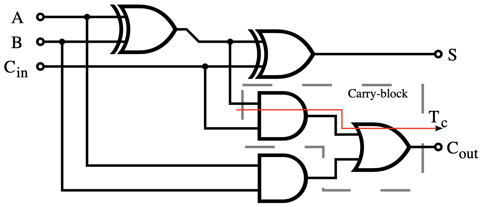

컴퓨터에서는 위 그림과 같은 1비트 가산기 32개로 구성된 32bit ripple-carry [adder](<https://en.wikipedia.org/wiki/Adder_(electronics)>)를 이용해 구성한다.

`정수의 뺄셈`은 음수의 덧셈으로 구현한다. 즉, negative sign integer를 이진수의 덧셈으로 구현한다.

#### Overflow

32비트 수들의 연산의 결과가 32비트로 표현할 수 없다면 `Overflow`가 발생했다고 한다.

C언어와 같은 overflow를 무시하는 언어는 `addu(add unsigned)`, `addiu(add immediate unsigned)`, `subu(sub unsigned)`와 같은 명령어를 사용한다.

하지만 ada, fortran등 overflow를 고려해야하는 언어는 operand의 타입에 맞게 명령어를 선택해야 한다.(`add`, `addi`, `sub`)

만약 overflow가 발생한다면, **exception handler**를 호출한다.

- interrupt라고 불리는 exception으로 overflow를 감지한다.
- \$PC를 **EPC register**(Exception Program Counter)에 저장한다.
- 미리 정의된 handler address(exception handler)로 jump한다.
- mfc0(move from system control)에서 명령이 이동하면 EPC에서 범용 레지스터에 복사해 원래의 명령으로 jump한다.

### Multiplication

다음으로 `정수의 곱셈`에 대해 살펴본다.

2진수의 곱셈에 대해 말하기 전에, 10진수의 곱셈에 대해 다시 생각해보자.

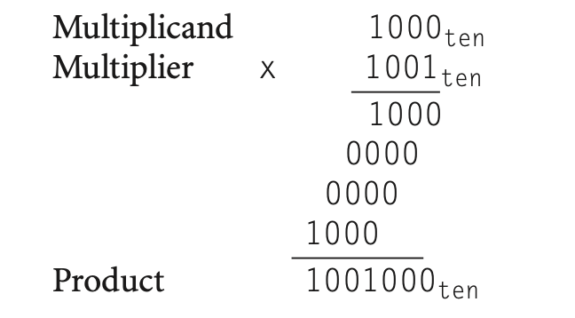

위의 연산은 10진수의 곱셈이지만 일부러 0과 1으로만 구성했다.

위 곱셈을 단계별로 나누면 다음과 같이 나타낼 수 있다.

1. multiplier의 가장 작은 자릿수부터 그 수가 0이 아니라면 multiplier에 그 자릿수를 곱한 값을 그 자리에 맞춰 적는다.
2. 0이면 지나간다.
3. 모든 자릿수에 대해 반복했으면 그 결과값들을 자리에 맞춰 더한다.

이진수의 경우에도 똑같이 진행하면 된다.  
multiplier의 각 자릿수가 0이거나 1일 뿐이므로, 그 수를 multiplican에 곱한 값은 0이거나(적지 않거나) multiplicand 그 자체이다.  
따라서 자리에 맞춰 적기만 한 후, 더하면 된다.

문제는 이것을 하드웨어적으로 어떻게 구현했는가를 살펴보는 것이다.

<br>

---

<br>

다음의 그림을 보자.

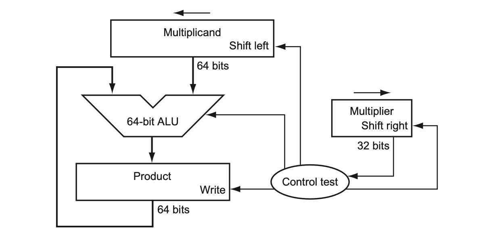

다음의 단계를 따라 곱셈을 진행한다.

1. Product를 0으로 초기화한다.
2. Multiplier의 0번째 비트(맨 오른쪽 비트, 가장 작은 자릿수)를 확인한다.
   > (가장 작은 자릿수부터 순차적으로 곱해서 더해나간다.)
3. 그 값이 1이라면, product에 multiplicand를 더하고, 그 값을 product register에 넣는다.
   > (0이라면 위의 알고리즘처럼 지나간다.)
4. Multiplicand register를 왼쪽으로 1비트 쉬프팅한다.
   > (자릿수에 따라 덧셈하는 값을 곱해주기 위함)
5. Multiplier register를 오른쪽으로 1비트 쉬프팅한다.
   > (다음 자릿수를 확인하기 위함)
6. 위 과정을 32번 반복한다.

Multiplicand는 자릿수를 맞추기 위해 매 multiplier 자릿수마다 왼쪽으로 쉬프팅돼서 더해진다.  
따라서 Multiplicand는 왼쪽으로 추가로 0으로 32비트 채워져 있는 64비트 레지스터에 저장되어 있어야 한다.

이 방법은 32번 반복해야 하므로 각 단계가 세번의 (bit check, sll, srl) clock cycle을 필요로 한다고 가정하면, 거의 100번에 가까운 clock cycle을 요구한다.

#### Refined version

위 알고리즘은 다음과 같이 각 단계당 한번의 clock cycle만 필요로 하도록 개선될 수 있다.

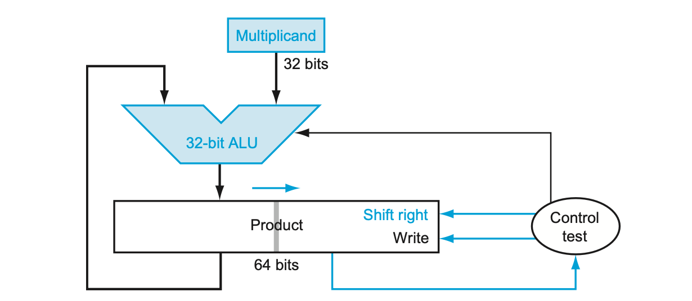

각 operation을 **병렬적으로 수행**함으로써 시간이 개선된다.

Multiplier와 multiplicand의 쉬프팅은 multiplicand가 product에 더해질 때 동시에 일어난다.  
하드웨어는 단지 multiplier의 0번째 비트가 0인지 1인지만 판단하고 multiplicand의 왼쪽으로 쉬프팅 되어있는 값을 얻는것을 보장하기만 하면 된다.

또한 하드웨어는 register와 adder의 사용되지 않는 부분을 찾아내어 폭을 줄일 수 있다.

위 그림에서 초기에 multiplier는 product의 맨 오른쪽 32비트에 저장되어 있다.  
multiplier의 0번째 비트를 확인하면서, 1이라면 product의 맨 왼쪽 32비트에 더한다.  
product를 전체적으로 오른쪽으로 쉬프팅하고, 그 과정을 반복한다.  
32번 반복하면, product에는 multiplier가 남아있지 않고 결과값만이 남아있게 된다.

#### Multiplication in MIPS

MIPS 아키텍쳐에는 곱셈과 나눗셈을 위한 2개의 레지스터가 있다.

`HI(High)`는 most-significant 32비트를 담는 레지스터이다.  
`LO(Low)` 는 least-significant 32비트를 담는 레지스터이다.

`mult(multiplication)`, `multu(multiplication unsigned)`은 두 opernad의 곱셈을 진행해 HI / LO 레지스터에 저장한다.

```txt
mult rs rt  # HI-LI = rs * rt
```

`mfhi(move from HI)`는 HI의 값을 레지스터로 이동시킨다.  
`mflo(move from lo)`는 LO의 값을 레지스터로 이동시킨다.

```txt
mfhi rd # rd <- HI
mflo rd # rd <- LO
```

### Division

마지막으로 `정수의 나눗셈`에 대해 알아보자.

이번에도 역시 10진수의 나눗셈을 다시 살펴보자.

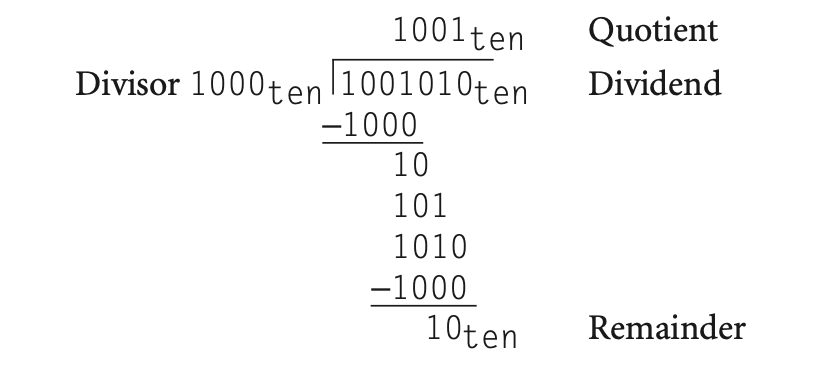

Divisor에 Quotient의 한 자릿수를 곱해서 그 자리만큼의 값만큼 Dividend에서 뺄셈이 가능하도록 Quotient의 자릿수의 크기를 정한다.

2진수의 나눗셈의 경우, 그 자릿수는 딱 자리를 고려한 divisor이거나(1) 들어가지 않거나(0)이기 때문에 고려할 계산이 10진법에 비해 매우 적다.

<br>

하드웨어로 구현한 나눗셈을 살펴보자.

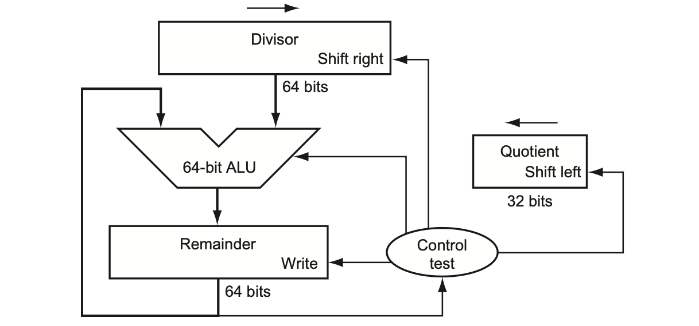

다음 단계에 따라 나눗셈이 진행된다.

0. Divisor register의 왼쪽 halfword를 divisor로 초기화하고, 오른쪽 halfword를 0으로 초기화한다.  
   Remainder를 dividend로 초기화한다.
1. Remainder register에서 Divisor register의 값을 빼고, 그 값을 Remainder register에 저장한다.
1. -a) 만약 Remainder가 0보다 크다면  
   Quotient를 왼쪽으로 쉬프팅하고, 새로운 가장 맨 오른쪽 비트의 값을 1로 만든다.

   -b) 만약 Remainder가 0보다 작다면  
   Divisor register의 값을 다시 Remainder register의 값에 더해서 원래의 값으로 복구하고, 그 값을 Remainder register에 저장한다.  
   Quotient를 왼쪽으로 쉬프팅하고, 새로운 가장 맨 오른쪽 비트의 값을 0으로 만든다.

1. Divisor register를 오른쪽으로 쉬프팅한다.
1. 33번 반복한다.

#### Refined version

위 알고리즘 역시 곱셈의 경우와 마찬가지로 **병렬적으로 명령을 수행**함으로서 개선될 수 있다.  
쉬프팅과 quotient의 뺄셈을 동시에 진행해 성능을 향상시킨다.

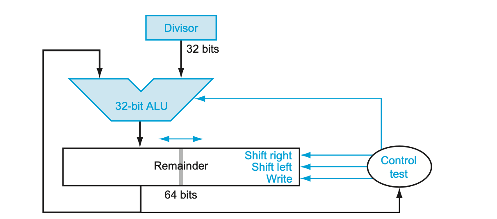

곱셈의 경우와 매우 유사하게 진행된다.

Remainder에 dividend를 넣고 시작하고, Remainder가 왼쪽 오른쪽으로 쉬프팅되면서 결국 remainder의 왼쪽 halfword는 remainder가, 오른쪽 halfword는 quotient가 저장되게 된다.

#### Division in MIPS

곱셈의 경우와 마찬가지로, `HI`와 `LO` 레지스터를 사용한다.

`HI(High)`는 most-significant 32비트. 즉, remainder를 저장하는 레지스터이다.  
`LO(Low)` 는 least-significant 32비트. 즉, quotiendt를 저장하는 레지스터이다..

`div(division)`, `divu(division unsinged)`는 두 opernad의 곱셈을 진행해 HI / LO 레지스터에 저장한다.

```txt
div rs rt  # HI = rs % rt, LO = rs // rt
```

오버플로우나 0으로 나눗셈에 대한 체크는 하지 않는다.  
따라서 프로그램단에서 그 검사를 해주어야한다.

`mfhi(move from HI)`는 HI의 값을 레지스터로 이동시킨다.  
`mflo(move from lo)`는 LO의 값을 레지스터로 이동시킨다.

```txt
mfhi rd # rd <- HI
mflo rd # rd <- LO
```

<br>

---

<br>

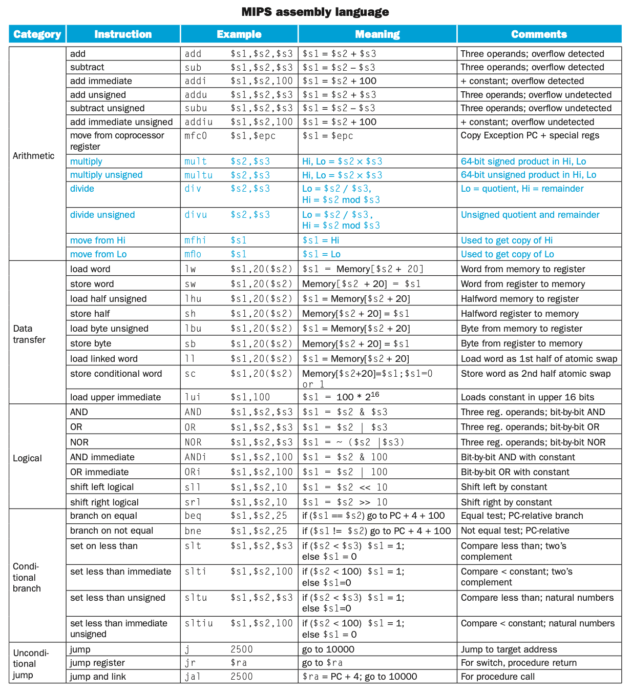

# Floating Point

정수에 대해 간략하게 알아보았으니 이제 실수의 표현에 대해 알아보자.

## Fixed-Point notation

실수 이진수를 표현할 방법으로 일반적인 십진수의 실수 표현 방식처럼, 소숫점을 찍는 방식을 생각해보자.

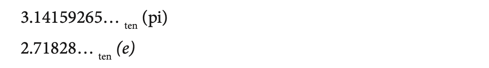

위의 십진수 실수의 표현처럼, 이진수를

$$
\begin{aligned}
   0\text{b}1101.1011 = 1 \times 2^3 + 1 \times 2^2 + 0 \times 2^1 + 1 \times 2^0 + 1 \times 2^{-1} + 0 \times 2^{-2} + 1 \times 2^{-3} + 1 \times 2^{-4}
\end{aligned}
$$

와 같이 소숫점을 숫자 중간에 찍어 표현할 수 있을 것이다.

이러한 표현방식을 소숫점이 고정(fixed)되어있는 방식, 즉 `fixed point(고정 소숫점) notation`이라고 한다.

## Floating-Point notation

다른 표현방식은 `floating point(부동 소숫점) notation`이다.

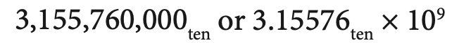

위 그림은 한 숫자를 두가지 표현방식으로 나타내었다.

위 그림의 첫번째 식은 32비트로는 표현할 수 없다.  
이를 두번째 식처럼 소숫점을 가지는 숫자와 자리수를 조정하기 위한 10의 제곱수의 곱으로 표현함으로서 해결할 수 있는데, 이와 같은 표현방법을 `scientific notation(과학적 표기법)`이라고 한다.  
특히, 위처럼 소숫점 왼쪽에 한자리의 수만을 가지는 scientific notation을 `normalized` 되었다고 한다.  
예를 들어, 위 식을 $$31.5576 \times 10^8$$이라는 scientific notation으로 표현하면 이 식은 non-normalized scientific notation이라고 할 것이다.

<br>

이진수의 경우에도 똑같이 표현할 수 있다.


위 식에서 곱셈의 왼쪽 항은 **significand**, 오른쪽 항의 지수는 **exponent**라고 한다.

<br>

위와 같은 숫자들을 지원하는 컴퓨터의 arithmetic은 binary point가 고정되어있지 않은 숫자를 나타내기 때문에, `floating point` 라고 불린다.

<br>

floating point 표현방식은 다음과 같은 장점이 있다.

- floating point 수를 포함하는 데이터의 교환을 단순화한다.
- 수가 항상 같은 form(scientific notation)을 유지하므로 floating point 수에 대한 알고리즘을 단순화한다.
- 불필요한 자릿수를 채우기 위한 0의 사용이 binary point 오른쪽에 있는 수로 대체되므로 word에 저장되는 숫자의 정확성이 올라간다.

### IEEE Representation

floating point를 표현하기 위해서는 한 word안에서 fraction이 차지하는 크기와 exponent이 차지하는 크기 사이에서 절충안을 정해야 한다. (fraction == significand - 1 )

이 절충안에서 fraction의 size를 키우면 그 숫자의 정확성을 높일 수 있지만, exponent의 size가 줄어들기 때문에 표현할 수 있는 수의 범위가 줄어들고,  
exponent의 size가 늘어나면 표현할 수 있는 수의 범위가 줄어들지만, fraction의 size가 줄어들기 때문에 정확성이 떨어진다.

<br>

MIPS에서는 다음과 같은 표현방식을 따른다.

 Representation](picture/IEEE.png)

- s 는 sign 1비트로 부호를 결정한다.
- exponent는 sign을 포함한 8비트로 표현된다.
- fraction은 23비트로 표현된다.

즉, floating porint number는 다음 위 format의 값에 따라 다음 식으로 표현된다.

$$
\begin{aligned}
\text{floating-point number} = (-1)^s + (\text{F}) + 2^{\text{E}}
\end{aligned}
$$

F(significand)는 fraction field의 값을 포함하는 값이다.  
E(exponent)는 exponent field의 값을 포함하는 값이다.

위 식에서, 표현하고자 하는 수의 exponent가 8비트로 표현하기에 너무 크다면 정수의 예와 마찬가지로 overflow가 발생할 수 있다.  
또한, 음수 exponenet가 8비트로 표현하기에 너무 크다면 underflow가 발생했다고 한다.

위와 같은 문제를 해결하기 위해 더 큰 exponent filed와 더 큰 fraction field를 가지는 format을 사용할 수 있다. 이를 double-precision이라고 한다.  
위 format은 single-precision이다.

#### single-precision

먼저 `single-precision` floating point에 대해 더 자세히 알아보자.

이 format으로 표현되는 자료형을 c에서는 **float**이라고 부른다.

<br>

`Significand`에 대해 생각해보자.

Normalized scientific notation의 sigificand는 절대값이  
$$ 1.0 \leq |\text{significand}| < 10.0 $$  
범위에 있다.

즉, 이진수의 경우  
$$ 0\text{b}1.0 \leq |\text{significand}| < 0\text{b}10.0 $$  
범위에 있을 것이다.

따라서 첫번째 leading-bit는 항상 1이며, 그렇게 때문에 이를 명시해줄 필요가 없다.

IEEE에서는 Significand를 표현할 때 1비트를 절약하기 위해, normalized binary number의 leading 1-bit를 숨긴다.(Hidden bit)

즉, 실제로 significand는 23비트 fraction field와 hidden leading bit 1로 구성된다.

<br>

**significand = fraction + 1**

<br>

`Exponenet`에 대해서도 살펴보자.

앞서 exponent는 첫번째 비트를 sign 비트로 가지는 8비트로 표현된다고 했다.

그렇게 할 경우, 다음과 같은 문제가 생긴다.

예를 들어, 0b1.0 X $$2^{-1}$$의 숫자는, 0b0 11111111 0000... 과 같이 표기될것이다.  
이는 너무 큰 숫자처럼 보인다.

0b1.0 X $$2^1$$은 0b0 00000001 0000...과 같이 표기된다.  
이는 위 숫자보다 더 작은 숫자처럼 보인다.

따라서 exponent 8비트가 0b00000000이 제일 작은 숫자가 되도록, 0b11111111이 제일 큰 숫자가 되도록 조정해서 표현하기로 하고, 이러한 방식을 **biased notation**이라고 한다.

즉, 실제 exponent는 exponent 8비트에서 bias를 뺀 값이 될 것이다.

IEEE single precision(float)에서 bias는 127이다.

<br>

**actual exponent = exponent - bias(127)**

<br>

즉, single-precision floating point를 다시 표현하면 아래의 식과 같다.

<br>

$$
\begin{aligned}
\text{floating-point number} = (-1)^s + (1 + \text{fraction}) + 2^{\text{exponent-bias}}
\end{aligned}
$$

<br>

몇몇 exponent는 특별한 값을 표현하기 위해 쓰인다.

exponent 8비트가 **0b0000 0000**이라면  
fraction이 0일때는 0을,  
farction이 0이 아닐때는 denormalized number를 나타낸다.

exponent 8비트가 **0b1111 1111**(즉 255)이라면  
fraction이 0일때는 infinity를,  
fraction이 0이 아닐때는 NaN(Not a Number)를 나타낸다.

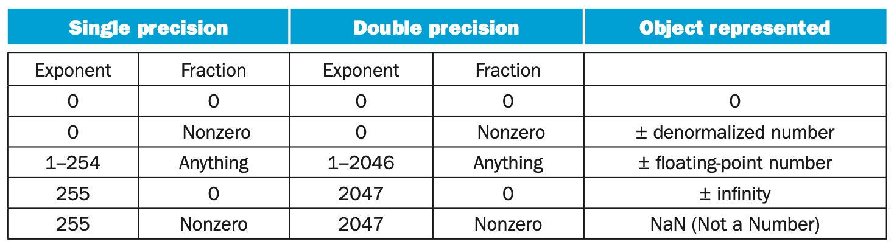

<br>

Single-precision의 **가장 작은 절댓값**에 대해 생각해보자.

Fraction이 0b0000...00일때 Significand는 0b1을 타나낼것이다.  
Exponent가 0b00000001일때 Actual Exponent가 -126을 나타낼 것이다.

> (0b0000 0000은 preserve 되어있기 때문에 특별한 값을 나타낸다.)

즉, $$\plusmn 1.0 \times 2^{-126} \approx \plusmn 1.2 \times 10^{-38}$$

<br>

**가장 큰 절댓값**은

Fraction이 0b1111...11일때 Significand는 $$0\text{b}1.1111...11 \approx 0\text{b}10.00000 \approx 2.0$$  
Exponent가 0b11111110일때 Actual Exponent가 127을 나타낼 것이다.

> (0b1111 1111은 preserve 되어있기 때문에 특별한 값을 나타낸다.)

즉, $$\plusmn 2.0 \times 2^{127} \approx \plusmn 3.4 \times 10^{38}$$

#### double-precision

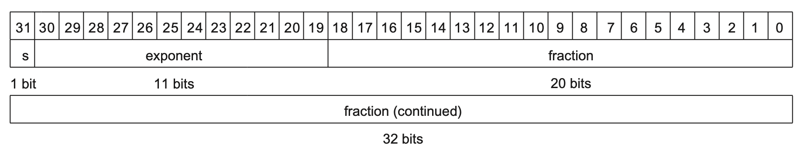

`double-precision`은 Fraction으로 52비트, Exponent로 11비트, bias로 1023을 사용하는 format이다.

이 format으로 표현되는 자료형을 c에서는 **double**이라고 부른다.

Double-precision의 경우에도 **가장 작은 절댓값**에 대해 생각해보자.

Fraction이 0b0000...00일때 Significand는 0b1을 타나낼것이다.  
Exponent가 0b0000 0000 001일때 Actual Exponent가 -1022를 나타낼 것이다.

> (0b0000 0000 000은 preserve 되어있기 때문에 특별한 값을 나타낸다.)

즉, $$\plusmn 1.0 \times 2^{-1022} \approx \plusmn 2.22 \times 10^{-308}$$

**가장 큰 절댓값**은

Fraction이 0b1111...11일때 Significand는 $$0\text{b}1.1111...11 \approx 0\text{b}10.00000 \approx 2.0$$  
Exponent가 0b1111 1111 110일때 Actual Exponent가 1023을 나타낼 것이다.

> (0b1111 1111 110은 preserve 되어있기 때문에 특별한 값을 나타낸다.)

즉, $$\plusmn 2.0 \times 2^{1023} \approx \plusmn 1.79 \times 10^{308}$$

<br>

single-precision에 비해 매우 큰 범위의 수를 표현할 수 있다.

### Addition

Floating Point 숫자들의 `덧셈`에 대해 살펴보자.

먼저 십진수의 경우에 대해 돌이켜본다.

9.9999 x $$10^1$$과 1.610 x $$10^{-1}$$의 덧셈에 대해 생각해보자.

다음과 같은 단계로 나눌 수 있다.

1. decimal point에 따라 정렬한다.  
   작은 exponent를 쉬프팅한다.

   > 9.9999 x $$10^1$$ + 0.0161 x $$10^1$$

2. significand를 더한다.

   > 9.9999 x $$10^1$$ + 0.0161 x $$10^1$$ = 10.015 x $$10^1$$

3. 결과를 normalized한다.

   > 1.0015 x $$10^2$$

이진수의 연산의 경우에도 똑같이 해주면 된다.

0b1.000 x $$2^{-1}$$과 -0b1.110 x $$2^{-2}$$의 덧셈의 과정을 보자.

1. binary point에 따라 정렬한다.  
   작은 exponent를 쉬프팅한다.

   > 0b1.000 x $$2^{-1}$$ + 0b0.111 x $$2^{-1}$$

2. significand를 더한다.

   > 0b1.000 x $$2^{-1}$$ + 0b0.111 x $$2^{-1}$$ = 0b0.001 x $$2^{-1}$$

3. 결과를 normalized한다.

   > 0b1.000 x $$2^{-4}$$

이 과정을 하드웨어로 구현한 다음의 그림을 보자.

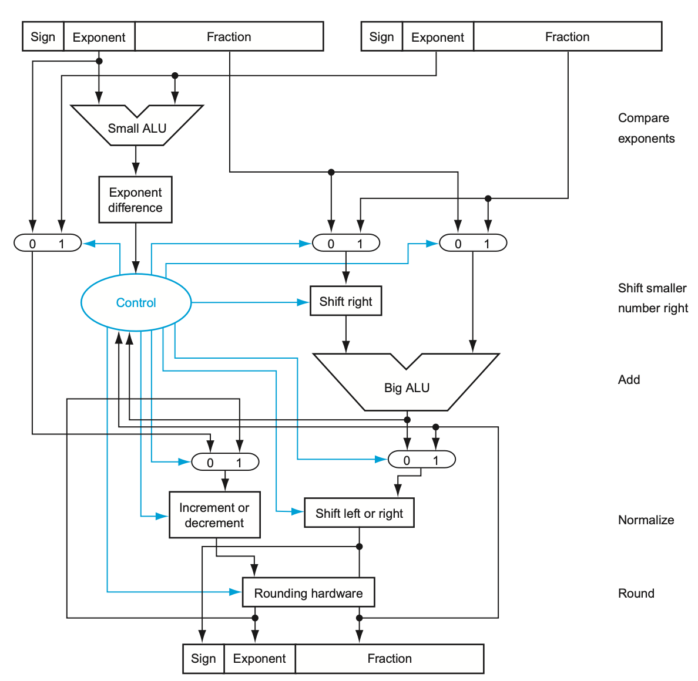

정수의 경우보다 매우 복잡한 구조를 가진것을 볼 수 있다.

위 과정을 한 cycle에 실행하려면 그 cycle에 매우 긴 시간이 소요될 것이다.  
긴 clock pulse는 다른 instruction의 한 cycle 실행 속도를 줄일 뿐이다.

따라서 몇개의 cycle로 나누어 연산을 진행한다.

### Multiplication

Floating point 숫자들의 `곱셈`에 대해서도 살펴보자.

역시 십진수의 경우에 대해 다시 돌이켜 생각해보자.

1.110 x $$10^{10}$$ 과 9.200 x $$10^{-5}$$의 곱셈은 다음과 같은 단계로 진행한다.

1. Exponent끼리 더한다.

   > new exponent = 10 + -5 = 5

2. Significand끼리 곱하고, new exponent를 붙인다.

   > 1.110 x 9.200 = 10.212 => 10.212 x $$10^5$$

3. 결과를 normalized한다.

   > 1.0212 x $$10^6$$

4. 원래 식의 operand로부터 sign을 결정한다.

이진수의 연산의 경우에도 똑같이 해주면 된다.

0b1.000 x $$2^{-1}$$과 -0b1.110 x $$2^{-2}$$의 곱셈의 과정을 보자.

1. Exponent끼리 더한다.

   > new exponent = -1 + -2 = -3

2. Significand끼리 곱하고, new exponent를 붙인다.

   > 0b1.000 x 0b1.110 = 0b1.110 => 0b1.110 x $$2^{-3}$$

3. 결과를 normalized한다.

   > 0b1.110 x $$2^{-3}$$

<br>
<br>

FP Adder의 경우처럼, FP Multiplier의 구현 역시 매우 복잡하다.

FP Hardware는 다음과 같은 연산을 진행한다.

- FP Addition, Subtraction
- FP Multiplication
- FP Division
- FP Reciprocal(1/n)
- FP Square-root
- Conversion between FP - Integer

각 연산들은 몇번의 cycle을 요구한다.

### FP in MIPS

FP Hardware는 `coprocessor1`이라고 불린다.

FP Register들은 따로 분류되어있다.

- \$f0 ~ \$f31 : single precision register, pair for double

FP Instruction들은 FP Register를 상대로만 동작한다.

다음과 같은 instruction들이 있다.

`lwc1(load word coprocessor1)`는 coprocessor1에 word를 로드한다.  
`ldc1(load double coprocessor1)`는 coprocessor1에 double을 로드한다.

```txt
ldc1 $f8, 32($sp)    # $f8 = stack point + 8 32bit FP
```

`swc1(store word coprocessor1)`는 coprocessor1 레지스터에서 word를 메모리에 store한다.  
`sdc1(store double coprocessor1)`는 coprocessor1 레지스터에서 double을 메모리에 store한다.

```txt
swc1 $f8, 32($sp)    # stack point + 8 32bit FP = $f8
```

다음 instruction들은 single-precision 숫자들에 대해 작동한다.

`add.s(addition single)`, `sub.s(subtraction single)`, `mul.s(multiplication single)`, `div.s(division single)`

다음 instruction들은 double-precision 숫자들에 대해 작동한다.

`add.d(addition double)`, `sub.s(subtraction double)`, `mul.s(multiplication double)`, `div.s(division double)`

다음과 같은 비교 연산자도 존재한다.

`c.xx.s(comparison xx single)`,`c.xx.d(comparison xx double)` xx에는 eq, neq, lt, le, gt, ge 등 비교 연산자가 들어간다.  
연산의 결과는 **FP condition register**에 저장된다.

`bclt(branch if condition register is true)`, `bclf(branch if condition register is false)`는 FPcond(FP conditional register)의 값에 따라 branch한다.

<br>

---

<br>

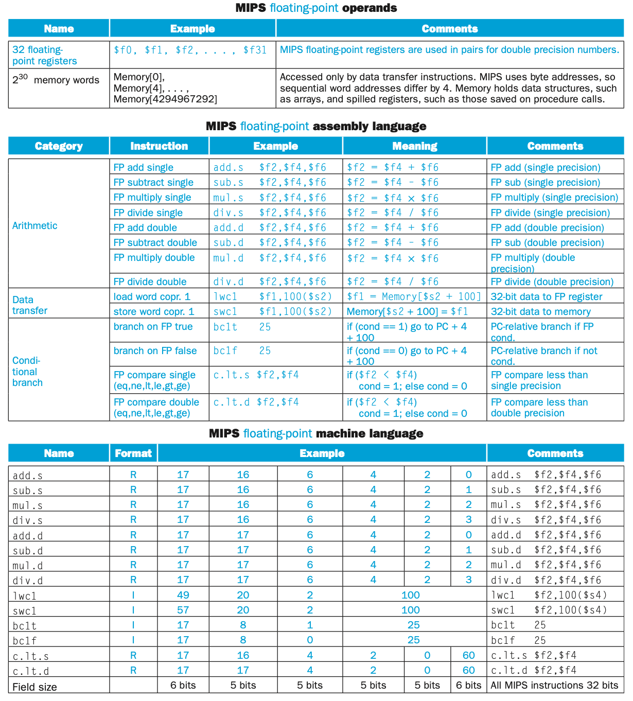
