> _Datapath_

_⌜Computer Organization and Design⌟의 4장 **Processor**에 대해 정리한 글입니다._

<!-- thumbnail -->

   
💡RoadMap

1. Computer Abstraction and Technology
2. Instruction Set Architecture
3. Arithmetic for Computer
4. `Proccessor`

   

 

---

# Proccessor

이번 장에서는 `프로세서(CPU)`에 대해 설명한다.

**1장**에서 컴퓨터의 성능이

- **Instruction Count (프로그램당 명령어 수)**
- **Cycle Per Instruction (명령어당 싸이클 수)**
- **Clock Cycle Time (싸이클에 걸리는 시간)**

3가지 요소에 의해 결정됨을 설명했다.

$$
\begin{aligned}
\text{CPU Time} &=
\frac{\text{time}}{\text{program}} =
\underbrace{\frac{\text{Instructions}}{\text{Program}}}_{\text{프로그램당 명령어 수}}  \times
\underbrace{\frac{\text{Clock Cycles}}{\text{Instruction}} }_{\text{명령어당 CPU Cycle 수}} \times
\underbrace{\frac{\text{time}}{\text{Clock Cycle}}}_{\text{CPU Cycle당 걸리는 시간}} \\
\end{aligned}
$$

**2장**에서는 **컴파일러**와 **ISA**가 그 중 **intstrcution count**를 결정함을 보았다.

이번 4장에서는 `프로세서`의 구현이 **CPI**와 **clock cycle time**에 영향을 미치는 것을 보일것이다.

 

이번 장에서는 MIPS를 바탕으로 구현한 프로세를 가지고 살펴볼 것이다.  
이번 장은 간단하게 구현한 프로세서와 파이프라인을 적용한 조금 더 현실적인 프로세서를 두 장으로 나누어 설명한다.

## Logic Design Convention

프로세서에 대해 얘기하기 전에, 어떻게 컴퓨터가 논리 하드웨어를 구현하고 실행하는지, 어떻게 컴퓨터가 clocking 하는지를 얘기해야 한다.

> 단, digital system에 관한 보다 자세한 내용은 따로 다룬다.

### Logic elements

MIPS의 datapath element는 두 종류의 `logic element(unit)`로 이루어져 있다:

- **Combinational elements**  
  input을 연산하여 output을 제공한다.

  > ex) AND GATE / Adder / MUX / ALU ...

- **State elements(Sequential elements)**  
  상태(state, information)를 저장한다.
  > ex) register, memory...

 

32비트 MIPS 아키텍쳐에서는 거의 모든 logic element들은 32비트의 입력과 출력을 가진다. (MIPS word = 32비트)

### Clocking

state element는 최소한 2개의 input이 있어야 한다.

하나는 **data value**이고,  
다른 하나는 언제 data value가 쓰여질지(written) 결정하는 **clock(clock pulse)**이다.
 

`Clocking Methodology`란 signal이 언제 read되거나 write될 수 있는지를 정의한다.  
이를 엄밀히 정의하는 것은 매우 중요한데, read와 write이 동시에 발생하면 문제가 생길 수 있기 때문이다.

#### edge-trigger

`edge-trigger clocking`이란 모든 sequential logic element에 저장되는 값이 한 clock edge에 업데이트 되는 것을 말한다.  
모든 값은 state element에만 저장될 수 있기 때문에,  
모든 combinational element는 state element에서 값을 가져와 입력해야하고,  
모든 combinational element에서 출력되는 값은 state element에 저장되어야 한다.

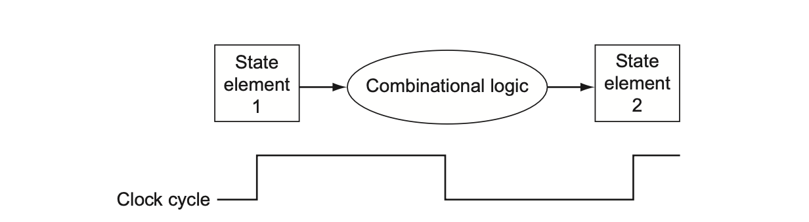

위 그림에서 한 clock cycle에 state element 1에서 combination logic을 통해 state element 2로 값이 저장됨을 볼 수 있다.

즉, edge-triggered 방법론에서는 레지스터의 내용을 읽어 combination logic을 통해 값을 얻어 레지스터에 저장하는 것을 1 clock cycle에 할 수 있다.

 

또한 다음과 같은 그림이 가능하다는 것을 시사한다.

 

## Datapath

`Datapath` element란 processor 안에서 data와 address 들을 process(operate, hold)하기 위한 유닛을 말한다.  
위에서 살펴본 것 처럼 두 종류의 logic element들로 구분할 수 있다.

> ex) Register, ALU, MUX, Memory...

 

MIPS Datapath에서 datapath element들을 가지고 MIPS 명령어를 어떻게 구혆하는지 명령어별로 생각해보자.

### Instruction Execution

우선적으로 `PC(Program Counter)`가 어떻게 동작하는지 살펴보아야한다.

MIPS에서 Instruction을 실행하는 과정은 다음과 같다.

1. 현재 \$PC의 32비트 주소값으로 instruction memory의 명령어를 fetch한다.
2. \$PC += 4
3. Fetch한 명령어를 decoding한다.
4. 명령어를 실행한다.

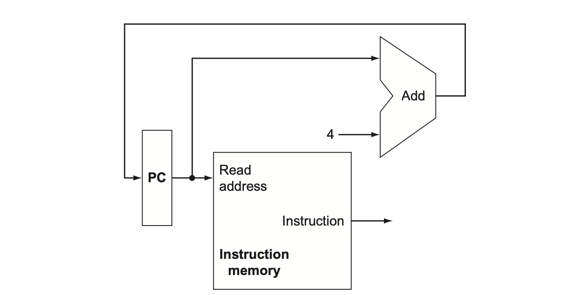

위 그림은 \$PC의 주소값으로 명령어를 fetch하고 \$PC의 주소값을 자동적으로 4만큼 증가시키는 유닛(들)을 나타내었다.

 

이제 위 과정을 통해 Fetch된 명령어들을 실행하는 datapath design을 살펴보자.  
Datapath design을 시작하는 가장 합리적인 방법은 MIPS 명령어의 각 format별로(세부적으로 몇몇 유형의 명령어별로) 명령을 실행하는데 필요한 주요 구성 유닛을 살펴보는 것이다.

### R-format

add, sub등의 수학 연산자와 and, or 등의 논리 연산자, sll, arl 등의 쉬프팅 연산자 등의 `R-format`의 경우를 생각해보자.

MIPS의 32개의 register convention에 따라 정의된 레지스터는 **register file**이라고 불리는 구조에 저장되어있다.

R-format은 다음과 같은 과정으로 실행된다.

1. 2개의 register operand를 받는다.(레지스터 숫자를 받는다.)
2. **register file**에서 두 값(word)을 읽는다.
3. 두 값을 input으로 **ALU**로부터 Arithmetic/Logicl 연산을 수행한다.
4. 결과값(word)를 **register file**에 저장한다.

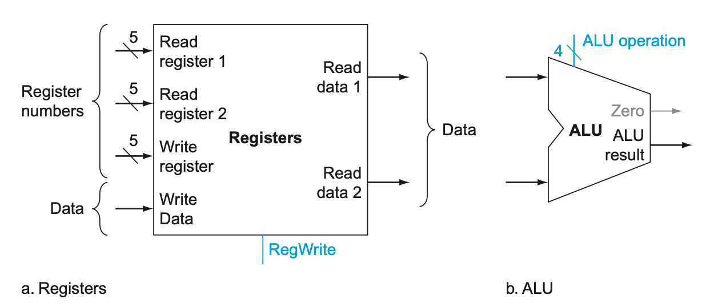

따라서 R-format을 구현하기 위해서는 위 두가지 유닛이 필요할 것이다.

위 그림의 a는 위 과정에 필요한 register file 접근을 나타낸다.

### load/store

다음은 `load/store` 명령에 대해 생각해보자.

> lw/sw \$t1,offset_value(\$t2)

이 명령어들은 다음과 같은 과정을 거친다.

1. base register(위 예에서 \$t2)로부터 **register file**에서 base address를 읽는다.
2. 16비트 offset을 32비트 **sign-extended** 값으로 계산한다.
3. 두 값을 **더하여(ALU)** 대상 매모리 주소를 얻는다.
4. 명령어가 sw라면, register file에서 불려온 \$t1값을 그 주소 **메모리**에 저장한다.
5. 만약 명령어가 lw라면, 대상 주소 **메모리**에서 불러온 값을 register file에 저장한다.

따라서, 위 명령어의 구현을 위해서는 R-format에서와 같이 register file과 ALU 유닛 둘 다 필요하다.

 

또한, 명령어의 16비트 offset 필드의 값을 32비트 **sign-extended** 값으로 계산하는 유닛이 필요하다.  
또, 메모리에서 값을 읽거나 메모리에 값을 저장해야 하기 때문에 **data memory** 유닛도 필요하다.

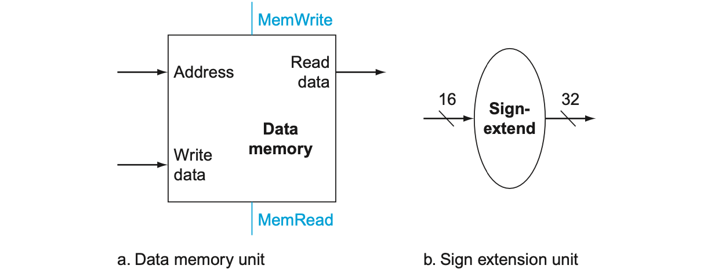

### branch

`Branch` 명령어에 대해서도 생각해보자.

Beq는 2개의 **register** operand가 있다.

또한 16비트 **offset**으로 타겟 주소를 계산해야 한다.  
offset을 왼쪽으로 2쉬프팅하고, 그것을 \$PC + 4에 더한다.

위 과정을 구현한 유닛의 구성은 다음 그림과 같다.

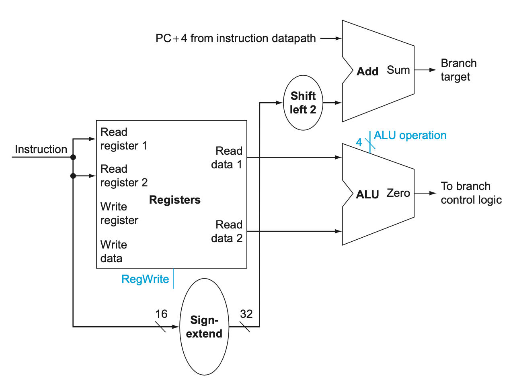

### Single Datapath

이제 명령어 format별로 필요한 datapath 구성 유닛들을 살펴보았으므로,  
해당 유닛들을 결합하고 control을 추가해 `single datapath`를 구현할 수 있다.

 

가장 간단하게 구현하는 datapath는 **하나의 clock cycle**동안 모든 명령어를 실행하려고 시도하는 datapath이다.

즉, 명령어당 datapath 자원을 두 번 이상 사용할 수 없으므로 두 번 이상 필요한 유닛은 복제되어야 한다.  
따라서 우리는 **데이터를 위한 메모리(Data Memory)**와 **명령어를 위한 메모리(IM, Instruction Memory)**를 별도로 분리해야 한다.

이제 위에서 살펴본  
instruction execution을 위한 datapath,  
R-type instruction과 메모리 접근을 위한 datapath,  
Branch를 위한 datapath  
를 추가해 간단한 버전의 MIPS 아키텍쳐 datapath를 만들 수 있다.

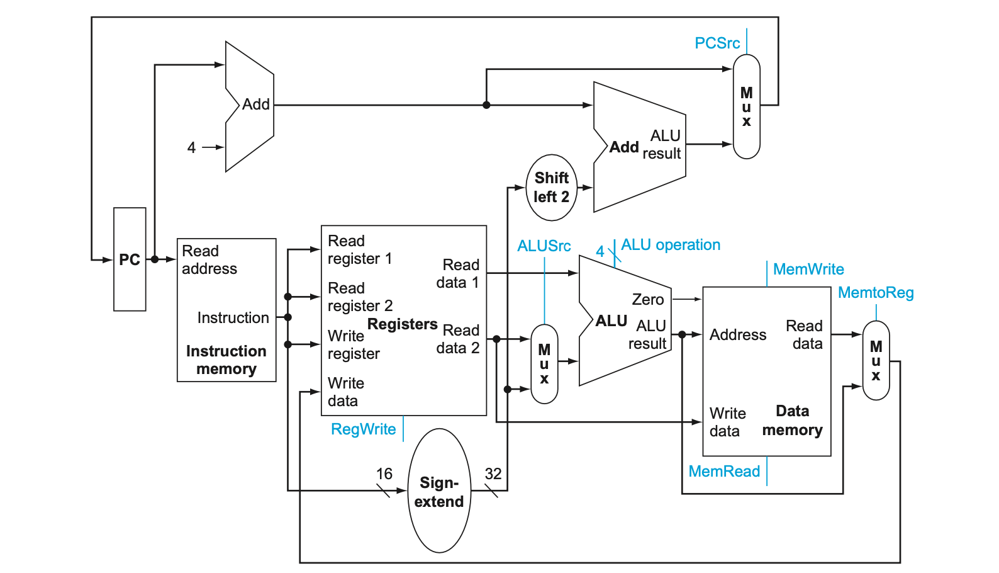

### Control

많은 유닛들이 서로 다른 명령어에 의해 공유되어 사용될 수 있다.

두 개의 서로 다른 명령어 format간에 유닛을 공유하려면 **MUX**와 `control signal(제어 신호)`을 사용하여 여러 입력 중에서 선택 할 수 있도록 유닛의 인풋에 대해 다중 연결(multiple collection)을 허용해야 한다.

#### ALU Control

명령어의 종류에 따라, ALU는 다음 6가지 function중 하나를 실행해야 한다.

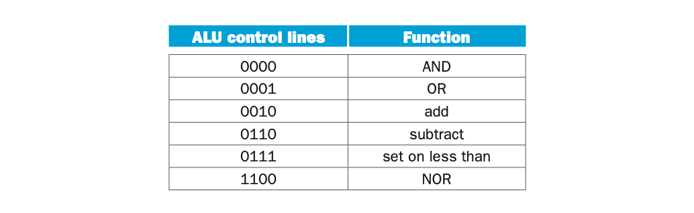

**lw/sw**를 위해서는 ALU로 offset을 통해 **addition**으로 주소값을 계산해주어야 한다.  
**beq**를 위해서는 ALU로 **subtraction**을 실행해야 한다.  
**R-format** 명령어들은 ALU로 funct field의 값들에 의해 **위 function중 하나**를 실행해야 한다.

 

우리는 `ALUOp`라고 부르는 2비트 control field와 명령의 funct field를 이용하여 4비트 ALU 제어 인풋을 생성할 수 있다.

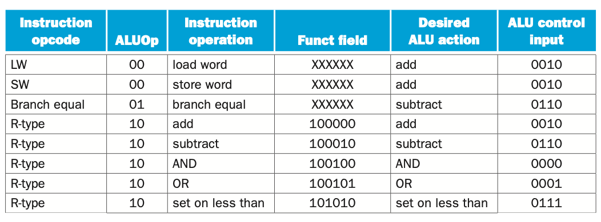

ALUOp는 수행할 작업이  
**lw/sw**를 위해 **Addition** 연산을 수행해야 하는지(00),  
아니면 **beq**를 위해 **Subtraction** 연산을 수행해야 하는지(01),  
아니면 **R-type** 명령어를 위해 **fucnt field**를 보아야 하는지(10)  
를 결정한다.

위 표를 통해 위 과정으로 4비트 ALU 제어 인풋(**ALU Control Input**)을 생성할 수 있음을 볼 수 있다.

> _(위 표를 truth table을 만들어 hardware로 구성하는 과정은 digital system에 관한 내용이므로 자세히 다루지 않는다.)_

#### Other Control Signal

ALU control을 제외한 나머지 부분의 `control signal`에 대해서 살펴본다.

다음의 MIPS 명령어 형식에 대한 몇가지 특징을 말할 수 있다.

- opcode는 항상 [31:26]이다. 이 필드를 Op[5:0]이라고 부른다.

- 읽을 두 레지스터 rs와 rt는 항상 [25:21], [20:16]이다.  
  이는 R-format, beq, sw 등에 적용된다.

- 저장될 base 레지스터는 항상 [25:21]\(rs)이다.

- 16비트 offset은 항상 [15:0]이다.  
  이는 beq, lw, sw등에 쓰인다.

- destination 레지스터 rd가 두 곳 중 하나에 존재한다.  
  lw의 경우 [20:16]이다.  
  R-format 명령어의 경우 [15:11]이다.  
  명령어의 어느 부분이 rd로 사용될 지 선택할 수 있도록 MUX를 추가해야 한다.

 

위 정보들을 사용해 instruction label과 추가적인 MUX를 위에서 구성한 single datapath에 적용시킬 수 있다.

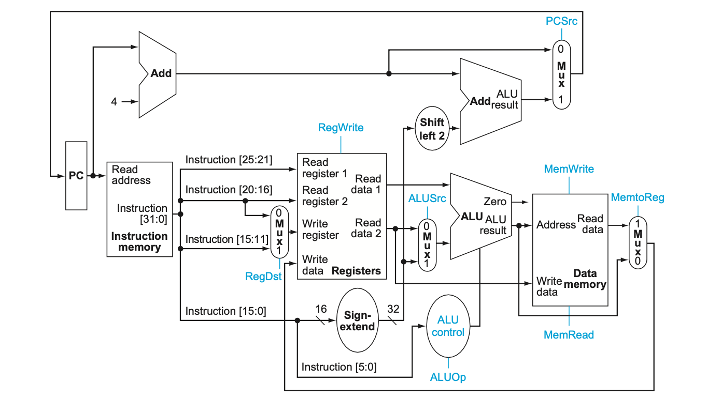

그림에서 파란색 선은 instruction label을 나타낸다.

 

---

 

다음 표는 control line들의 기능을 설명한다.

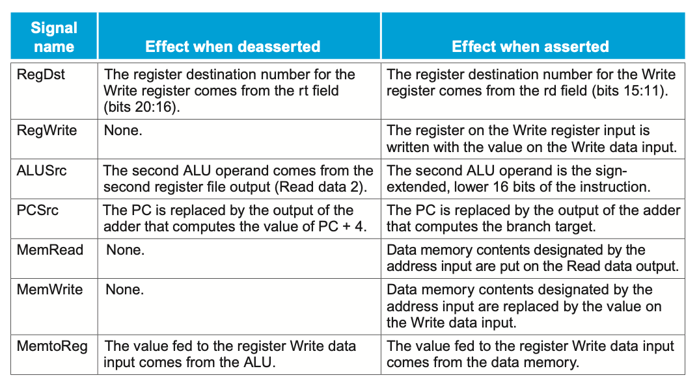

이제 위 제어 신호들을 제어 유닛에 세팅해보자.

제어 유닛은 명령의 **opcode**만을 기준으로 하나의 제어 신호를 제외한 모든 신호를 설정할 수 있다.  
그 예외 신호는 PCSrc이다. PCSrc는 명령어가 beq이고, ALU의 결과가 0일때(즉, 같을 때) 그 신호가 실행(asserted)된다.

 

이제 위 7개의 신호와 ALUOp 신호를 opcode 6비트를 기준으로 생성할 수 있다.

아래 그림은 제어 유닛과 제어 신호가 추가된 간단한 버전의 MIPS Architecture datapath이다.

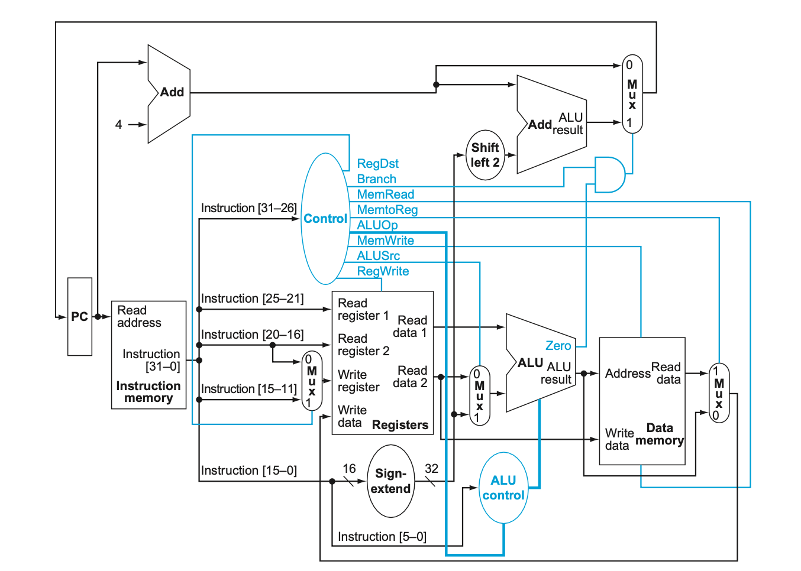

### Jump

위 datapath에 `Jump`를 구현해보자.

\$PC에서 4비트를 받고,  
26비트의 address field의 비트를 붙이고,  
2비트(00)을 붙여 address를 완성한다.

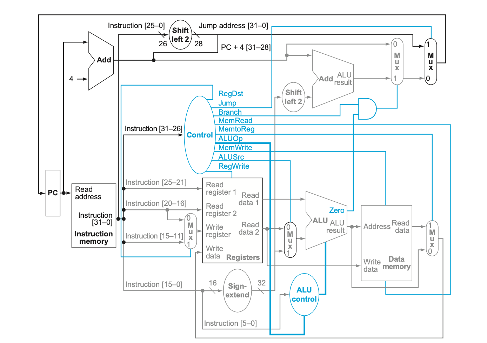

Control unit에 jump signal이 추가된 것을 볼 수 있다.

### Performance Issue

위처럼 구현한 **Single-Cycle Datapath**는 정상적으로 작동하지만, 현대의 컴퓨터 구조로는 사용하지 않는다.  
이는 너무 비효율적이기 때문이다.

Clock cylce은 모든 명령어에 대해 같은 길이(시간)를 가져야 한다.  
따라서, **가장 긴 clock cycle**이(path)가 전체 시간을(clock period)를 결정한다.

> (Logest delay determines clock period)

위 구조에서 가장 긴 path는 거의 lw 명령어이다.  
lw는 5개의 functional unit을 사용한다:

1. instruction memory
2. register file
3. ALU
4. data memory
5. register file

CPI는 1 이라고 할지라도, 전체적인 single-cylcle의 성능은 clock cycle의 시간이 (clock period)가 길어지기 때문에 나빠진다.

따라서, 다음 글에서는 성능을 개선하기 위해 **pipeline**이라는 방법을 알아본다.
