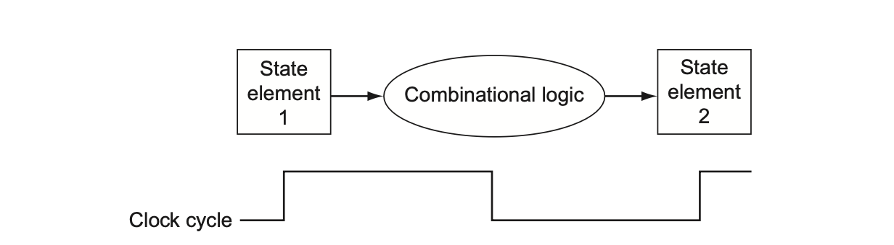
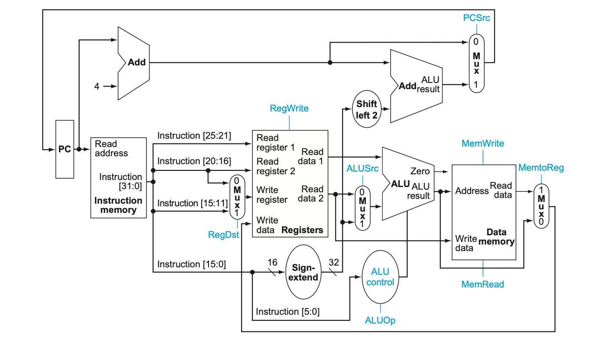
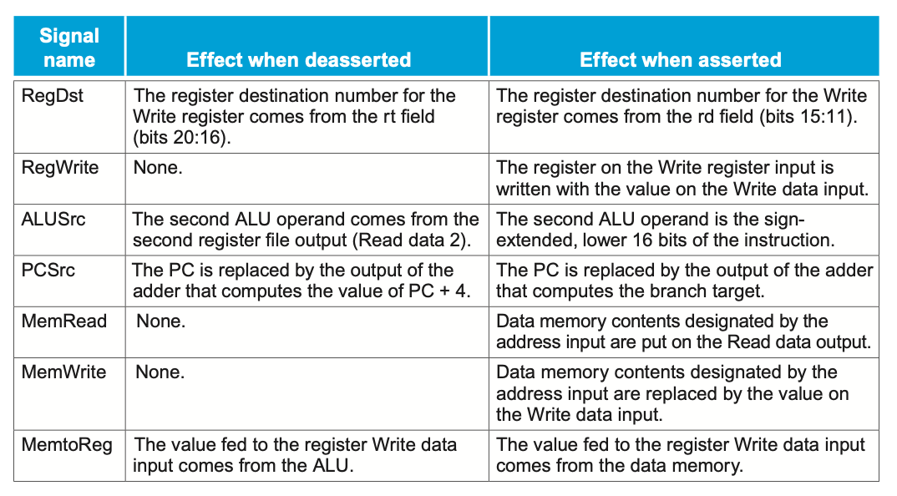
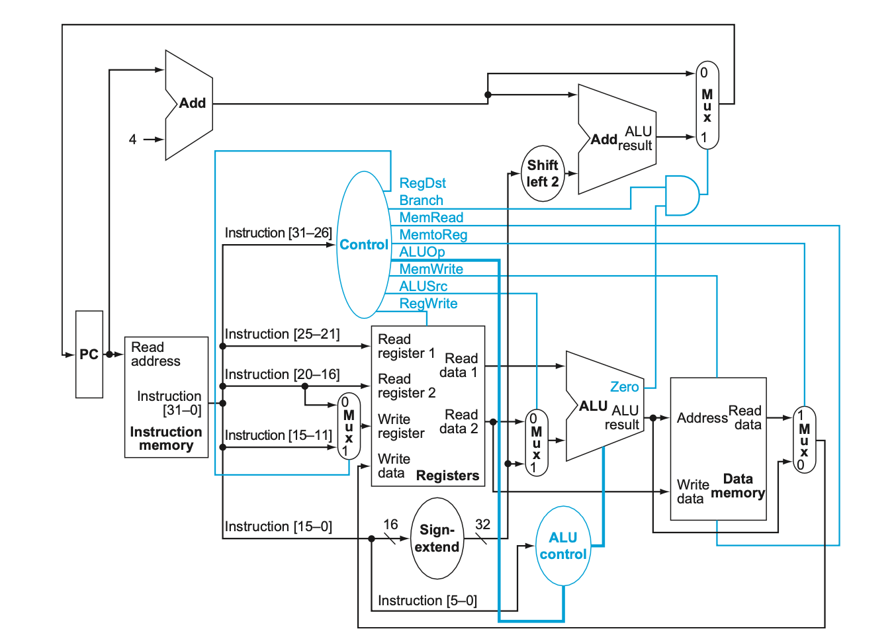

> _Datapath_

_⌜Computer Organization and Design⌟의 4장 **Processor**에 대해 정리한 글입니다._

<!-- thumbnail -->

<details>
   <summary>💡RoadMap</summary>

1. Computer Abstraction and Technology
2. Instruction Set Architecture
3. Arithmetic for Computer
4. Proccessor

   </details>

<br>

---

# Proccessor

이번 장에서는 `프로세서`에 대해 설명한다.

**1장**에서 컴퓨터의 성능이  
**프로그램당 명령어 수(intctruction count)**  
**명령어당 싸이클 수(CPI)**  
**싸이클당 걸리는 시간(clock cycle time)**  
3가지 요소에 의해 결정됨을 설명했다.

**2장**에서는 **컴파일러**와 **ISA**가 **intstrcution count**를 결정함을 보았다.

이번 4장에서는 `프로세서`의 구현이 **CPI**와 **clock cycle time**에 영향을 미치는 것을 보일것이다.

<br>

이번 장에서는 MIPS를 바탕으로 구현한 프로세서를 예를 들어 살펴볼 것이다.  
간단하게 구현한 프로세서와, pipeline을 적용한 조금 더 현실적인 프로세서를 살펴볼 것이다.

## Logic Design Convention

프로세서에 대해 얘기하기 전에, 어떻게 컴퓨터가 논리 하드웨어를 구현하고 실행하는지, 어떻게 컴퓨터가 clocking 하는지를 얘기해야 한다.

> digital system에 관한 보다 자세한 내용은 따로 다룬다.

### logic elements

MIPS의 datapath element는 두 종류의 `logic element`로 이루어져 있다:

- **Combinational elements**  
  input을 연산하여 output을 제공한다.

  > ex) AND GATE / Adder / MUX / ALU ...

- **State elements(Sequential elements)**  
  상태(state, information)를 저장한다.
  > ex) register, memory...

state element는 최소한 2개의 input이 있어야 한다.  
하나는 **data value**이고, 다른 하나는 언제 data value가 쓰여질지(written) 결정하는 **clock(clock pulse)**이다.

### Clocking

Clocking에 대해서도 더 엄밀히 정의해보자.

<br>

`Clocking Methodology`란 signal이 언제 read되거나 write될 수 있는지를 정의한다.  
이를 엄밀히 정의하는 것은 매우 중요한데, read와 write이 동시에 발생하면 문제가 생길 수 있기 때문이다.

#### edge-trigger

`edge-trigger clocking`이란 모든 sequential logic element에 저장되는 값이 한 clock edge에 업데이트 되는 것을 말한다.  
모든 값은 state element에만 저장될 수 있기 때문에,  
모든 combinational element는 state element에서 값을 가져와 입력해야하고,  
모든 combinational element에서 출력되는 값은 state element에 저장되어야 한다.



위 그림에서 한 clock cycle에 state element 1에서 combination logic을 통해 state element 2로 값이 저장됨을 볼 수 있다.  
즉, edge-triggered 방법론에서는 레지스터의 내용을 읽어 combination logic을 통해 값을 얻어 레지스터에 저장하는 것을 1 clock cycle에 할 수 있다.

또한 다음과 같은 그림이 가능하다는 것을 시사한다.


<br>

32비트 MIPS 아키텍쳐에서는 거의 모든 logic element들은 32비트의 입력과 출력을 가진다(MIPS word = 32비트)

## Datapath

`Datapath` element란 processor 안에서 data와 address 들을 process(operate, hold)하기 위한 유닛을 말한다.  
위에서 살펴본 것 처럼 두 종류의 logic element들로 나누어진다.

> ex) Register, ALU, MUX, Memory...

MIPS Datapath에서 datapath element들로 MIPS 명령어를 어떻게 수행하는지 명령어별로 생각해보자.

### Instruction Execution

우선적으로 `PC(Program Counter)`가 어떻게 동작하는지 살펴보아야한다.

MIPS에서 Instruction을 실행하는 과정은 다음과 같다.

1. 현재 \$PC의 32비트 주소값으로 instruction memory의 명령어를 fetch한다.
2. \$PC += 4
3. Fetch한 명령어를 decoding한다.
4. 명령어를 실행한다.


위 그림은 \$PC의 주소값으로 명령어를 fetch하고 \$PC의 주소값을 자동적으로 4만큼 증가시키는 유닛(들)을 나타내었다.

<br>

이제 위 과정을 통해 Fetch된 명령어들을 실행하는 datapath design을 살펴보자.  
Datapath design을 시작하는 가장 합리적인 방법은 MIPS 명령어의 각 format별로(세부적으로 몇몇 유형의 명령어별로) 명령을 실행하는데 필요한 주요 구성 유닛을 살펴보는 것이다.

### R-format

add, sub등의 수학 연산자와 and, or 등의 논리 연산자, sll, arl 등의 쉬프팅 연산자 등의 `R-format`의 경우를 생각해보자.

MIPS의 32개의 register convention에 따라 정의된 레지스터는 **register file**이라고 불리는 구조에 저장되어있다.

R-format은 다음과 같은 과정으로 실행된다.

1. 2개의 register operand를 받는다.(레지스터 숫자를 받는다.)
2. **register file**에서 두 값(word)을 읽는다.
3. 두 값을 input으로 **ALU**로부터 Arithmetic/Logicl 연산을 수행한다.
4. 결과값(word)를 **register file**에 저장한다.


따라서 R-format을 구현하기 위해서는 위 두가지 유닛이 필요할 것이다.

위 그림의 a는 위 과정에 필요한 register file 접근을 나타낸다.

### load/store

다음은 `load/store` 명령에 대해 생각해보자.

> lw/sw \$t1,offset_value(\$t2)

이 명령어들은 다음과 같은 과정을 거친다.

1. base register(위 예에서 \$t2)로부터 **register file**에서 base address를 읽는다.
2. 16비트 offset을 32비트 **sign-extended** 값으로 계산한다.
3. 두 값을 **더하여(ALU)** 대상 매모리 주소를 얻는다.
4. 명령어가 sw라면, register file에서 불려온 \$t1값을 그 주소 **메모리**에 저장한다.
5. 만약 명령어가 lw라면, 대상 주소 **메모리**에서 불러온 값을 register file에 저장한다.

따라서, 위 명령어의 구현을 위해서는 R-format에서와 같이 register file과 ALU 유닛 둘 다 필요하다.


<br>

또한, 명령어의 16비트 offset 필드의 값을 32비트 **sign-extended** 값으로 계산하는 유닛이 필요하다.  
또, 메모리에서 값을 읽거나 메모리에 값을 저장해야 하기 때문에 **data memory** 유닛도 필요하다.


### branch

`Branch` 명령어에 대해서도 생각해보자.

Beq는 2개의 **register** operand가 있다.

또한 16비트 **offset**으로 타겟 주소를 계산해야 한다.  
offset을 왼쪽으로 2쉬프팅하고, 그것을 \$PC + 4에 더한다.

위 과정을 구현한 유닛의 구성은 다음 그림과 같다.


### single datapath

이제 위 명령어 format들에 필요한 datapath 구성 유닛들을 살펴보았으므로,  
해당 유닛들을 결합하고 control을 추가해 single datapath를 구현할 수 있다.

<br>

가장 간단하게 구현하는 datapath는 **하나의 clock cycle**동안 모든 명령어를 실행하려고 시도하는 datapath이다.

즉, 명령어당 datapath 자원을 두 번 이상 사용할 수 없으므로 두 번 이상 필요한 유닛은 복제되어야 한다.  
따라서 우리는 **데이터를 위한 메모리(Data Memory)**와 **명령어를 위한 메모리(IM, Instruction Memory)**를 별도로 분리해야 한다.

이제 위에서 살펴본  
instruction execution을 위한 datapath,  
R-type instruction과 메모리 접근을 위한 datapath,  
Branch를 위한 datapath  
를 추가해 간단한 버전의 MIPS 아키텍쳐 datapath를 만들 수 있다.


### Control

몇몇의 유닛들은 중복되어야 하지만, 많은 요소들이 서로 다른 명령어에 의해 공유되어 사용될 수 있다.

두 개의 서로 다른 명령어 format간에 유닛을 공유하려면 **MUX**와 `control signal(제어 신호)`을 사용하여 여러 입력 중에서 선택 할 수 있도록 유닛의 인풋에 대해 다중 연결(multiple collection)을 허용해야 한다.

#### ALU Control

명령어의 종류에 따라, ALU는 다음 5가지 function중 하나를 실행해야 한다.


lw/sw를 위해서는 ALU로 offset을 통해 **addition**으로 주소값을 계산해주어야 한다.  
beq를 위해서는 ALU로 **subtraction**을 실행해야 한다.  
R-format 명령어들은 ALU로 funct field의 값들에 의해 **위 function중 하나**를 실행해야 한다.

<br>

우리는 `ALUOp`라고 부르는 2비트 control field와 명령의 funct field를 이용하여 4비트 ALU 제어 인풋을 생성할 수 있다.


ALUOp는 수행할 작업이  
lw/sw를 위해 Addition 연산을 수행해야 하는지(00),  
아니면 beq를 위해 Subtraction 연산을 수행해야 하는지(01),  
아니면 R-type 명령어를 위해 fucnt field를 보아야 하는지(10)  
를 결정한다.

위 표를 통해 위 과정으로 4비트 ALU 제어 인풋(ALU Control Input)을 생성할 수 있음을 볼 수 있다.

> _(위 표를 truth table을 만들어 hardware로 구성하는 과정은 digital system에 관한 내용이므로 자세히 다루지 않는다.)_

#### Control signal

ALU control을 제외한 나머지 부분의 `control signal`에 대해서 살펴본다.

다음의 MIPS 명령어 형식에 대한 몇가지 특징을 말할 수 있다.

- opcode는 항상 [31:26]이다. 이 필드를 Op[5:0]이라고 부른다.

- 읽을 두 레지스터 rs와 rt는 항상 [25:21], [20:16]이다.  
  이는 R-format, beq, sw 등에 적용된다.

- 저장될 base 레지스터는 항상 [25:21]\(rs)이다.

- 16비트 offset은 항상 [15:0]이다.  
  이는 beq, lw, sw등에 쓰인다.

- destination 레지스터 rd가 두 곳 중 하나에 존재한다.  
  lw의 경우 [20:16]이다.  
  R-format 명령어의 경우 [15:11]이다.  
  명령어의 어느 부분이 rd로 사용될 지 선택할 수 있도록 MUX를 추가해야 한다.

위 정보들을 사용해 instruction label과 추가적인 MUX를 위에서 구성한 single datapath에 적용시킬 수 있다.



그림에서 파란색 선은 instruction label을 나타낸다.

---

다음 표는 control line들의 기능을 설명한다.



이제 위 제어 신호들을 제어 유닛에 세팅해보자.

제어 유닛은 명령의 **opcode**만을 기준으로 하나의 제어 신호를 제외한 모든 신호를 설정할 수 있다.  
그 예외 신호는 PCSrc이다. PCSrc는 명령어가 beq이고, ALU의 결과가 0일때(즉, 같을 때) 그 신호가 실행(asserted)된다.

<br>

이제 위 7개의 신호와 ALUOp 신호를 opcode 6비트를 기준으로 생성할 수 있다.

아래 그림은 제어 유닛과 제어 신호가 추가된 간단한 버전의 MIPS Architecture datapath이다.



### Jump

이제 위 datapath에 `Jump`를 구현한다.

\$PC에서 4비트를 받고,  
26비트의 address field의 비트를 붙이고,  
2비트(00)을 붙여 address를 완성한다.


Control unit에 jump signal이 추가된 것을 볼 수 있다.

### Performance Issue

위처럼 구현한 **Single-Cycle Datapath**는 정상적으로 작동하지만, 현대의 컴퓨터 구조로는 사용하지 않는다.  
이는 너무 비효율적이기 때문이다.

Clock cylce은 모든 명령어에 대해 같은 길이(시간)를 가져야 한다.  
따라서, 가장 긴 clock cycle이(path)가 전체 시간을(clock period)를 결정한다.

> (Logest delay determines clock period)

위 구조에서 가장 긴 path는 거의 lw 명령어이다.  
lw는 5개의 functional unit을 사용한다:

1. instruction memory
2. register file
3. ALU
4. data memory
5. register file

CPI는 1 이라고 할지라도, 전체적인 single-cylcle의 성능은 clock cycle의 시간이 (clock period)가 길어지기 때문에 나빠진다.

따라서, 성능을 개선하기 위해 **pipeline**이라는 방법을 알아본다.

## Pipeline

`Pipeline(파이프라인)`이란 여러 명령어를 실행할 때 중복해서(overlap) 실행하는 구현 기법을 말한다.

다음의 빨래 과정을 보면 파이프라인이 무엇인지 알 수 있다.


**병렬적**으로 각 과정을 수행하여 훨씬 적은 시간이 소요되는 것을 볼 수 있다.  
각 과정(단계, `stage`)는 모두 병렬적으로 동시에 작동한다.

위처럼, 각 단계별로 별도의 자원이 있는 한, 파이프라인을 적용할 수 있다.

<br>

역설적인점은, 각 파이프라인의 길이(위 그림의 빨래의 예에서는, 세탁기->건조기->접기->장에넣기)는 똑같다는 것이다.  
파이프라인은 각 라인을 병렬적으로 실행해 많은 작업(위 예에서는 세탁기에 들어가는 한 빨래 묶음)에 대해 같은 시간당 많은 작업을 시행할 수 있게 한다.  
따라서 파이프라인은 처리해야 할 작업이 많을 때, 한 작업을 실행하는 속도는 향상시켜주지 않지만 작업을 완료하는데 총 걸리는 시간을 줄여준다.

### pipeline in MIPS

동일한 원칙을 파이프라인 명령어 수행(pipeline instruction-execution)을 하는 프로세서에 적용시킬 수 있다.

MIPS insturction은 일반적으로 다음과 같은 5가지 단계(stage)로 이루어져 있다.

1. `IF(Intruction Fetch)`  
   \$PC의 주소값으로 메모리에서 명령을 가져온다.
2. `ID(Instruction Decode)`  
   명령을 디코딩하는 동안 레지스터를 읽는다.  
   MIPS 명령어의 regular format을 사용하면 디코딩과 레지스터를 읽는 두 과정을 동시에 진행할 수 있다.
3. `EX(Execution)`  
   명령을 실행하거나 주소를 계산한다.
4. `MEM(Memory)`  
   메모리에 접근한다.
5. `WB(Write Back)`  
   결과를 레지스터에 저장한다.

따라서 MIPS pipeline에는 5가지의 단계가 있다.

다음 예제는 pipeline으로 명령어 실행 속도가 빨라지는 것을 보여준다.


### ISA for pipeline

다음과 같은 몇가지 특징을 살펴보면, MIPS 아키텍쳐는 파이프라인을 위해 설계되었음을 알 수 있다.

1. **모든 MIPS isntruction은 32비트 길이이다.(고정길이)**  
   이러한 특징은 첫번째 단계에서 명령어를 가져오고(IF) 두번쨰 단계에서 명령어를 decoding하는것(ID)을 매우 쉽게 만든다.  
   X86과 같이 명령어의 길이가 다양한 ISA에서 파이프라인을 구현하는 것은 더 어렵다.

2. **소스 레지스터 필드(rs)가 명령어에서 같은 위치에 존재하는 몇개의 명령어 형식만 가지고 있다.**  
   이러한 구성은 IF 단계에서 에서 명령어를 가져와 foramt을 판단함과 동시에 ID 단계가 레지스터 파일을 읽기 시작할 수 있음을 의미한다.

3. **메모리 operand는 lw나 sw에서만 나타난다.**  
   이렇게 구성하면 EXE 단계에서 메모리 주소를 계산하고 다음 MEM 단계에서 메모리에 접근할 수 있음을 말한다.  
   X86과 같은 메모리에서 operand를 계산할 수 있는 ISA는 단계 3, 4는 address stage, memory stage로 확장되고 나서야 실행 단계로 갈 수 있을 것이다.

4. **operand는 메모리에서 정렬(aligned)되어 있어야 한다.**  
   따라서 우리는 두 개의 데이터 메모리가 필요한 단일 데이터 전송 명령에 대해 걱정 할 필요가 없게 된다.  
   요청된 데이터는 단일 파이프라인 단계(one-cycle)에서 프로세서와 메모리 간에 전송될 수 있다.

---

### Pipelined datapath


위 그림은 MIPS에서의 single-datapath를 pipeline의 5가지 stage로 구분해놓은 그림이다.

명령어와 데이터는 대체적으로 왼쪽에서 오른쪽으로 이동하며 각 stage를 수행한다.  
하지만, 오른쪽에서 다시 왼쪽으로 이동하는 두 가지의 예외적인 경우가 있다.(그림에서 파란색으로 표시):

- WB(Write Back), datapath의 마지막 stage에서 datamemory의 값을 datapath의 중간에 있는 register file에 전달한다.
- \$PC의 다음 주소값을 선택, MEM stage와 자동적으로 4 증가한 \$PC의 주소값 중 하나를 선택해 다시 \$PC에 전달한다.

오른쪽에서 왼쪽으로 이동하는 두 가지의 경우는 현재 명령어에 영향을 끼치지 않는다.  
두 데이터의 이동은 나중 명령어에만 영향을 끼친다.

첫번째 이동인 WB는 data hazard를,  
두번째 이동인 \$PC값의 설정은 control hazard를 일으킬 수 있다.  
이 부분은 Hazards 부분에서 다시 자세히 다룬다.

<br>

파이프라인의 동작을 이해할 수 있게 시각적으로 보는 방법은, 각 명령어들이 그들 고유의 datapath를 가지고 사용한다고 가정하는 것이다.


위 그림처럼 각 명령어가 한 datapath를 사용한다고 가정하면, 한 clock cycle(CC)에서 겹치는 유닛이 없음을 알 수 있고, 따라서 한 datapath에서 여러개의 명령어를 각 단계별로 사용하는 파이프라인이 가능하다는 것을 볼 수 있다.

<br>

하지만 문제가 있다. 예를 들어 위 그림에서 첫번쨰 명령어 datapath에서 IM 유닛이 IF stage에서 명령어를 제공하면, 그 명령어의 내용을 나머지 4 stage에서 사용해야 한다.  
하지만 바로 다음 명령어가 첫번째 명령어가 2번쨰 ID stage를 실행하고 있을 때 IF stage를 실행하게 되어 IM에 접근하게 된다.

위와 같은 문제를 해결하기 위해 그 전의 값을 기억할 수 있도록, 유닛과 유닛 사이에는 값을 담아놓는 레지스터가 필요하다.


위 그림은 파이프라인 레지스터가 각 stage를 담당하는 유닛 사이에 구현되있는 pipeline-datapth이다.

모든 명령어들은 각 clock cycle마다 한 pipeline register에서 다음 pipeline register로 실행된다.

---

이제 실제로 파이프라인을 실행해보자.

lw 명령어는 파이프라인의 5가지 stage를 모두 사용한다. 따라서 lw 명령어가 실행됨을 예를 들어 datapath의 각 stage들이 어떤 작업을 하는지 stage별로 그림과 함께 설명한다.


1. `Instruction Fetch`  
   \$PC의 주소값을 활용해서 메모리로부터 명령어를 읽어와 IF/ID 레지스터에 저장한다.  
   \$PC의 주소값은 자동적으로 4만큼 증가해 다시 \$PC에 저장되어 다음 clock cycle을 기다린다.  
   이 증가된 주소값은 IF/ID 레지스터에도 저장된다.(beq등 명령어에서 쓰일 수도 있기 때문)


2. `Instruction Decoding & register file read`  
   IF/ID 레지스터의 값으로부터 16비트 immediate 값, 두 개의 레지스터 번호를 얻는다.  
   16비트 immediate값은 sign-extend 유닛을 통해 32비트의 값으로 변환되고,  
   두 레지스터 번호를 통해 레지스터의 값을 읽는다.  
   3개의 값은 ID/EX 레지스터에 저장된다.
   또한 IF/ID에 저장했던 4만큼 증가한 \$PC의 주소값도 ID/EX 레지스터로 이동되어 저장된다.


3. `Execute or Address calculation`  
   ID/EX 레지스터로부터 레지스터1의 값과 sign-extended immeidate 값을 가져와 ALU로 두 값을 더한다.  
   더한 값을 EX/MEM 레지스터에 저장한다.
   //이 단계에서 beq라면 \$PC + 4 값을 IF/ID에서 불러와 sign-extended 값을 2만큼 쉬프팅 시켜 ADD 유닛으로 더하고 PC에 저장했을것.


4. `Memory Access`  
   EX/MEM 레지스터로부터 주소값을 얻어서 data memory에서 그 주소값에 해당하는 값을 읽는다.  
   읽어온 값을 MEM/WB 레지스터에 저장한다.


5. `Write Back`  
   MEM/WB 레지스터에서 값을 읽어 register file에 저장한다.

마지막 단계가 조금 이상하다는 것을 느낄 수 있는가?  
lw명령에서 불러온 word를 저장할 register는 어떤 stage에서 계산되는가?

IF/ID 레지스터가 그 레지스터 번호를 제공한다. 하지만 이 레지스터 번호는 ID stage가 아닌 lw 명령어가 끝난 뒤 저장할(Write Back 할) 레지스터의 주소를 찾을때에 사용된다.

따라서, 우리는 lw의 destination register의 번호를 저장해놓을(preserve) 필요가 있다.

IF/ID에서 desitnation register 번호를 읽어오면, 그 번호를 ID/EX, EX/MEM를 거쳐 저장해가며 MEM/WB 레지스터까지 도달한다.


---

이제 pipelined datapath의 한 명령어가 stage별로 실행되는 과정을 살펴봤으니, 여러 명령어가 파이프라인에 맞게 동시에(stimulus) 실행되는 과정을 보자.


위 그림은 5개의 명령어가 파이프라인에 따라 실행되는 모습을 나타낸 multiple-clock-cylcle pipeline diagram이다.

맨 마지막 add 명령어가 실행될 때(Clock Cylce 5), datapath의 모습은 다음과 같을 것이다.


### Pipeline Control

single-datapath에 컨트롤 유닛을 추가한 것처럼, pipeline-datapath에도 컨트롤 유닛을 추가해 보자.

먼저 datapath의 컨트롤 라인에 이름(label)을 다는 것으로 시작하자.


파이프라인 컨트롤을 구체화하기 위해서, 각 파이프라인 stage마다 컨트롤 값을 지정해주기만 하면 된다.  
각 컨트롤 라인은 오직 하나의 파이프라인 stage에 활성화되는 유닛에만 관련되어 있기 때문에, 우리는 컨트롤 라인을 5개의 stage에 각각 한개씩 총 5개로 나눌 수 있다.

1. `instruction fetch`  
   instruction memory를 읽고 \$PC에 새로운 주소값을 부여하는 일은 매 명령마다 항상 진행되므로, 이 stage에서는 특별히 컨트롤 할 일이 없다.

2. `instruction decode`  
   이 stage 역시 매 명령어마다 항상 일어나므로 특별히 제어할 것이 없다.

3. `Execution`  
   이 stage에서 설정된 신호는 RegDst, ALUOp, ALUSrc이다.  
   이 신호들은 result register, ALU operation, read data 2 또는 ALU를 위한 sign-extended immediate 를 선택한다.

4. `Memory access`  
   이 stage에서 설정된 신호는 Branch, MemRead, MemWrite이다.  
   beq, lw, sw는 이 신호들을 설정한다.

5. `Write Back`  
   이 stage의 신호는 MemtoReg, RegWrite이다.  
   MemtoReg는 ALU의 결과나 메모리 값을 register file로 보내는 것을 결정한다.  
   RegWrite은 선택한 값을 기록한다


아리 그림은 파이프라인 레지스터와 각 stage에 맞게 적절한 제어 신호가 연결된 full data path이다.


## Hazards

`Hazard`란 다음 clock cycle에 다음 명령어가 실행되는 것을 막는 상황을 뜻한다.

다음과 같이 세가지의 종류가 있다.

- Structure hazards  
  요구되는 자원이 사용중(busy)일 때

- Data hazards
  이전 명령이 data를 읽고 쓰는것을 기다려야 할 때

- Control hazards  
  이전 명령에 따라 컨트롤 행동이 달라질 때

### Structure hazard

`Structure hazard`란 명령어들이 한 clock cycle 내에서 같은 유닛을 사용할 때 발생하는 문제를 말한다.

예를 들어, MIPS의 파이프라인에서 memory가 Instruction memory(IM)와 Data memory(DM)로 분리되어 있지 않고 단일 메모리를 사용했다면, IF 단계와 MEM 단계에서 동시에 한 메모리에 접근하기 때문에 파이프라인에서 여러 명령어가 각기 다른 단계(IF와 MEM)를 수행하고 있을 때 같은 메모리, 즉 같은 유닛에 접근하게 되는 문제가 발생할 수 있다.

이러한 문제는 같은 유닛을 사용하게 되는 명령어가 발생한다면 `Bubble(지연)`을 주어 뒤의 명령어를 몇 cycle 늦게 사용하는 방식으로 해결할 수 있다.  
즉, 나중의 명령어가 IF단계로 인해 메모리를 사용하고 싶을 때 어떤 이전 명령어가 DM단계를 수행하고 있어 메모리를 사용하고 있다면, 나중 명령어의 IF단계는 `stall`된다는 뜻이다.  
이는 성능에 문제를 일으킨다.

이러한 구조적인 문제는 설계자가 **파이프라인을 설계할 때** 위험을 피할 수 있다.

이미 앞서 말했다시피, MIPS에서는 메모리를 Instriction Memory와 Data Memory로 나누어 이를 해결한다.

### Data Hazard

다음으로 살펴볼 pipeline hazard는 `Data Hazard`이다.

다음과 같은 순차적인 MIPS 명령어들에 대해 생각해보자.

```txt
sub   $2, $1,$3     # Register $2 written by sub
and   $12,$2,$5     # 1st operand($2) depends on sub
or    $13,$6,$2     # 2nd operand($2) depends on sub
add   $14,$2,$2     # 1st($2) & 2nd($2) depend on sub
sw    $15,100($2)   # Base ($2) depends on sub
```

첫번째 줄의 명령어에서 \$2 레지스터의 값이 결정되고, 뒤에 네 줄에 걸친 명령어들은 그 \$2의 값에 **의존한다**.  
따라서 위 순차적인 명령어들은 파이프라인으로 실행할 수 없다.

왜냐하면 뒤의 명령어들은 첫번째 명령어의 WB단계에서 \$2의 값이 정해지기 전에 ID명령을 실행하고 그 때 아직 WB에 의해 새로운 값이 저장되지 않은 register file을 사용하기 때문이다.


어떻게 하면 파이프라인으로 위와 같은 경우를 처리할 수 있을까?

#### Stalling

첫번째로 생각해 볼 수 있는 방법은, Structure Hazard의 경우와 같이 파이프라인을 `stall` 시키는 것이다.

예를 들어, 위의 경우 첫번쨰 명령어와 두번째 명령어만을 생각해 보자.

두번째 명령어의 ID단계에서 첫번째 명령어의 결과를 사용하므로, 두번째 명령어의 ID단계는 첫번째 명령어의 WB단계가 끝날때까지 stall 시키는 것이다.

실제로 stalling은 ID/EXE 레지스터가 아무 일도 하지 않도록 제어값(control value) 조정해서 구현한다.  
EXE, MEM, WB는 nop, noop이라고 불리는 **'no-operation'**을 실행한다.(아무 일도 하지 않는다.)

또한, PC와 IF/ID 레지스터의 업데이트도 막는다.  
다음 Cycle에서는 이미 fetch된 명령어를 **다시 fetch**하고, decode된 명령어를 **다시 decode**한다.

즉, 첫번째 명령어가 WB단계를 완료하여 레지스터의 값을 업데이트 할 때까지, 다른 단계들은 no-operation하거나 ID/IF를 다시 수행하며 stalling한다.

#### Forwarding

다음 방법으로 `forwarding(bypassing)`이라는 방법을 설명한다.

만약

```txt
add $s0, $t0, $t1
sub $t2, $s0, $t3
```

와 같은 순차적인 명령어가 있다고 가정하자.

stalling방법으로는 두번째 sub 명령어는 첫번째 add 명령어의 WB단계까지 끝나야 register file에 값이 저장되어 ID단계에서 올바른 register file의 값을 가져와 실행할 수 있기 때문에 첫번째 명령어가 WB단계가 실행될 때 까지 stalling 되어야 한다.

하지만 잘 생각해보면 \$s0의 값은 MEM, WB 단계를 가기 전 **EXE단계에서 이미 EXE/MEM 레지스터에 저장된다.**

따라서 뒤의 명령어들을 실행할 때 이전의 명령어가 메모리에 기록되고 다시 레지스터에 기록된는 것을 기다릴 필요 없이, EXE 단계에서 얻은 값을 뒤의 명령어에서 사용할 수 있도록 datapath에 경로를 만들어 즉시 사용한다면 stalling을 피하고 바로 사용할 수 있다.

이를 forwarding이라고 한다.


<br>

forwarding은 어떻게 작동할까?

먼저 pipeline register에 field notation을 사용해 종속성을 더 정확하게 나타내자.

예를 들어, "ID/EX.RegisterRs"는 한 레지스터의 값이 ID/EX 레지스터에서 발견되는 레지스터 1개의 번호이다.  
즉, register file의 첫번째 read port에서 나온 번호를 말한다.

위 노테이션의 왼쪽 부분(.을 기준으로)은 파이프라인 레지스터의 이름이고, 오른쪽 부분은 레지스터의 필드 이름이다.

이 노테이션을 사용하여 나타내는 hazard condition의 쌍들은 다음과 같다.

- EX/MEM.RegisterRd = ID/EX.RegisterRs
- EX/MEM.RegisterRd = ID/EX.RegisterRt
- MEM/WB.RegisterRd = ID/EX.RegisterRs
- MEM/WB.RegisterRd = ID/EX.RegisterRt

다시 맨 첫번째 예시의 순차적인 명령어들을 살펴보자.

```txt
sub   $2, $1,$3     # Register $2 written by sub
and   $12,$2,$5     # 1st operand($2) depends on sub
or    $13,$6,$2     # 2nd operand($2) depends on sub
add   $14,$2,$2     # 1st($2) & 2nd($2) depend on sub
sw    $15,100($2)   # Base ($2) depends on sub
```

첫번째 sub 명령어와 두번째 and 명령어 사이의 hazard는  
두번째 and 명령어가 EX 단계일 때,  
첫번째 sub 명령어가 MEM 단계일 때 나타날 것이다.

즉, 이 hazard는 다음과 같은 노테이션으로 나타낼 수 있다.

EX/MEM.RegisterRd = ID/EX.RegisterRs = \$2

반면 첫번째 sub명령어와 4번째 add 명령어 사이에는 hazard가 없다.

왜냐하면 첫번째 sub 명령어가 WB단계에서 레지스터 파일의 왼쪽 절반(write)를 사용하고 add의 ID단계에서 레지스터 파일의 오른쪽 절반(read)을 사용해 맞는 \$2를 읽기 때문이다.

<br>

이제 hazard를 탐지할 수 있고 이를 적절한 노테이션으로 나타낼 수도 있다.

이제 그 hazard에 맞게 데이터를 forwarding 시켜야 한다.


첫번째 명령어의 WB단계가 register file에 데이터를 기록하는것을 기다리지 않고 뒤의 명령어들이 ALU Input에 대한 종속성(파란색 선)에 따라 파이프라인 레지스터에서 값을 전달받아 사용하는 것을 볼 수 있다.

만약 모든 파이프라인 레지스터에서 ALU로 입력을 전달할 수 있다면, ALU 입력에 대해 MUX와 Control signal등을 추가해 데이터 종속성 노테이션에 따라 적절하게 제어한다면 파이프라인을 최대 속도로 실행할 수 있다.


위 두 그림은 forwarding control에 관련된 유닛과 제어신호를 보여준다.

다음과 같이 forwarding control unit을 추가해 전체적인 forwarding을 구현한 pipeline datapath를 나타낼 수 있다.


<br>

forwarding으로 항상 stall을 피할 수 있는것은 아니다.

다음과 같은 경우를 보자.


위 그림에서 첫번째 명령어 lw의 결과값은 EX스테이지의 ALU가 아닌 MEM단계에서 이루어져 MEM/WB 레지스터에 저장된다.

따라서 바로 다음 명령인 and 명령어는 첫번째 명령의 결과인 \$2레지스터를 EX/MEM 레지스터에서 forward해서 사용할 수 없다.

and 명령어는 EX 단계에서 ALU의 입력값으로 \$2값이 필요한데, 이는 전 명령어의 MEM단계가 끝나 MEM/WB 레지스터에서 forward 할 수 있다.

따라서 and 명령어는 이전 명령어의 MEM단계가 끝날 때 까지 한 cycle을 stall해야한다.


따라서 stall을 해야할지 말아야할지 결정하는 hazard 를 감지하는 유닛이 있어야 한다.


### Control Hazard

마지막으로 살펴볼 pipeline hazard는 `Control Hazard`이다.

다음과 같은 순차적인 명령어들을 살펴보자.

```txt
40 beq $1 $3 28
44 and $12 $2 $5
48 or $13, $6, $2
52 add $14, $2, $2
...
72 lw $4, 50($7)
```

첫번째 명령어 beq는 branch하면 72 lw 명령어로 branch 하게된다.

하지만 beq 명령어에서 어디로 branch할지 결정하는 것은 MEM단계에서 이루어진다.  
(\$PC의 값은 \$PC+4와 MEM stage의 주소값 중 하나로 선택된다.)


즉, 위와 같은 그림에서 만약 첫번째 명령어의 beq에서 마지막 명령어로 분기가 이루어진다면, 그 사이에 있는 명령어들은 진행되지 않았어야 하는 명령어들이지만 pipeline에 의해 각각 자신의 파이프라인 단계들을 수행하고(unit들을 이용하고) 있을 것이다.

따라서 그들이 단계를 수행하면서 이용한 각각의 유닛들에 있는 값을 flush해주어야 한다.(branch가 결정된다면)

첫번째 beq명령어가 branch 할지 안할지 결정하는 MEM stage까지 진행되어야 flush의 실행 여부가 결정되므로, 3개의 clock cycle동안(첫번째 명령어가 MEM단계를 수행하기까지) 그 다음 명령어들은 일단 순차적으로 파이프라인을 진행중일 것이다.  
만약 branch가 결정되어 그 3개의 3 clock cycle동안 진행중인 명령어들이 flush되어야 한다면, penalty가 3 cylce 발생했다고 한다.

다행히도 3개의 clock cycle동안에는 첫번째 branch 명령어 이후에 어떤 명령어도 명령을 완료해 레지스터나 데이터에 값을 쓰는등의 행위를 못하므로, 단순히 datapath unit들만 flush해주면 된다.

control hazard를 해결하기 위한 두가지 방법과 한가지의 최적화 방법을 알아보자.

<br>

##### Reducing delay of branches

Branch의 성능을 향상시키는 한가지 방법은 branch가 행해지는(taken)데 들이는 비용을 줄이는 것이다.

지금까지 다음 \$PC는 MEM 단계에서 \$PC+4와 메모리의 값 중 하나를 선택한다고 가정했지만, 하드웨어를 추가해 그 선택을 MEM단계보다 전 단계에서 할 수 있도록 조정한다면, penatly는 3보다 줄어들 것이다. (flush해야하는 명령이 줄어든다.)


위 그림은 MIPS pipeline에 ID stage에 unit을 추가해 branch가 taken되는지 그렇지 않은지 결정함을 보여준다.

Cycle3에서 beq가 ID 단계에서 banch taken되었기 때문에 cycle4에서 bubble(nop)이 발생하였고, 다음 IF는 lw가 fetch되었음을 볼 수 있다.

<br>

이제 ID 단계에서 분기를 할지 말지 결정할 수 있기 때문에, penalty는 1로 줄었다.


매 branch마다 위와 같이 1 cycle만 stall 하는 방법으로 control hazard를 해결할 수 있다.

##### Assume Branch Not Taken

두번째 방법은 앞서 행한 방법처럼 branch가 되지 않을것처럼 가정하고 그냥 다음 순차적인 명령어들을 파이프라인에 따라 실행하는 것이다.

만약 branch 명령어가 실행되어 분기해야 한다면, 그동안 진행된 명령어에 의해 유닛에 쓰여진 값들은 모두 폐기된다.(flush)

이렇게 branch가 될지 안될지에 상관 없이 일단 명령어를 진행시키는 방법은 control hazard를 절반으로 줄여준다.


그림에서 위의 방법은 1cycle stall하는 밑의 방법에 비해 branch가 실행되지 않는다면 그 다음 명령어에 대해 1cycle 만큼 pipeline 단계를 진행하기 때문에 빠르다.

유닛을 flush하는 방법은 load-use data hazard의 예시처럼 단순히 control value를 0으로 변경해주기만 하면 된다.

##### Dynamic branch prediction

branch not taken 방법은 branch prediction의 한가지 간단한 형태이다.  
이러한 방법은 MIPS와 같이 단순한 5단계 파이프라인의 경우에는 적합하다.

하지만 단계가 더 깊은 파이프라인에서는, clock cycle로 측정할 경우 penalty가 증가한다.  
마찬가지로, multiple issue에서 instruction lost의 관점에서 penalty가 증가한다.

이는 aggressive 파이프라인에서 이러한 단순한 정적 예측(static prediction)이 많은 성능 낭비를 일으킬 수 있음을 의미한다.

따라서 우리는 다른 branch prediction에 대해 생각해 보아야 한다.

datapath에 하드웨어를 더 추가해 프로그램의 실행 가운데서 branch prediction을 행할 수 있다.

예를들어, 명령어의 주소를 통해 이 명령이 마지막으로 실행되었을 때 branch가 실행되었는지를 확인하고, 만약 branch가 사용되었을 경우 마지막과 동일한 위치에서 새 명령을 가져오기 시작한다. 이를 `dynamic branch prediction`(동적 분기 예측)이라고 한다.

이를 구현하기 위한 방법 중 하나는 branch prediction buffer(branch history table, BHT)를 구현하는 것이다.

이 1비트짜리 버퍼는 branch 명령어의 주소의 lower 부분에 index된 작은 메모리이다.

이 메모리에는 가장 최근에 branch 되었는지 아닌지 알려주는 비트가 들어있다.

이것은 가장 간단한 형태의 buffer다.

만약 이 branch 연산이 가장 최근에 브랜치 되었다면(버퍼가 1이라면), branch가 taken 되었을 것이라고 가정한다.  
그렇지 않다면 taken되지 않았다고 가정하고 행동한다.

예를 들어 반복문을 MIPS Assembly언어로 구현한다면, 그 순차적인 명령어들의 가장 마지막 부분에는 그 반복문의 처음으로 돌아가는 분기 명령어가 있을 것이다.  
그 분기 명령어는 반복문의 횟수만큼 taken 될 것이다.

따라서 위 방법과 같이 buffer를 이용해 가장 최근에 taken 되었다면 taken 될 것이라고 예측하는게 도움을 준다.

하지만 다음과 같은 반복문에 대해 생각해보자.

```py
for i in range(1, 10):
      #loop
```

반복문의 맨 마지막 loop는 필연적으로 mispredict이다.  
따라서 위 반복문의 분기문은 맨 처음 branch는 buffer가 0인데 분기하므로 1번 mispredict, 그리고 마지막 10번째 분기문은 분기하지 않아야하는데 그 전 반복에서 분기했으므로 buffer가 1이기 때문에 mispredict이다.

따라서 80%의 정확도를 가진 branch prediction이라고 할 수 있다.

이는 괜찮은 수율이라고 생각할 수 있을지도 모르지만, 다음과 같은 경우를 생각해보자.

```py
for i in range(1, 100):
   for j in range(1, 3):
      #loop
```

위와 같은 중첩된 반복문을 생각해보자.

안쪽의 반복문을 도는 과정에서는 안쪽의 명령어로 분기하기 때문에 바로 prdiction을 하지만 마지막 반복에서 misprediction이 1회 발생한다.

또한 바깥쪽의 반복문 과정에서는 안쪽 반복문의 branch를 다시 실행시키게 되는데 그 branch는 바깥의 반복문으로 갈 때 misprediction이 발생해서 not taken을 예상하고 있는 상태이다.

따라서 이 때 misprediction이 또 발생한다!

이와 같은 문제점을 보완하기 위해, 2비트 BHT가 종종 고려된다.


Buffer로 2비트를 활용한다.

그림에서 왼쪽에 있는 2가지 상태(색이 진한 Predict taken과 Predict not taken)는 한번 예측이 틀려도 그들 오른쪽의 색이 연한 2가지 상태로 전환된다.

즉, 예측이 바뀌려면 두번 연속 misprediction이 발생해야 한다.

이러한 방법으로 아까의 반복문을 진행한다고 생각해보자.

안쪽의 반복문을 반복하는 마지막 branch 명령어는 misprediction이지만 계속 taken을 예측하기 때문에 바깥의 반복문으로 나갔다가 다시 안쪽의 반복문으로 들어와도 taken을 예측하고 있으므로 misprediction이 발생하지 않는다.

<br>

branch prediction을 통해 분기를 할지 말지를 효율적으로 계산할 수 있었다.  
하지만 여전히 분기 명령어에서는 어디로 분기할지 target address를 계산해야 한다.

5단계 파이프라인에서 이는 1단계를 소모하게 되며, 이는 branch가 taken된다면 1penalty가 발생한다는 것을 의미한다.

이를 해결하기 위해, 몇가지 방법들을 생각해 볼 수 있다.

<br>

Branch delay에서는 branch 명령어 다음의 명령어를 항상 실행시킨다.  
하지만 그 다음 명령어, 즉 2번째 명령여부터는 브랜치의 분기여부에 따라 실행여부가 결정된다.(분기 명령어의 ID 단계에서 여부가 결정되기 때문)

그 다음 항상 실행되는 명령어가 문제였고, prediction을 통해 이를 해결하려 했으나 100% 예측에 성공할 수는 없어서 1penalty가 발생할 수 있었다.

그 항상 실행되는 명령어 자리를 delayed slot이라고 하고, 컴파일러와 어셈블러가 delayed slot에 분기 여부에 상관없이 항상 실행되어야 하는 명령어를 채우는 방법을 고려한다.


위 그림은 delay slot을 스케쥴링하는 3가지 방법을 소개한다.

이 방법에 대한 한계점은 delay slot에 들어갈 수 있는 명령어의 제한과 분기가 taken될지 taken되지 않을지 컴파일 시간 안에 예측할 수 있는 능력이다.

분기 주소를 예측할 방법으로 고려되는 또 하나의 방법은 branch prediction buffer를 이용하는 것이다.

## datapath summary

이번 장에서 언급한 모든 프로세스를 적용한 datapath를 나타내었다.


