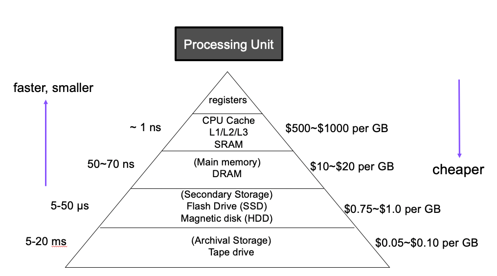
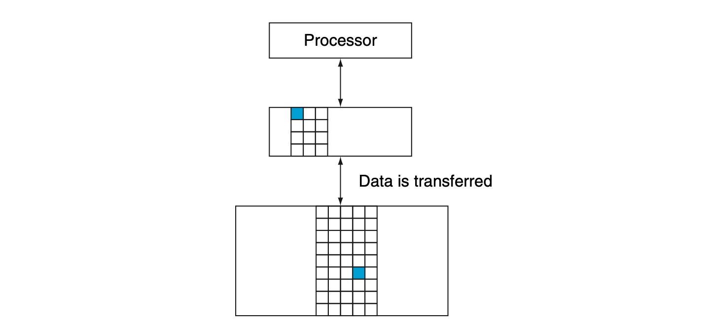
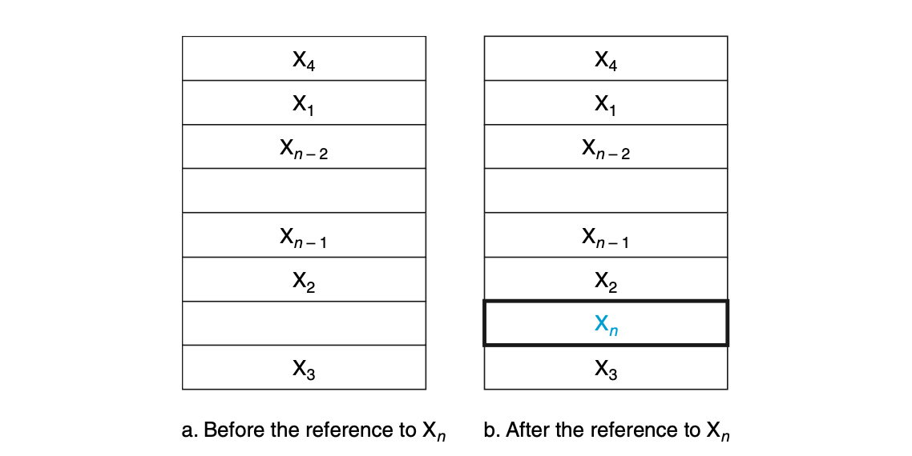
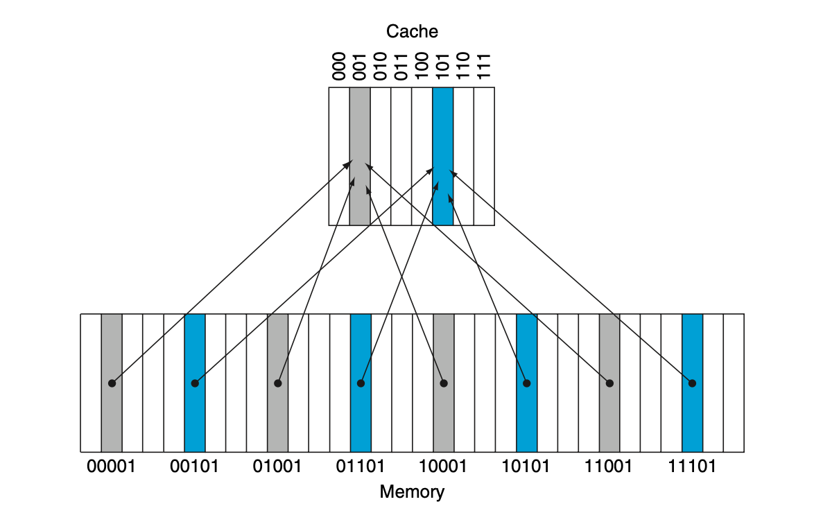
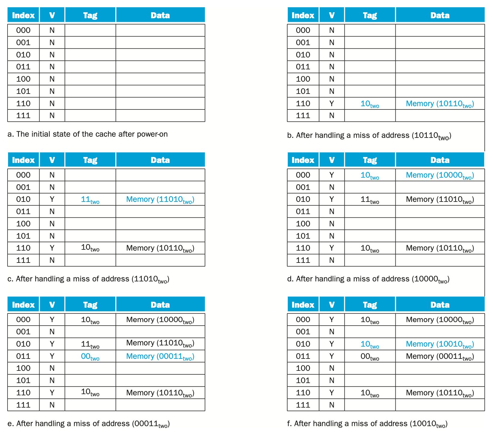

> _Memory_

_⌜Computer Organization and Design⌟의 5장 **Memory**에 대해 정리한 글입니다._

<!-- thumbnail -->

   
💡RoadMap

1. Computer Abstraction
2. ISA
3. Arithmetic for Computer
4. Proccessor
5. `Memory`

   

 

---

# Memory

이번 챕터에서는 `Memory`에 대해서 설명한다.

## Introduce

### principle of locality

컴퓨터 메모리의 구현에 대해 생각해보기 위해, 실생활에서의 예를 들어보자.

어떤 특정한 분야에 관해 조사하기 위해 도서관에 방문했다.  
도서관의 분류 시스템에 따라 그 주제와 관련된 책이 있을만한 책장에 가서 몇가지의 책을 꺼내어 책상으로 돌아와 쌓아놓는다고 생각해보자.  
만약 쌓아놓은 책 무더기에서 한 권을 골라 읽었는데 관련 내용을 찾을 수 없었다면, 책장에 다시 돌아가 새로운 책을 찾는 것 보다는 이미 책상에 쌓아놓은 책 중 한 권을 새로 골라 읽는 것이 더 효과적이라는 것을 쉽게 생각할 수 있다.  
일단 책상에 책을 잘 갖추게 된다면, 필요로 하는 많은 주제들이 그 책들에서 발견될 가능성이 높고, 책장으로 돌아가는 비효율적인 행동 대신 책상의 책들만을 살펴보면서 시간을 활용할 수 있다.

이와 같은 원리를 적용해 아주 작은 메모리만큼의 속도로 메모리에 접근할 수 있는 큰 메모리의 환상을 만들 수 있다.

도서관의 모든 책들에 대해 같은 확률로 접근할 필요가 없었던 것 처럼 프로그램이 모든 코드나 데이터에 같은 확률로 접근하지 않는다.

만약 그렇지 않으면 대부분의 메모리 접근을 빠르게 할 수 없고 메모리의 용량도 커져야 한다.

`principle of locality`(지역성의 원칙)은 도서관의 일부분의 책들만 찾아본 것 처럼 프로그램이 항상 address space의 비교적 작은 부분에 access한다는 것을 말한다.

다음의 두 가지 유형이 있다.

- `Temporal locality`(locality in time)  
  만약 아이템이 참조되면 그 아이템은 곧 다시 참조되는 경향이 있다.

  > ex) instruction in a loop, induction variable..

   

* `Spatial locality`(locality in space)  
  만약 아이템이 참조되면 가까운 주소의 아이템이 곧 참조되는 경향이 있다.
  > ex) sequential instruction access, array data..

### Memory Hierarchy

프로그램의 지역성은 간단하고 자연스러운 프로그램의 구조에서 발생한다.

예를 들어, 대부분의 프로그램에는 루프를 포함하기 때문에 temporal locality가 많이 발생한다. 또한, 명령어들은 보통 순차적으로 엑세스 하기 때문에 높은 spatial locality를 가진다.

`Memory hierarchy`를 구현하여 이러한 principle of locality를 활용할 수 있다.

Memory hierarchy는 속도와 크기가 다른 여러 수준의 메모리로 구성된다.

속도가 빠른 메모리는 프로세서에 가깝지만 비트당 비용이 비싸기 떄문에 크기가 작고,
속도가 느린 메모리는 그 밑에 위치하며 밑으로 갈 수록 비트당 비용이 싸 크기가 크다.

목표는 사용자에게 가장 싼 기술로 사용할 수 있는 만큼의 메모리를 제공함과 동시에 가장 빠른 메모리의 속도의 접근을 제공하는 것이다.

### Data Hierarchy

데이터도 마찬가지로 계층화된다.

`Data Hierarchy`는 여러 레벨로 구성될 수 있지만, 데이터의 복사는 한번에 인접한 두 레벨 사이에서만 일어나므로 두 레벨에만 집중할 수 있다.

모든 데이터는 가장 낮은 레벨에 저장된다.

상위 레벨(프로세서에 가까운 레벨)은 일반적으로 더 낮은 레벨에 저장된 데이터의 서브셋이다.  
상위 레벨일수록 하위 레벨보다 작고 빠르다.

하위 레벨(프로세서에서 먼 레벨)일수록 그 레벨에 접근하는 시간이 길어진다.  
하지만 비용이 싸기 때문에 크기가 크다.

- **Block** (cache block, line, cache line)  
  은 데이터 계층에서 복사되는 단위를 뜻한다.

- **Hit**  
  은 프로세서가 요구하는 데이터가 상위 레벨에 있는 경우를 뜻한다.

- **Miss**  
  는 반대로 프로세서가 요구하는 데이터가 상위 레벨에 없어서, 하위 레벨에 접근해야 하는 경우를 말한다.

다음과 같은 식으로 Hit ratio와 Miss ratio를 정의할 수 있다.

$$
\begin{aligned}
\text{Hit ratio} &= \text{hit} / \text{accesses} \\
\text{Miss ratio} &= \text{misses} / \text{accesses} = 1 - \text{hit ratio}
\end{aligned}
$$

메모리 계층을 구성한 가장 주된 이유는 성능이기 때문에 hit와 miss를 서비스하는 시간이 매우 중요하다.

이 시간에는 hit인지 miss인지 판별하는 시간이 포함된다.

Miss penalty는 miss시 상위 레벨의 블록을 하위 레벨의 블록으로부터 복사하여 교체하는 시간과 그 블록을 프로세서에 전달하는 시간을 말한다.

## Cache

`Cache`란 메모리 계층에서 프로세서에 가장 가까운 레벨을 말한다.

위 그림은 캐시에 없는 데이터를 요청하기 전/후의 그림을 나타낸다.

위 그림에서 두 가지의 질문을 생각할 수 있다.

- 어떻게 캐시에 요청한 데이터가 있는지 알 수 있을까?
- 요청한 데이터가 있다면 어떻게 찾을 수 있는가?

### Direct Mapped Cache

만약 각 word가 캐시 내에서 정확히 한 곳에 배치될 수 있다면, 캐시에 있는 워드를 찾는 것은 매우 간단하다.

메모리의 각 워드에 대해 캐시내의 위치를 할당하는 가장 간단한 방법은, 메모리의 워드 주소에 근거해 캐시 주소를 할당하는 것이다.

이러한 구조를 `direct mapped cache` 라고 부른다.

Direct Mapped Cache와 메모리의 주소 사이의 매핑은 매우 단순하다.

일반적으로, 거의 모든 directe mapped cache는 다음 매핑을 사용해서 Xn 블록을 찾는다.

$$
\text{(Block address) modulo (Number of Blocks in cache)}
$$

위 식을 살펴보면 각 캐시의 위치는 mapping 연산에 의해 여러 메모리 주소의 내용을 포함할 수 있다.

그렇다면 캐시 내의 데이터가 요청된 워드에 대응하고 있는지를 어떻게 알 수 있을까? 즉, 한 캐시 위치에 어떤 block(word)이 위치하고 있는 것인지 어떻게 알 수 있을까?

 

캐시에 `tag` set을 추가하는 것으로 이를 해결할 수 있다.

태그에는 캐시의 단어가 요청된 단어에 해당하는지 여부를 식별하기 위해 필요한 주소 정보가 포함되어 있다.

태그는 단지 주소의 상위 부분만 포함하고 있으면 된다.

예를 들어, 위 그림의 캐시 101을 보자. 만약 그 캐시 101의 태그가 00 이라면 메모리의 00-101 데이터를 가지고 있을 것이고, 11이라면 11-101의 데이터를 가지고 있다는 뜻이 된다.  
이 경우 태그로 오직 2개의 비트만 사용하면 된다.

<bt>

또한 우리는 캐시 블록이 잘못된 정보를 가지고있는지 아닌지 판별할 수 있는 방법이 필요하다.

이는 `valid bit`를 추가함으로써 해결할 수 있다.

만약 valid bit가 0 이라면 그 블록과 매칭되는 데이터가 없다는 뜻이다.

다음은 위 내용을 바탕으로 구성한 direct mapped cache의 write 과정을 나타내었다.

캐시의 블록 사이즈가 크면 spatial locality를 이용해 miss rate을 줄일 수 있다.  
하지만 블록 사이즈가 너무 커서 캐시의 너무 큰 부분을 차지한다면 캐시 내의 블록들의 숫자가 너무 줄어들어 캐시에서 유지할 수 있는 블록의 수가 적어지게 되고 결국 블록들끼리 경쟁하게 되어 결국 miss rate이 올라가게 된다.

더 심각한 문제는 miss의 비용이 증가한다는 것이다.

miss panalty는 바로 밑의 레벨에서 블록을 가져와 캐시에 로드하는데 필요한 시간에 따라 결정된다. 블록을 가져오는 시간은 첫번째 워드에 대한 지연시간과 블록의 나머지 부분에 대한 전송시간 두 부분으로 구성된다.

이 때 전송시간은 캐시의 블록이 커지면 증가하기 때문에 miss panalty는 캐시의 블록 크기에 따라 증가한다고 할 수 있다.

### Cache Misses

cache miss가 발생하면 control unit이 어떻게 대처하는지 살펴보자.

제어 유닛은 miss를 감지하면 요청된 데이터를 더 낮은 레벨에서(메모리) 가져와야 한다.
