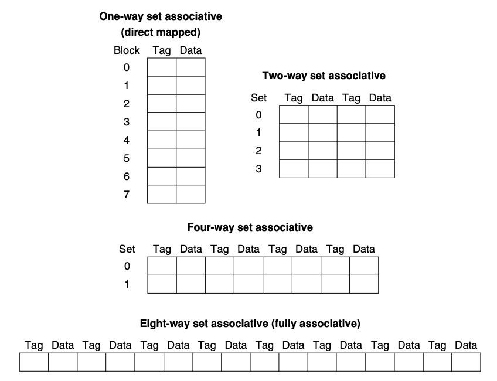

> _Memory_

_⌜Computer Organization and Design⌟의 5장 **Memory**에 대해 정리한 글입니다._

<!-- thumbnail -->

   
💡RoadMap

1. Computer Abstraction
2. ISA
3. Arithmetic for Computer
4. Proccessor
5. `Memory`

   

 

---

# Memory

이번 챕터에서는 `Memory`에 대해서 설명한다.

## Introduce

### principle of locality

컴퓨터 메모리의 구현에 대해 생각해보기 위해, 실생활에서의 예를 들어보자.

어떤 특정한 분야에 관해 조사하기 위해 도서관에 방문했다.  
도서관의 분류 시스템에 따라 그 주제와 관련된 책이 있을만한 책장에 가서 몇가지의 책을 꺼내어 책상으로 돌아와 쌓아놓는다고 생각해보자.  
만약 쌓아놓은 책 무더기에서 한 권을 골라 읽었는데 관련 내용을 찾을 수 없었다면, 책장에 다시 돌아가 새로운 책을 찾는 것 보다는 이미 책상에 쌓아놓은 책 중 한 권을 새로 골라 읽는 것이 더 효과적이라는 것을 쉽게 생각할 수 있다.  
일단 책상에 책을 잘 갖추게 된다면, 필요로 하는 많은 주제들이 그 책들에서 발견될 가능성이 높고, 책장으로 돌아가는 비효율적인 행동 대신 책상의 책들만을 살펴보면서 시간을 활용할 수 있다.

이와 같은 원리를 적용해 아주 작은 메모리만큼의 속도로 메모리에 접근할 수 있는 큰 메모리의 환상을 만들 수 있다.

도서관의 모든 책들에 대해 같은 확률로 접근할 필요가 없었던 것 처럼 프로그램이 모든 코드나 데이터에 같은 확률로 접근하지 않는다.

만약 그렇지 않으면 대부분의 메모리 접근을 빠르게 할 수 없고 메모리의 용량도 커져야 한다.

`principle of locality`(지역성의 원칙)은 도서관의 일부분의 책들만 찾아본 것 처럼 프로그램이 항상 address space의 비교적 작은 부분에 access한다는 것을 말한다.

다음의 두 가지 유형이 있다.

- `Temporal locality`(locality in time)  
  만약 아이템이 참조되면 그 아이템은 곧 다시 참조되는 경향이 있다.

  > ex) instruction in a loop, induction variable..

   

* `Spatial locality`(locality in space)  
  만약 아이템이 참조되면 가까운 주소의 아이템이 곧 참조되는 경향이 있다.
  > ex) sequential instruction access, array data..

### Memory Hierarchy

프로그램의 지역성은 간단하고 자연스러운 프로그램의 구조에서 발생한다.

예를 들어, 대부분의 프로그램에는 루프를 포함하기 때문에 temporal locality가 많이 발생한다. 또한, 명령어들은 보통 순차적으로 엑세스 하기 때문에 높은 spatial locality를 가진다.

`Memory hierarchy`를 구현하여 이러한 principle of locality를 활용할 수 있다.

Memory hierarchy는 속도와 크기가 다른 여러 수준의 메모리로 구성된다.

속도가 빠른 메모리는 프로세서에 가깝지만 비트당 비용이 비싸기 떄문에 크기가 작고,
속도가 느린 메모리는 그 밑에 위치하며 밑으로 갈 수록 비트당 비용이 싸 크기가 크다.

목표는 사용자에게 가장 싼 기술로 사용할 수 있는 만큼의 메모리를 제공함과 동시에 가장 빠른 메모리의 속도의 접근을 제공하는 것이다.

### Data Hierarchy

데이터도 마찬가지로 계층화된다.

`Data Hierarchy`는 여러 레벨로 구성될 수 있지만, 데이터의 복사는 한번에 인접한 두 레벨 사이에서만 일어나므로 두 레벨에만 집중할 수 있다.

모든 데이터는 가장 낮은 레벨에 저장된다.

상위 레벨(프로세서에 가까운 레벨)은 일반적으로 더 낮은 레벨에 저장된 데이터의 서브셋이다.  
상위 레벨일수록 하위 레벨보다 작고 빠르다.

하위 레벨(프로세서에서 먼 레벨)일수록 그 레벨에 접근하는 시간이 길어진다.  
하지만 비용이 싸기 때문에 크기가 크다.

- **Block** (cache block, line, cache line)  
  은 데이터 계층에서 복사되는 단위를 뜻한다.

- **Hit**  
  은 프로세서가 요구하는 데이터가 상위 레벨에 있는 경우를 뜻한다.

- **Miss**  
  는 반대로 프로세서가 요구하는 데이터가 상위 레벨에 없어서, 하위 레벨에 접근해야 하는 경우를 말한다.

다음과 같은 식으로 Hit ratio와 Miss ratio를 정의할 수 있다.

$$
\begin{aligned}
\text{Hit ratio} &= \text{hit} / \text{accesses} \\
\text{Miss ratio} &= \text{misses} / \text{accesses} = 1 - \text{hit ratio}
\end{aligned}
$$

메모리 계층을 구성한 가장 주된 이유는 성능이기 때문에 hit와 miss를 서비스하는 시간이 매우 중요하다.

이 시간에는 hit인지 miss인지 판별하는 시간이 포함된다.

Miss penalty는 miss시 상위 레벨의 블록을 하위 레벨의 블록으로부터 복사하여 교체하는 시간과 그 블록을 프로세서에 전달하는 시간을 말한다.

## Cache

`Cache`란 메모리 계층에서 프로세서에 가장 가까운 레벨을 말한다.

위 그림은 캐시에 없는 데이터를 요청하기 전/후의 그림을 나타낸다.

위 그림에서 두 가지의 질문을 생각할 수 있다.

- 어떻게 캐시에 요청한 데이터가 있는지 알 수 있을까?
- 요청한 데이터가 있다면 어떻게 찾을 수 있는가?

### Direct Mapped Cache

만약 각 word가 캐시 내에서 정확히 한 곳에 배치될 수 있다면, 캐시에 있는 워드를 찾는 것은 매우 간단하다.

메모리의 각 워드에 대해 캐시내의 위치를 할당하는 가장 간단한 방법은, 메모리의 워드 주소에 근거해 캐시 주소를 할당하는 것이다.

이러한 구조를 `direct mapped cache` 라고 부른다.

Direct Mapped Cache와 메모리의 주소 사이의 매핑은 매우 단순하다.

일반적으로, 거의 모든 directe mapped cache는 다음 매핑을 사용해서 Xn 블록을 찾는다.

$$
\text{(Block address) modulo (Number of Blocks in cache)}
$$

위 식을 살펴보면 각 캐시의 위치는 mapping 연산에 의해 여러 메모리 주소의 내용을 포함할 수 있다.

그렇다면 캐시 내의 데이터가 요청된 워드에 대응하고 있는지를 어떻게 알 수 있을까? 즉, 한 캐시 위치에 어떤 block(word)이 위치하고 있는 것인지 어떻게 알 수 있을까?

 

캐시에 `tag` set을 추가하는 것으로 이를 해결할 수 있다.

태그에는 캐시의 단어가 요청된 단어에 해당하는지 여부를 식별하기 위해 필요한 주소 정보가 포함되어 있다.

태그는 단지 주소의 상위 부분만 포함하고 있으면 된다.

예를 들어, 위 그림의 캐시 101을 보자. 만약 그 캐시 101의 태그가 00 이라면 메모리의 00-101 데이터를 가지고 있을 것이고, 11이라면 11-101의 데이터를 가지고 있다는 뜻이 된다.  
이 경우 태그로 오직 2개의 비트만 사용하면 된다.

<bt>

또한 우리는 캐시 블록이 잘못된 정보를 가지고있는지 아닌지 판별할 수 있는 방법이 필요하다.

이는 `valid bit`를 추가함으로써 해결할 수 있다.

만약 valid bit가 0 이라면 그 블록과 매칭되는 데이터가 없다는 뜻이다.

다음은 위 내용을 바탕으로 구성한 direct mapped cache의 write 과정을 나타내었다.

캐시의 블록 사이즈가 크면 spatial locality를 이용해 miss rate을 줄일 수 있다.  
하지만 블록 사이즈가 너무 커서 캐시의 너무 큰 부분을 차지한다면 캐시 내의 블록들의 숫자가 너무 줄어들어 캐시에서 유지할 수 있는 블록의 수가 적어지게 되고 결국 블록들끼리 경쟁하게 되어 결국 miss rate이 올라가게 된다.

더 심각한 문제는 miss의 비용이 증가한다는 것이다.

miss panalty는 바로 밑의 레벨에서 블록을 가져와 캐시에 로드하는데 필요한 시간에 따라 결정된다. 블록을 가져오는 시간은 첫번째 워드에 대한 지연시간과 블록의 나머지 부분에 대한 전송시간 두 부분으로 구성된다.

이 때 전송시간은 캐시의 블록이 커지면 증가하기 때문에 miss panalty는 캐시의 블록 크기에 따라 증가한다고 할 수 있다.

### Cache Misses

cache miss가 발생하면 control unit이 어떻게 대처하는지 살펴보자.

일단, pipeline stall을 생성한다.  
메모리를 기다리는 동안 프로세서 전체를 정지시켜서 임시 레지스터 및 프로그래머가 볼 수 있는 레지스터의 내용을 정지시킬 수 있다.

> _고도의 비순서 프로세서의 경우 cache miss를 기다리는 동안 명령을 실행할 수는 있지만, 여기서는 cache miss를 기다리는 프로세스를 순서대로 실행할 수 있다고 가정한다._

그 다음 요청된 데이터를 더 낮은 레벨에서(메모리) 가져와야 한다.

만약 instruction data miss였다면 instruction register의 값이 invalid하다는 뜻이다.  
cache에 알맞은 명령을 넣으려면 메모리 계층의 하위 레벨에 읽기를 지시한다.  
즉, 다음과 같은 과정을 거친다:

1. 원래의 PC값(현재 PC-4)를 메모리에 전달한다.
2. 그 주소값을 가지고 메모리에 접근한다(몇 사이클이 소모된다.)
3. cache entry를 쓰고, 메모리의 데이터를 cache entry의 data부분에 넣고, 주소의 상위 비트를 tag에 쓴 후, valid bit를 1로 켠다.
4. IF단계에서 명령을 다시 시작한다.

명령어가 아닌 일반적인 data miss의 경우에도 기본적으로 동일하다. 메모리가 적절한 데이터를 줄 때까지 프로세서를 정지시킨다.

### Write

Write(쓰기, 즉 SW)는 다소 다르게 동작한다.

캐시에 데이터를 쓴 후 메모리는 캐시와 다른 값을 가지게 된다. 이 경우 캐시와 메모리는 inconsistent하다고 한다.

캐시와 메모리를 consistent하게 유지하는 가장 간단한 방법은 항상 메모리와 캐시 둘 다에 데이터를 쓰는 것이다. 이를 `write-through` 방식이라고 한다.

이러한 디자인은 매우 단순하고 안정적이지만 매 store 명령마다 cpu가 stall해야 하기 때문에 성능이 좋지 못하다.

#### wirte buffer

성능을 위한 첫번째 대안으로 `write buffer` 를 이용하는 방법이 있다.

쓰기 버퍼는 메모리에 쓰기를 기다리는 동안 데이터를 저장한다. 데이터를 캐시와 쓰기 버퍼에 쓴 후 프로세서는 실행을 계속한다.

메인 메모리에 쓰기가 완료되면 버퍼는 free된다.

프로세서가 write을 할 때 쓰기 버퍼가 꽉 차있었다면, 버퍼가 빌 때 까지 프로세서는 stall 되어야 한다.

물론 메모리의 쓰기 속도가 프로세서의 쓰기 속도보다 일반적으로 낮다고 생각되기 때문에 버퍼링은 도움이 되지 않는다. 왜냐하면 쓰기가 메모리가 받아들일 수 있는 것 보다 빨리 생성되기 때문이다.

그럼에도 쓰기가 너무 많이 생성되면(occur in burst) stall은 여전히 발생할 수 있다.

프로세서는 이런 stall의 발생을 줄이기 위해 통상 write buffer의 깊이를 싱글 엔트리를 넘어 증가시킨다.

#### write-back

write-through의 또 다른 대안 방법은 `write-back` 방법이다.

이 방식은 쓰기가 발생하면 새 데이터가 캐시내의 블록에만 기록된다.

이 업데이트 된 블록은 표시를 위해 dirty bit를 설정한다.

변경된 블록(dirty block)은 새로운 블록으로 교체될 때 비로소 하위 계층(메모리)에 기록된다.

특히 프로세서가 메모리에서 처리할 수 있는 쓰기 속도보다 빠르거나 빠르게 쓰기를 생성할 수 있는 경우에는 이 방식이 성능을 매우 향상시킨다.

하지만 이 방식은 write-through방식보다 구현하기 더 복잡하다.

#### write allocation

write-thorugh 방법에서 miss가 발생했을 때, `write allocate`라고 불리는, 블록을 캐시에 할당하는 방법이다.

두 가지의 방법이 있다.

- allocate on miss(Fetch the block):  
  Cache에 적절한 데이터를 덮어쓴다. 그 후 메모리에도 저장(write thorugh)한다.

- write around(Don't fetch the block):  
  Cache의 블록을 이용하지 않고 직접 메모리에 저장한다.

write-back에서는 보통 fetch the block 방식을 사용한다.

### Associative Cache

지금까지는 cache에 블록을 배치할 때 단순한 방식을 사용했다.

즉, 앞에서 설명한 direct map 방식은 블록을 캐시에 정확히 한 곳에 배치할 수 있었다.

하지만 실제로 블록을 배치하는 방식은 매우 다양하다. 블록을 정확히 한 위치에 배치하는 방법은 매우 극단적이다.

또 다른 생각해 볼 수 있는 극단적인 방법은 블록을 cache의 어느 위치던지 상관 없이 배치할 수 있는 방식이다. 이를 `fully associative` 방식이라고 한다.

이러한 방식은 cache에서 특정 블록을 찾으려면 cache의 어느 부분이던지 블록을 배치할 수 있으므로 cache의 모든 엔트리를 검색해야 한다. 이는 매우 비효율적이다.

dircect map과 fully associative 방식의 중간 범위를 `set associative` 방식이라고 한다.

블록에을 n개의 entry를 가진 set들로 나눈 set-associative cache를 n-way associative cache라고 한다.

즉, n-way associative cache는 n개의 블록으로 구성된 다수의 세트로 구성된다.

메모리 내의 각 블록은 인덱스 필드에 의해 주어진 cache내의 고유 세트에 매핑되며, 블록은 그 세트의 n개 엔트리 중 임의의 요소에 배치될 수 있다.

즉, set-association 배치는 direct map과 fully associative 배치가 결합된 방법이다.

direct mapped cache는 1way associative cache이고 fully associative cache는 n이 최대인 cache 인 것이다.

다음의 그림은 8개의 entry를 가지는 세 종류의 cache를 나타낸다.

블록은 세트에 직접 매핑되고 세트 내의 모든 블록이 검색된다.

Direct mapped cache의 매핑 방법을 다시 생각해보자.

$$
\text{(Block address) modulo (Number of Blocks in cache)}
$$

Set-association 에서는 다음과 같이 매핑한다.

$$
\text{(Block address) modulo (Number of Sets in cache)}
$$

블록은 세트가 정해지면 그 세트의 모든 엔트리에 저장될 수 있으므로 그 셋의 모든 요소들의 태그를 검색해야 한다.

만약 fully associative cache였다면 블록은 어디든지 갈 수 있기 떄문에, 모든 블록의 모든 태그는 검색되어야 한다.

n-way set associative cache의 경우 모든 set은 병렬적인 회로로 한번에 검색할 수 있기 때문에, n번의 비교만 하면 된다.

따라서 associativity를 높이면 miss rate을 줄일 수 있지만, hit time이 증가할 수 있다.

### Replacement Policy

Direct mapped cache에서 miss가 발생하면 요청된 블록은 정확히 한 위치에만 갈 수 있고, 그 위치의 블록을 교체해야 한다. 즉, 어떤 블록을 교체할지 선택할 필요가 없다.

반면 Associative cache에서는 요청된 블록이 어디에 위치될지를 결정할 수 있다.

Fully associative cache에서는 모든 블록이 교체 대상이다. 즉, cache의 어떤 블록이든지 교체할 수 있다.

set-associative cache에서는 요청된 블록이 선택하는 set의 블록 중 하나를 선택해야 한다.

그렇다면 어떤 블록을 선택할 것인가?

앞서 본 것 처럼 non-valid entry가 있다면, 그 블록에 저장한다.

만약 set의 블록이 모두 valid하다면, 특정한 방법에 따라서 결정한다.

가장 일반적으로 사용되는 방식은 LRU(Last Recently Used) 방식이다.

이 방식에서는 가장 오랫동안 사용되지 않은 블록을 교체한다.

세트의 블록 중 무작위로 선정하는 방식도 있다.

이는 Associativity가 높아질수록 점점 LRU와 성능이 비슷해지게된다.

오늘날의 실제 컴퓨터에서는 LRU보다 훨씬 복잡한 알고리즘을 사용한다.

### Measuring Cache Performance

Cache 성능을 측정하고 분석하는 방법을 살펴보자.

CPU시간은 프로그램을 실행하는데 소모되는 싸이클과 메모리를 stall하는데 소모되는 싸이클로 구성된다.

이 때, 일반적으로 cache hit time은 프로그램을 실행하는데 소모되는 싸이클에 포함된다고 가정한다.

따라서,

$$
\begin{aligned}
\text{CPU Time} &= (\text{CPU execution clock cycle} + \text{Memory stall clock cycle}) \\
                & \quad \times \text{Clock cycle time}
\end{aligned}
$$

이다.

Memory stall clock cycle은 다음과 같이 정의할 수 있다.

$$
\begin{aligned}
\text{Memory stall clock cycle} &= (\text{Read stall cycle} + \text{Write stall cycle}) \\
\end{aligned}
$$

이 때, Read stall cycle과 Write stall cycle은

$$
\begin{aligned}
\text{Read stall cycle} &= \frac{\text{Reads}}{\text{Program}} \times \text{Read miss rate} \times \text{Read miss penalty} \\
\text{Write stall cycle} &= \frac{\text{Writes}}{\text{Program}} \times \text{Write miss rate} \times \text{Write miss penalty} + \text{Write Buffer Stall}
\end{aligned}
$$

대부분의 write-through cache 구조에서는 read와 write miss penalty가 메모리에서 블록을 fetch해 오는 시간으로 같다.(write buffer stall은 무시한다.)

즉, 위에서의 read와 write을 하나의 miss rate과 miss penalty로 조합할 수 있다.

$$
\begin{aligned}
\text{Read stall cycle} &= \frac{\text{Memory Access}}{\text{Program}} \times \text{Miss rate} \times \text{Miss penalty}\\
&= \frac{\text{Instruction}}{\text{Program}} \times \frac{\text{Miss}}{\text{Instruction}} \times \text{Miss penalty}
\end{aligned}
$$
