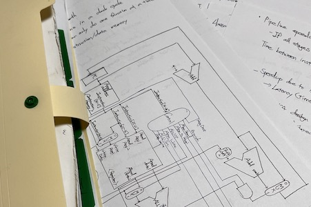
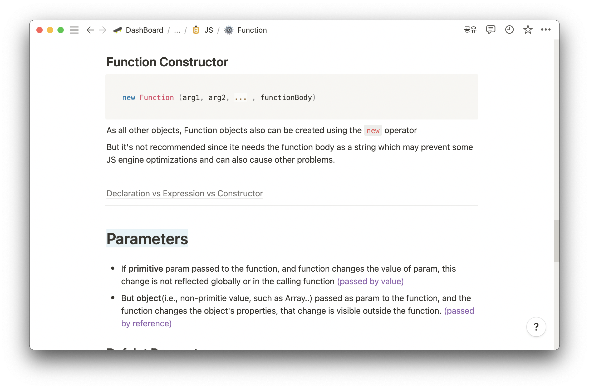

> _기술 블로그 운영을 시작하며_

_본 글은 기술 블로그 운영을 시작함에 따라 왜∙어떤 목적으로 블로그 운영을 시작하는지, 어떤 글을 어떻게 쓰고 싶은지를 적어내고자 한 글입니다._

<!-- thumbnail -->

## 기술 블로그

> 왜 블로그를 운영하는가?

### 파일에서 파일으로

나는 글 쓰는 것을 좋아한다. 정확히는, 글씨 쓰는 것을 좋아한다.  
스스로를 명필이라고 자부하는 것은 아니지만, 아무런 종이에 단단한 내 글씨체를 끄적어 나리며 생각과 같은 무언가를 정리하는 것을 좋아하고 사람이다.  
예컨대 카페에 간다거나 할 때는 다이어리를 꺼내어 일정을 정리하거나 빈 공간에 생각을 적어 내리며, 기록이 중요한 대화 (팀플, 미팅 등)에서는 서기 역할을 맡았고, 전화할 때는 항상 어딘가에 끄적이며 전화하는, 그런 식이었다.

이러한 성격이 공부하는데에도 반영되었다.

강의 시간에는 형식 없이 휘갈기며 기록하고, 도서관에서는 나름의 체계에 맞게 정리했다. 그 기록들을 모아놓은 공책과 파일들을 고등학교 시절부터 가지고 있었고, 그것이 내 노력의 산물이자 내 배움을 지탱해주는 증빙이었다.  
공부할 때 가장 중요한 것은 해당 과목이나 도메인에 대한 전체적인 그림과 흐름을 보고 파악하고 있는 것이라고 생각하였으며, 나만의 기준과 형식으로 정리하여 쌓아놓는 것이 곧 공부라고 생각했다.



그러다가 입대를 했고, 전역을 했다. 복학 전 공부를 하고자 예전에 정리했던 파일들을 꺼내 읽어보려고 하는데, 이러한 정리와 공부 방식에 **문제점**을 느꼈다.

- 체계화되지 못한 분류 방식
  - 순서의 뒤섞임
  - 도메인별 분류할 것인지? 학기별 분류할 것인지?
  - 특정 부분을 찾을 때의 문제점
- 유실 발생
  - 종이의 훼손
  - 내용의 훼손
  - **분실**
- 세부적인 내용 망각
  - 세부적인 내용은 넘어가고 기록하는 경향
  - 당시에는 잘 알고 있고 이해했다고 생각하는 내용을 적지 않았으나, 나중에 이해가 되지 않음
- 일부 글씨체와 그림 등 혼동
  - 글씨의 혼동
  - 문장 기호나 들여쓰기, 문장 역할별 크기의 통일성이 일관적이지 않음 (Heading의 크기, Indentation)
- 공간 차지
  - 가방에서의 부피 문제
  - 자료가 쌓이면서 이동 시 뿐만 아니라 개인 짐에서도 부피 차지가 상당함
- 삽화 삽입
  - 그림이나 사진의 삽입 문제
  - 링크 등 레퍼런스의 삽입 문제
  - 코드 블럭의 삽입 문제(손 코딩)

<br>

이와 같은 아날로그적 정리 방식에 문제점을 느끼면서, 여전히 나는 내 공책들과 만년필들을 사랑하지만 내 백팩에서의 무거운 종이들과 책, 펜과 **`파일`**들은 모두 노션의 MD **`파일`**들로 대체되었다.

캘린더와 다이어리, 플래너와 가계부 그리고 무엇보다 모든 공부하며 정리하는 내용은 [**노션**](https://www.notion.so/ko-kr/product)을 이용해서 정리하는 중이다.



### 기술 블로그

노션을 열심히 활용하며 정리 및 공부하던 중, `개발 블로그`에 관해 고려하게 되었다.

많은 개발자가 블로그에 글을 쓰고, 개인 페이지를 운영한다. 소프트웨어 학부로 전과하고 한 학기, 길어봤자 6개월에서 1년 남짓 공부한 것이 전부인 나도 수십, 수백 개의 개발 블로그를 읽고, 참고했다. 개발자들은 왜 블로그를 운영하는가?  
그들 대부분은 본인 스스로 기록 정리, 또 하나는 지식과 경험의 공유 등을 목적으로 블로그를 운영한다.

나의 경우 공부하는 내용, 문제 풀이, 개발기, 그에 대한 기타 당시의 생각까지 노션을 사용해 정리하기 때문에 블로그가 따로 필요하지 않다고 느꼈고, 특히 내 배움의 정도나 수준이 누군가에게 공유할 만한 깊이가 되지 않는다고 생각하여 블로그의 운영은 고려 대상이 아니라고 생각했다.

그러던 중, [실용주의 프로그래머](http://www.yes24.com/Product/Goods/12501565) 라는 책에서 다음과 같은 문장을 읽었다.

> "가장 큰 약점은 약점을 보일 것에 대한 두려움이다."  
> ("The greatest weakness of all weaknesses is to fear too much to apear a weak.") -J. B. Bossuet

실용주의 프로그래머는 자신의 무지나 실수를 인정하기를 두려워하지 않는다. 변명 대신에 대안을 제시하고, 도움이 필요하다는 것을 인정한다. 그러므로 성장해간다.

나도 나만의 정리에서 벗어나 사람들과 지식을 공유하고 소통하고자, 지적과 수정을 받으며 성장하고자 블로그를 운영하고자 한다.

<br>

직접적인 피드백이 없더라도 누군가가 볼 수도 있다는 사실만으로 노션에 개인적으로 정리하는 글 보다 훨씬 퀄리티 높은 글을 체계적으로 작성하려고 노력할 것이다.  
블로그와 나의 글들이 나를 증명해주는 자산이 될 수 있을 것이며, 어디서든 볼 수 있는 저장소가 되어주는 동시에 나를 소개하는 수단이 될 수도 있을 것이다.  
누군가는 나의 포스트에서 도움을 받을 수도 있을 것이고, 나 역시 누군가에게 피드백을 받을 기회가 될 수도 있을 것이다.

## 개발자의 글쓰기

> 어떻게 글을 쓸 것인가?

[개발자의 글쓰기](http://www.yes24.com/Product/Goods/79378905)라는 책을 읽었다. 네이밍 컨벤션, 변수명, 주석, 에러 메세지, 로그, 릴리즈 문서, 장애 보고서, 개발 가이드 등 말 그대로 개발자의 글쓰기에 관해 다룬 책이다.  
이 장에서는 이 책의 마지막 챕터인 `기술 블로그`에 관해 정리하고자 한다. 더불어 정리한 내용을 바탕으로 본 개발 블로그를 작성하고자 한다. 이 장은 본 블로그에 작성하는 글들의 **작성 지침서**가 될 것이다.

### 개발자의 글쓰기

저자는 책에서 개발자들이 기술 블로그를 잘 쓰지 못하는 이유를 블로그에 글을 쓰는 방법이 학생 때 배운 글쓰기 방법과 다르기 때문이라고 설명한다.  
학생 시절 배운 글쓰기는 주제 우선 글쓰기, 독자 중심 글쓰기, 주장하는 글쓰기의 방법인 데 반해 기술 블로그는 **주제가 불분명**하고, **독자 수준이 천차만별**이며, 딱히 **주장할 것이 없는 글**을 작성해야 하므로 개발자들이 글쓰기를 하지 못한다고 말한다.  
이에 저자는 다음과 같은 방법으로 개발자들이 글을 쓰는 것을 제시한다.

1. 소재 의식 글쓰기
2. 자기 수준 글쓰기
3. 재미있는 글쓰기

#### 소재 의식 글쓰기

`소재 의식`이란 특정한 대상이나 상황에 대한 자기만의 관점이나 생각, 해결 방안들을 뜻한다.  
기술 블로그는 논설문이나 설파가 아니다. 그보다는 수필과 비슷하다. 튜토리얼, 개발 가이드, 컨퍼런스 후기, 공부를 정리한 내용, 컴퓨터 과학에 대한 설명 모두는 단지 내용을 전달하고자 하는 것뿐이다. 담담하게, 있는 그대로 정리하여 적어 내리면 되는 것이다.

#### 자기 수준 글쓰기

기술 블로그를 보는 독자는 다행히도 대부분 개발자일 것이다. 문제는 개발자의 범위나 수준이 천차만별이라는 것이다. 모든 독자를 만족시킬 수 있는 소재와 글의 수준으로 작성할 수 있을까? 용어 설명은 어느 수준에 맞춰서 해야 할 것이며, 어떤 것을 설명하기 위해 알고 있어야 하는 사전 지식은 어디까지 설명해야 할까? 어느 정도 수준은 모두가 알 것이라고 치부하고 넘어갈 수 있을까?  
심지어는 대다수의 독자는 글의 저자인 나보다 더 넓고 깊은 수준의 배경지식을 가지고 있을 것이다. 그래서 모든 독자를 만족시킬 수 있는 글을 작성하려고 노력하기보다는, `저자의 수준에 맞는 글쓰기`를 지향해야 한다.  
이 블로그의 원초적인 목적 중 하나 역시 나를 위해 정리하는 글을 작성하는 것이기 때문에 나의 수준에 맞추어 글을 작성할 것이다. 그래야 비로소 내가 쓰려는 글의 본질에 집중할 수 있을 것이다. 그리고 글을 읽어주는 독자 역시도 본인 수준에 맞는 피드백을 줄 수 있을 것이다. 도움을 받는 사람도 있을 것이고, 수정해주는 사람도 있을 것이다. 또한 그들 덕분에 저자 역시도 도움을 받을 수 있을 것이다. 그것이 개발자가 글을 쓰는 목적, 지식의 공유와 소통이다.

#### 재미있는 글쓰기

블로그의 글, 특히 개인 블로그의 포스트는 논문이나 기술 매뉴얼, 공식 레퍼런스 등과는 다르다. 이런 글들은 정확하고 깔끔하지만, 읽는 데는 재미가 없다. 블로그의 글은 형식이나 글쓰기에 제약이 없다. 글 쓰는 기교는 글을 재밌고 쉽게 읽히게 한다. 글에 재미가 있으면 독자가 활발히 반응하고, 반응이 활발하면 저자는 글을 계속 쓸 동력을 얻는다. `재미있는 글쓰기`는 이런 선순환을 가질 수 있다.  
더불어 독자와 마찬가지로 저자도 재미있게 글을 작성할 수 있는 글쓰기를 지향해야 한다. 이 블로그를 운영하는 게 하나의 스트레스가 되거나 의무감과 압박감을 주는 요소가 아닌 내 재미 요소 중 하나가 되었으면 좋겠다.

### 어떤 글을 어떻게 쓸 것인가?

기술 블로그의 글의 종류는 매우 다양하다. 책에서는 이러한 글들을 4가지의 종류로 나누어 설명한다.

1. **저(著)** - 직접 경험하고 실험한 과정이나 결과
2. **술(述)** - 어떤 것을 분석해 의미를 풀이하고 해석한 것
3. **편(編)** - 산만하고 복잡한 자료를 편집해 질서를 부여한 것
4. **집(輯)** - 여러 사람의 견해나 흩어진 자료를 한데 모아 정리한 것

#### **저** - 목차를 잘 구성하고 본문부터 쓴다.

`저`는 **직접 경험한 것**, 예를 들면 개발기나 경험기, 도입기, 적용기 등을 말한다.  
이러한 글은 무엇보다 목차를 잘 구성해야 한다. 개발기를 작성할 때 목차를 구성하기 어려운 이유는, 경험은 단방향 순서에 의존적이지 않고 다방향으로 왔다 갔다 하기 때문이다. 이러한 경험의 순서는 당연히 단방향 순서로 차례대로 구성된 최종 루트와 다르다. 다방향 순서로 구성된 개발 경험을 단방향 차례대로 구성된 목차로 바꾸기 위한 핵심 방법은, 최종적으로 성공한 개발 경험 루트와 중간에 실패해 다시 돌아간 루트를 구별하는 것이다.  
이렇게 목차를 정리했다면, 본문부터 쓰자. 개발자가 가장 쓰기 어려워하는 것이 바로 머리말이다. 머리말에 해당하는 서비스 설명과 개발의 필요성 등의 글은 개발자가 아닌 기획자나 관리자들에게 익숙한 글이다. 이런 글은 일단 제쳐두고, 잘 쓸 수 있는 본문부터 작성해 수월하게 써 내려가자.

#### **술** - 원전을 비교하고 실험해 풀이해서 쓴다

`술`은 **어떤 것을 분석해 의미를 풀이하고 해석한 것**, 예를 들면 기술 소개, 용어 분석, 에러 해결 방법 등을 말한다.  
개발에는 원문, 공식문서, 프로토콜, 레퍼런스, 즉, **원전**이 있다. 술에 해당하는 글을 작성할 때는 본래 내용인 원전을 바탕으로 하여 내 생각이나 분석, 해설을 덧붙이는 방식을 사용한다.


#### **편** - 순서를 요약하여 쓴다.

`편`은 **산만하고 복잡한 자료를 편집해 질서를 부여한 것**, 예를 들어 프로그램 설치 방법, 튜토리얼, 세미나 후기, 책 리뷰 등을 말한다.  
편을 쓰는 방법은 시간 순서로 하나씩 나열해 내용을 쓴 다음, 단계로 묶어서 요약한다. 처음부터 적절하게 목차를 구성하고 글을 묶어 요약할 수 있는 흐름을 볼 수 있다면 좋겠지만, 그러기엔 쉽지 않으므로 일단 구조를 생각하지 않고 글을 쭉 나열한 뒤, 내용부터 쓴다. 그다음 내용을 단계로 묶은 뒤 각 단계에 속한 내용을 요약하는 방법을 사용하면 수월하게 글을 쓸 수 있다.


#### 집 - 자료를 모어 핵심을 엮어 쓴다.

`집`은 **여러 사람의 견해나 흩어진 자료를 한데 모아 정리하는 것**, 예를 들어 명령어 모음, 팁, 네이밍 컨벤션, 커밋 메세지 컨벤션 등을 예로 들 수 있다.  
집은 내용을 많이 쓰는 것이 아니라 핵심만 간결하게 요약해 요점이 되는 것만 모아서 정리한 것이다. 본인이 이미 알고 있거나 찾을 수 있는 자료를 모아 나열하거나 나름의 일정한 기준을 가지고 순서와 단계로 엮기만 하면 된다.


<br>

저술보다는 편집이 더 쉽게 쓰인다고 한다. 본 블로그에서도 소개된것과 같이 글의 종류에 따라 글쓰기 전략을 나누어 보다 쉽고 효율적이게 작성할 것이다.

## new DevLog();

> 이 블로그는..

### 생성

왜 블로그를 운영하는지, 어떤 글을 어떻게 쓸 것인지 나름의 생각이 정리되었고, 블로그를 생성했다.

Tistory나 Velog등의 플랫폼을 선택하기보다는 나름의 웹 페이지를 입맛에 맞게 커스텀해서 생성하고 싶었다.  
여러 후보 중 React를 배우고 있고, 노션에 마크다운 파일을 작성하다 보니 MD은 익숙했기에, 루비 기반의 jekyll이나 vue의 vue-press 말고 [Gatsby](https://www.gatsbyjs.com)를 선택했다.

[JBee](https://jbee.io/about)님의 [gatsby-bee-starter](https://github.com/JaeYeopHan/gatsby-starter-bee)를 사용해 생성하고, 조금 수정했다.  
[netlify](https://www.netlify.com)를 이용해서 배포한다.

☞[**`github repo`**](https://github.com/41312432/devLog)

### 참고

- [awesome-devblog](https://github.com/sarojaba/awesome-devblog)의 개발 블로그들을 포함한 국내/외 많은 개발 블로그들을 참고한다.
- 공식 레퍼런스나 프로토콜 등이 있는 항목에 관한 글이라면 공식 문서를 참조하고 풀이함을 기본으로 글을 작성한다.
- [네이버](https://d2.naver.com/home), [라인](https://engineering.linecorp.com/ko/blog/), [우아한형제들](https://techblog.woowahan.com), [카카오](https://tech.kakao.com) 등을 비롯한 국내 IT 기업들과 [Netflix](https://netflixtechblog.com), [Google](https://developers.googleblog.com), [amazon](https://developer.amazon.com/blogs) 등 해외 기업들의 기술 블로그들을 참고한다.

- 개인적으로 확률과 통계, Calculus, Linear Algebra 등 수학 과목을 수강할 때 많은 도움이 되었던 블로그인 [Truth in Engineering](https://blog.naver.com/mykepzzang/220843133196)의 글과 같이 작성하고 싶다. 개발 블로그는 아니지만 내가 보았던 블로그 중 가장 큰 도움이 되었고 가장 감명 깊게 본 블로그이다. 블로그를 운영하게 된 큰 이유 중 하나가 이처럼 멋진 블로그를 운영하고 싶다는 생각이다. 해당 블로그 소개 글의 첫 줄은 다음과 같다.

  > "이 블로그에 글을 쓰는 목적은 '지식 공유' 입니다. 제가 알고 있는 내용들을 블로그를 통해 게시하고, 제 글을 읽는 여러분은 오류가 있는지 없는지 검토해주세요. ...(후략)

  본 블로그도 위와 같은 목적을 달성할 수 있는 블로그가 되었으면 한다.
  더불어 이 자리를 빌려 Truth in Engineering 블로그의 저자이신 '존이' 님에게 감사하다는 말씀을 드립니다.

- 위에 언급했듯이 책 [개발자의 글쓰기](http://www.yes24.com/Product/Goods/79378905)를 지침서 삼아 글을 작성한다.

### 원칙

- 어디까지나 첫 번째 목적은 공부와 기록이다. 내가 이해한 것을 나의 수준에 맞추어 작성하고 기록한다. 나중에 알아볼 수 있도록 쓴다.
- 지속 가능하고 수정 가능한 글을 작성한다. 단기적으로 짧게 작성하는 BOJ N번 문제 풀이 등의 짧은 글의 작성은 지양한다. 본 블로그의 글은 언제든지 추가되고 수정될 수 있다.
- 양과 속도보다는 질에 집중한다. 업로드의 주기보다는 좋은 글을 고심하여 작성하도록 노력한다. 다만 꾸준히 포기하지 않고 작성한다.
- 작성을 위한 작성이 아닌, 실제로 느끼고 배우고 통감한 내용을 하나하나 공들여 작성한다.
- 스스로 블로그 운영을 압박이나 골칫거리로 생각하지 않고 하나의 재미로, 또 개발자로서 한 발자국의 정진으로 생각했으면 한다.

<br>
<br>
<br>

```JS
new DevLog(`413124321`);
```

<br>
<br>
