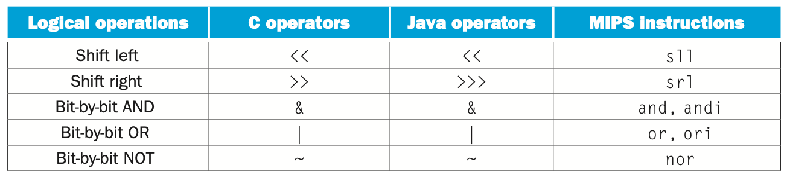
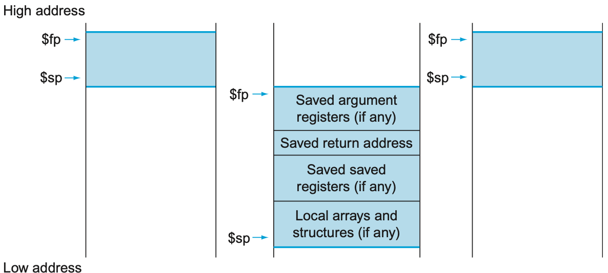

> _Introduction Set Architecture_

_⌜Computer Organization and Design⌟의 2장 **ISA**에 대해 정리한 글입니다._

<!-- thumbnail -->

<details>
   <summary>💡RoadMap</summary>

1. Computer Abstraction and Technology
2. `Instruction Set Architecture`

   </details>

<br>

---

# ISA, Instruction Set Architecture

이 장에서는 ISA에 대해 정리한다. 특히, 본 과목을 다루는 이 글 전반에서 예시로 들어 다루는 MIPS ISA에 대해 살펴본다.

본 책의 2장은 MIPS assembly어와 Assembly어를 machine code로 변환하는 2개의 부분으로 나누어 포스팅한다.  
본 장은 ISA와 MIPS assembly어에 대해 다룬다.

## Architecture

컴퓨터 하드웨어에 명령을 내리려면 하드웨어의 언어로 번역해야 한다.

그 컴퓨터 언어의 단어(word)를 `instruction`이라고 하고, 그 문법(vocabulary)을 `instruction set`이라고 한다.  
`Instruction Set Architecture (ISA)`는 다음으로 구성된다.

- Instruction Set
- Operand Types
- Data Types
- Memory Addressing mode
- ...

<br>

ISA는 컴퓨터마다, 제조사, 목적, 기술 수준 등에 따라 다르다.  
하지만 한국어와 영어가 판이하게 다른것 처럼 사람의 언어는 종류가 극단적으로 다르고 다양한데 반해 컴퓨터의 경우 다른 종류의 instruction set 끼리 크게 다르지 않다.

따라서 한 컴퓨터 언어에 대해 공부하면 다른 컴퓨터 언어를 이해하기 쉽다.

## MIPS

`MIPS Instruction Set`은 1980년대 경 MIPS Technology에서 개발했다.[_MIPS Architecture_](https://en.wikipedia.org/wiki/MIPS_architecture)  
이 ISA는 실리콘 그래픽스사의 컴퓨터 시스템, 많은 임베디드 시스템, 닌텐도 64, 플레이스테이션 등 많은 분야에서 사용되었다.

현대 **RISC ISA**의 정석, 표준에 가까운 구조를 가지고 있고 매우 깔끔하게 구성되므로 공부할 때 다루기 좋다.  
따라서 컴퓨터 구조를 다루는 이 글 전반에서는 MIPS instruction set을 대표적으로 선택해서 다룰것이다.

### Instruction vs Assembly

MIPS Instruction은 32비트 바이너리 코드로 이루어져 있다.  
ex) 0x02324020 라는 32비트 코드가 레지스터 a와 레지스터 b를 더해서 레지스터 c에 저장하라-라는 instruction 일 수 있다.

이러한 형태는 사람이 작성하고 이해하기 매우 어렵다.

따라서 우리는 `MIPS Assembly`라고 불리는, 사람이 이해하기 비교적 쉬운 표현을 정의한다.

ex) add \$s0 \$s1 \$s2

MIPS Assembly는 MIPS Instruction와 동등하다(equivalent).

<br>

우리가 프로그램을 작성하면,  
**컴파일러(Compiler)**가 코드를 **MIPS Assembly**로 전환하고,  
MIPS **어셈블러(Assembler)**가 Assembly어를 **MIPS Instruction**으로 전환한다.

<br>


위 표는 MIPS Assembly어를 나타낸 표이다.  
카테고리별로 명령어에 대해 살펴보자.

## Arithmetic Operation

기본적인 `Arithmetic operation(수학 연산자)`부터 알아보자.

`add(Addition`는 두 레지스터의 값을 더해 레지스터에 저장한다.  
`sub(Subtract)`는 두 레지스터의 값을 빼 레지스터에 저장한다.

```txt
add $s1, $s2, $s3    # $s1 = $s2 + $s3
sub $s1, $s2, $s3    # $s1 = $s2 - $s3
```

두 operation은 항상 정확히 **3가지의 operand**만을 필요로한다.  
첫번째 operand는 **desination**을, 뒤따라오는 두개의 operand는 **source**를 나타낸다.  
2가지 source의 값을 연산해서 destination에 저장한다.

<details>
   <summary>예제</summary>
<br>
   예를 들어, 파이썬으로 구현한 다음의 코드를 보자.

```py
a = (b + c) - (d + e)

```

위의 연산은 MIPS Assembly로 다음과 같이 구현한다.

```txt
add $t0, b, c
add $t1, d, e
sub a, $t0, $t1
```

</details>

## Operand

두 arithmatic operation은 **메모리(Memory)**의 값을 직접적으로 쓸 수 없다.  
오직 **레지스터(Register)**에 저장된 값만을 `operand`로써 사용할 수 있다.

### Register

MIPS Architecture는 **32-bit x 32개** 의 `register`를 가지고 있다.  
즉, 32비트의 데이터를 담을 수 있는 레지스터가 0~31번까지 32개가 존재한다.  
그리고 그 **32비트의 데이터(32Bits == 4Bytes)**를 `word`라고 한다.


### Memory

Processor는 오직 제한된 숫자(MIPS의 경우 32개)의 레지스터에 일부 값만을 가지고 있다.  
그렇다면 array, structue등과 같은 큰 data는 어떻게 다룰 수 있을까?

<br>

그러한 데이터들은 `Memory`에 저장된다.

#### Data Transfer Instruction

기본 수학 operation은 오직 레지스터의 값만을 operand로 사용한다고 언급했다.

따라서 메모리의 값을 사용하기 위해서는 메모리와 레지스터사이에 데이터를 옮기는 instruction이 필요하다.  
그러한 instruction을 `data transfer instruction` 이라고 한다.

<br>

`lw(load word)`는 메모리의 값을 레지스터에 저장한다.  
`sw(store word)`는 레지스터의 값을 메모리에 저장한다.

```txt
lw $s1, 4($s2)    # $s1 = Memory[$s2 + 4]
sw $s1, 4($s2)    # Memory[$s2 + 4] = $s1
```

<br>
<br>

Memory의 값에 접근하려면 `주소(address)`값을 알아야 한다.


위 그림을 보자.  
메모리는 단순히 주소값을 배열의 인덱스로 생각할 수 있는 1차원의 큰 배열(large, single-dimension array with the address acting as the index to that array)이다.

Memory는 Byte 단위의 주소값을 사용한다.  
Memory 한 칸에는 1word = 32bits = 4bytes의 데이터가 들어간다.  
즉, 메모리의 주소값은 **4의 배수** 단위로 구성된다.

### Immediate Operand

프로그램에서 상수(constant)를 사용하는 경우는 매우 많을 것이다.  
위에서 살펴본 기본 수학 연산자들로는 operand로 레지스터의 값만을 사용할 수 있기 때문에  
연산을 할 때마다 메모리에서 상수를 레지스터에 불러오고, 그 값을 읽는 과정을 거쳐야 할 것이다.

<br>

그것에 대한 대안으로. MIPS에서는 **하나의 operand를 상수로 삼는** instruction을 제공한다.

`Addi(Add Immediate)`

```txt
addi $s1, $s1, 4     # $s1 += 4
```

subi(sub immediate)는 존재하지 않는다. 상수 operand로 음수의 값을 사용하면 되기 때문이다.

<br>

또한, 0번째 레지스터(=`$zero`)는 항상 **상수값 0**을 가진다.(덮어쓸 수 없다.)

이는 다음과 같이 레지스터의 값을 다른 레지스터로 옮기는 작업 등 많은 작업에서 유용하게 사용한다.

```txt
addi $t1, $s1, $zero    # $t1 = $s1
```

## Logical Operation

> 각 논리 연산에 대한 구체적인 내용은, digital system을 다루는 다른 글에서 자세히 알아본다.

`logical operation(논리 연산자)`, `bitwise operation(비트 연산자)`에 대해 알아보자.



위 표는 C나 JAVA에서 볼 수 있는 논리 연산자를 MIPS instruction으로 나타낸 표이다.

### Shift

`sll(shift left logical)`은 shamt만큼 왼쪽으로 비트를 이동하고, 빈 부분을 0으로 채운다.  
`srl(shift right logical)`은 shamt만큼 오른쪽으로 비트를 이동하고, 빈 부분을 0으로 채운다.

```txt
sll $t0, $s0, 2   # $t0 = $s0 << 2 == $t0 = $s0 * 2^2
srl $t1, $s1, 2   # $t1 = $s1 << 1 == $t1 = %s1 / 2^2
```

sll은 $$2^\text{shamt}$$를 곱하는, srl은 $$2^\text{shamt}$$로 나누는 연산임을 알 수 있다.

<br>

shift right logical의 경우를 살펴보자  
음수의 경우, 위 방법대로라면 오른쪽으로 shifting하고 그 자리를 0으로 채우므로 맨 앞 비트(sign bit, most significant bit)는 1이 아닌 0, 즉 양수가 될 것이다.

따라서 srl은 unsigned int에만 정상적으로 적용된다.

sra(shift right arithmetic)의 경우 most significant bit가 1이면 쉬프팅 후 1로 채우기 때문에 이를 해결할 수 있다.

### Logical

`and`은 두 레지스터의 값을 bitwisw and연산 후 레지스터에 저장한다.  
`or` 은 두 레지스터의 값을 bitwisw or연산 후 레지스터에 저장한다.  
`xor`은 두 레지스터의 값을 bitwisw xor연산 후 레지스터에 저장한다.  
`nor`은 두 레지스터의 값을 bitwisw nor연산 후 레지스터에 저장한다.

```txt
and $t0, $s1, $s2   # $t0 = $s1 & $s2
or $t0, $s1, $s2   # $t0 = $s1 | $s2
xor $t0, $s1, $s2   # $t0 = $s1 ^ $s2
nor $t0, $s1, $s2   # $t0 = ~($s1 | $s2)
```

MIPS에는 NOT 연산자가 없는데, \$zero와 NOR 연산을 진행하면 NOT과 같기 때문에 이를 이용할 수 있다.

<br>

몇몇의 논리 연산자는 상수와 연산할 수 있다.

`andi(and immediate)`, `ori(or immediate)`, `xori(xor immediate)`

```txt
andi $t0, $s1, 4   # $t0 = $s1 & 4
ori $t0, $s1, 4   # $t0 = $s1 | 4
xori $t0, $s1, 4   # $t0 = $s1 ^ 4
```

## Conditional Operation

조건에 따라 결정을 내리는 `conditional operation(조건 연산자)`에 대해 알아보자.

### branch

2가지의 `conditional branch operation`이 있다.

`beq(branch on equal)`은 두 레지스터의 값이 같으면 라벨(주소) instriction으로 branch한다.  
`bne(branch on not equeal)`은 두 레지스터의 값이 다르면 라벨(주소) instruction으로 branch한다.

```txt
beq $s0, $s1, L1   # if $s0 == $s1 : branch to instriction labeled L1
bne $s0, $s1, L1   # if $s0 != $s1 : branch to instruction labeled L1
```

또한 `unconditional branch operation`도 있다.

`j(jump)`, 즉 goto를 말한다.

```txt
j L1   # goto L1
```

<details>
   <summary>예제</summary>
<br>
   예를 들어, 다음의 파이썬 코드를 보자.

```py
if i == j:
   f = g + h
else:
   f = g - h
```

위의 연산은 MIPS Assembly로 다음과 같이 구현한다.

> i, j, f, g, h 는 레지스터 \$s3, \$s4, \$s0, \$s1, \$s2에 있다고 가정한다.

```txt
      bne $s3, $s4, Else
      add $s0, $s1, $s2
      j   Exit
Else: sub $s0, $s1, $s2
Exit: ...
```

Else와 Exit같은 label은 assembler가 그 주소를 계산한다.

<br>

다음과 같은 반복문도 구현할 수 있다.

```py
while save[i] == k:
   i += 0x3
```

> i는 \$s3에, k는 \$s5에, save배열의 시작주소는 \$s6에 있다고 가정한다.

```txt
Loop : sll $t1, $s3, 2     # i를 4배 해서 임시 레지스터 $t1에 저장한다. (배열의 주소값 4배단위)
       add $t2, $t1, $s6   # save의 시작주소에 $t1을 더한다. save[i]의 값이 들어있는 주소값이다.
       lw  $t0, 0($t2)     # save[i]를 불러와 $t0에 저장한다.
       bne $t0, $s5, Exit  # $t0과 k가 같지 않다면 반복문 종료.
       addi $s3, $s3, 0x03 # 같아서 branch가 안됐다면 i의 값을 상수만큼 증가시킨다.
       j   Loop            # 반복문으로 돌아간다.
Exit : ...
```

</details>

다음과 같은 conditional branch도 있다.

`slt(set on less than)`, `slti(set on less than immediate)`는 두 값을 비교해 첫번째 operand가 더 작다면 1을, 더 크다면 0을 저장한다.

```txt
slt $s0, $s1, $s2    # $s0 = 1 if $s1 < $s2 else $s0 = 0
```

다음과 같이 branch operation과 연계할 수 있다.

```txt
slti $s0, $s1, 0x08
beq $s0, $zero L1
```

### Basic Block

처음을 제외하고는 다른 branch의 target이 되지 않고,  
끝을 제외하고는 나가는 branch가 없는  
일련의 instruction 모음을 `Basic Block`이라고 한다.

compiler는 최적화를 위해 basic block 단위로 구별한다.

## Procedure

`Procedure`, 즉 `function`은 프로그램을 구성하는데 매우 유용한 도구로, 이해하기 쉽고 직관적이게 코드를 만들 수 있고 재사용 할 수 있게 한다.

Procedure의 실행은 다음과 같은 6계의 단계를 따른다.

1. **Place parameters in registers**

   procedure의 parameter들을 register convention에 따라 \$a0 ~ \$a3에 저장한다.

   <br>

2. **Transfer control to procedure**

   procedure을 call하는것은 다음 instruction을 통해 진행된다.

   `jal(jump and link)`는 바로 다음 instruction의 주소를 register convention에 따라 \$ra(return address)레지스터에 저장해놓고, label로 jump한다.

   ```txt
   jal procedure-label  #jump to procedure-label
                         #and $ra = next insrcution's address
   add $t0, $t1, $s2    #common instruction..

   ...

   procedure-label : ...
   ...
   ```

   다음 instruction의 주소를 저장한다는 말은 현재 실행중인 명령어의 주소를 보유하는 레지스터 가 있어야 함을 암시한다.  
   관습적으로, 이 레지스터는 대부분 `PC(Program Counter)`로 불린다.

   jal은 실제로 PC+4의 주소를 \$ra 레지스터에 저장하고 procedure를 호출한다.

   <br>

3. **Acquire storage for procedure**

   procedure을 위한 storage를 확보한다.  
   <a href="/computer%20organization/computer-organization-2-(1)/#memory-layout">Memory Layout</a>

   <br>

4. **Perform procedure's operations**

   procedure의 operation들을 순차적으로 수행한다.

   <br>

5. **Place result in register for caller**

   procedure의 결과값들을 register convention에 따라 \$v0, ~ \$v1에 저장한다.

   <br>

6. **Return to place of call**

   procedure을 call 했던 instruction(caller)의 다음 instruction으로 가야한다.  
   그 instruction은 2번 단계에서 jal에 의해 \$ra에 저장되어 있을 것이다.

   `jr(jump register)`은 레지스터에 저장된 주소값으로 jump한다.  
   (정확히는, program counter에 전달한다.)

   ```txt
   jal procedure-label  #jump to procedure-label
                         #and $ra <= next insrcution "add $t0, $t1, %s2" 's address
   add $t0, $t1, $s2    #common instruction..

   ...

   procedure-label : ...
   ...
   jr $ra               #jump $ra
   ```

<br>

`Caller`란 말 그대로 procedure를 호출하는 것, **호출하는 instruction**, program을 말한다.  
`Callee`는 말 그대로 **호출되는 procedure**를 말한다.

Caller는 필요한 parameter value를 \$a0-\$a3에 저장하고 jal을 통해 procedure를 호출한다.  
Callee는 호출 된 뒤 일련의 instruction을 실행하고, 결과를 \$v0, \$v1에 저장한다. 그리고 jr \$ra 을 통해 caller에게 control을 넘겨준다.

<br>

전체 과정을 보여줄 수 있는 예시를 들어보자.

<details>
   <summary>예제</summary>
<br>
   다음의 파이썬 코드를 보자.

```py
def m_function(g, h, i, j):
   f = (g + h) - (i - j)
   return f
```

> g, h, i, j 는 \$a0, \$a1, \$a2, \$a3에 들어있고, f는 \$t2를 사용한다고 가정하자.

위 함수를 호출하고 결과값을 받는 MIPS code는 다음과 같이 구현할 수 있다.

```txt
...common instruction
jal m_function
...common instruction

...

m_function:
add $t0, $a0, $a1
add $t1, $a2, $a3
sub $t2, $t0, $t1
add $v0, $t2, $zero
jr $ra

```

</details>

<br>

### Register / Memory Convention

한 procedure이 register convention에서 정의된 것 보다 (MIPS가 가지는 32개의 레지스터보다) 많은 레지스터를 요구하면 어떻게할까?  
예를 들어, register convention에서 procedure의 parameter를 위해 사용하는 레지스터는 \$a0 부터 \$a3까지 총 4개이다.  
하지만 function의 paramater가 5개 이상이면 어떻게 할까?

아니면, procedure안에 다른 procedure이 호출되는 경우는 어떻게 해야 할까?  
재귀(recursive)함수를 포함한, 많은 함수에서 다른 함수를 호출하는데 그 때 마다 한 레지스터에 대해 중복적으로 사용해야 하는 경우가 발생할 수 있다.

Register의 값을 메모리에 spill해야 하는 경우가 바로 그런경우이다.

#### Caller, Callee Register

MIPS의 Register convention을 다시 살펴보자.


<br>

`Caller-save Register`는 \$t0-\$t9 레지스터를 말한다.  
임시적인 레지스터 (Temporary Register)로 필요하면 업데이트해서 사용할 수 있지만 callee(procedure)에 의해 보존되지 않는다.  
따라서, caller는 procedure를 호출하기 전에 레지스터의 값을 저장해 놓아야 하고, callee가 return하면 레지스터의 값을 보존해야 한다.

`Callee-save Register`는 \$s0-\$s7 레지스터를 말한다.  
저장되는 레지스터(Saved Register)인 callee-save register는 callee(procedure)에 의해 보존된다.  
즉, callee에 입장에서는 이 레지스터를 사용하려면 원래의 값을 저장해 놓았다가 return할 때 원래의 값으로 복원해야 한다.  
caller의 관점에서 보면, caller가 아무런 행동을 취하지 않아도 procedure 안에서 자동으로 보존되는 레지스터이다.

위의 표는 레지스터의 값이 procedure call마다 보존되는지 여부를 나타낸다.

<br>

이처럼 레지스터의 보존을 위해 값을 따로 저장해놓아야 한다.(Memory에 spill 해 놓아야 한다.)

그렇다면 그 임시로 저장해야 하는 메모리의 주소값은 어떻게 정해질까?

#### Memory Layout


위 그림은 MIPS의 memory allocation(`memory layout`)을 나타낸 그림이다.  
아래로 갈수록 주소값이 낮아지고, 위로 갈수록 주소값이 높아진다.

> _강의는 반대로 설명하나, 여기서는 책을 기준으로 설명한다._

각 영역은 다음을 나타낸다.

- `Text`:  
  프로그램의 **Code**가 들어있다.  
  각 instruction이 메모리마다 들어있으며 **\$PC**(Program Counter)레지스터에 그 주소값이 들어있다.  
  \$PC는 자동으로 4씩 증가하며 instrcution을 실행한다.

- `Data`:  
  **Static Data**가 들어있다.  
  static variable이나 constant array, string과 같은 전역 변수(global variable)이 들어있다.  
  **\$gp**(Global Pointer) 레지스터에 주소값이 들어있으며, 그 주소값은 Data의 중간값을 가리키고 있다.

- `Stack`, `Heap`:  
  그림에서의 맨 윗 부분은 두 부분으로 나누어 생각해 볼 수 있다.

  **Stack**은 local variable, array, 그리고 temporarily saved register value가 저장된다.  
  즉, 위에서 살펴본 예시인 함수의 중첩등으로 인한 많은 parameter 사용으로 인한 레지스터 중복 사용, register value의 임시 저장, 등 레지스터의 값을 spill하는 예시는 다 stack 영역에 저장된다.

  

  **\$fp**(frame pointer)가 현재 stack frame(procedure frame)의 시작(base)를 가리킨다.  
  **\$sp**(stack pointer)는 stack의 마지막을 가리킨다.

  <br>

  **Heap**은 동적으로 할당된 object들이 저장된다. 즉, malloc이나 new 키워드 등을 통해서 동적으로 할당된 object들(Dynamic Date)이 해당된다.

  Heap과 Stack은 서로를 향해 증가한다.(주소값이 늘고 줄어든다.)

  <br>

이제 다시 Procedure Call 일련의 과정을 정리해보자.

1. Compliler가 code compliation을 하는 동안, 각 function마다 stack frame(procedure frame)의 크기를 계산한다.

2. Stack Frame을 생성하는(popualte) assembly 코드를 생성한다. (function prologue 라고 한다.)

   > 예를 들어, \$fp = \$sp \\n \$sp = \$sp - 32

3. Local variable들과 saved 레지스터들마다 그들이 저장될 stack의 주소값을 계산한다.

4. Function body의 assembly 코드를 생성한다.

5. Return하기 전에, 모든 callee-save 레지스터를 stack에서 원래의 값을 가져와 복원한다.

6. Stack frame을 pop한다. (function epilogue 라고 한다.)

7. jr \$ra
